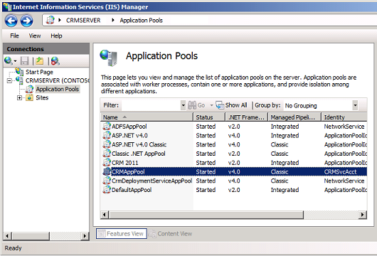

# Configure the Microsoft Dynamics 365 Server for claims-based authentication


After you have installed [!INCLUDE[pn_adfs_short](../includes/pn-adfs-short.md)], you need to set the [!INCLUDE[pn_microsoftcrm_server](../includes/pn-microsoftcrm-server.md)] binding type and root domains before you enable claims-based authentication.  
  
<a name="BKMK_server_binding"></a>   
## Set Microsoft Dynamics 365 Server binding to HTTPS and configure the root domain web addresses  
  
1.  On the [!INCLUDE[pn_microsoftcrm](../includes/pn-microsoftcrm.md)] server, start the [!INCLUDE[pn_deploymentmanager](../includes/pn-deploymentmanager.md)].  
  
2.  In the **Actions** pane, select **Properties**.  
  
3.  Select the **Web Address** tab.  
  
4.  Under **Binding Type**, select **HTTPS**.  
  
5.  Verify that the web addresses are valid for your [!INCLUDE[pn_ssl_short](../includes/pn-ssl-short.md)] certificate and the [!INCLUDE[pn_ssl_short](../includes/pn-ssl-short.md)] port bound to the [!INCLUDE[pn_microsoftcrm](../includes/pn-microsoftcrm.md)] website. Because you are configuring [!INCLUDE[pn_microsoftcrm_server](../includes/pn-microsoftcrm-server.md)] to use claims authentication for internal access, use the host name for the root domain web addresses.  
  
     For example, for a *.contoso.com wildcard certificate, you would use internalcrm.contoso.com for the web addresses.  
  
     If you install [!INCLUDE[pn_adfs_short](../includes/pn-adfs-short.md)] and [!INCLUDE[pn_microsoftcrm_server](../includes/pn-microsoftcrm-server.md)] on separate servers, do not specify port 443 for the [!INCLUDE[pn_Web_Application_Server](../includes/pn-web-application-server.md)], [!INCLUDE[pn_Organization_Web_Service](../includes/pn-organization-web-service.md)], or [!INCLUDE[pn_Discovery_Web_Service](../includes/pn-discovery-web-service.md)].  
  
       
  
6.  Select **OK**.  
  
    > [!WARNING]
    >  If [!INCLUDE[pn_crm_for_outlook_short](../includes/pn-crm-for-outlook-short.md)] clients were configured using the old binding values, these clients will need to be configured with the new values.  
  
<a name="BKMK_crmapppool"></a>   
## The CRMAppPool account and the Microsoft Dynamics CRM encryption certificate  
 The certificate you specify in the [!INCLUDE[pn_Configure_Claims-based_Wizard](../includes/pn-configure-claims-based-wizard.md)] is used by [!INCLUDE[pn_adfs_short](../includes/pn-adfs-short.md)] to encrypt security tokens issued to the [!INCLUDE[pn_microsoftcrm_server](../includes/pn-microsoftcrm-server.md)] client. The CRMAppPool account of each [!INCLUDE[pn_microsoftcrm](../includes/pn-microsoftcrm.md)] web application must have read permission to the private key of the encryption certificate.  
  
1.  On the [!INCLUDE[pn_microsoftcrm](../includes/pn-microsoftcrm.md)] server, create a [!INCLUDE[pn_Microsoft_Management_Console](../includes/pn-microsoft-management-console.md)] with the **Certificates** snap-in console that targets the **Local computer** certificate store.  
  
2.  In the console tree, expand the **Certificates (Local Computer)** node, expand the **Personal** store, and then select **Certificates**.  
  
3.  In the details pane, right-click the encryption certificate specified in the [!INCLUDE[pn_Configure_Claims-based_Wizard](../includes/pn-configure-claims-based-wizard.md)], point to **All Tasks**, and then select **Manage Private Keys**.  
  
4.  Select **Add**, (or select the Network Service account if that is the account you used during Setup) add the **[!INCLUDE[ui_CRMAppPool](../includes/ui-crmapppool.md)]** account, and then grant **Read** permissions.  
  
    > [!NOTE]
    >  You can use IIS Manager to determine what account was used during setup for the [!INCLUDE[ui_CRMAppPool](../includes/ui-crmapppool.md)] account. In the Connections pane, select Application Pools, and then check the Identity value for [!INCLUDE[ui_CRMAppPool](../includes/ui-crmapppool.md)].  
  
       
  
5.  Select **OK**.  
  
<a name="BKMK_configure_wizard"></a>   
## Configuring claims-based authentication using the Configure Claims-Based Authentication Wizard  
 Run the [!INCLUDE[pn_Configure_Claims-based_Wizard](../includes/pn-configure-claims-based-wizard.md)] to enable claims authentication on your [!INCLUDE[pn_microsoftcrm_server](../includes/pn-microsoftcrm-server.md)].  
  
1.  On the [!INCLUDE[pn_microsoftcrm](../includes/pn-microsoftcrm.md)] server, start the [!INCLUDE[pn_deploymentmanager](../includes/pn-deploymentmanager.md)].  
  
2.  In the **[!INCLUDE[pn_deploymentmanager](../includes/pn-deploymentmanager.md)]** console tree, right-click **Microsoft Dynamics 365**, and then select **Configure Claims-Based Authentication**.  
  
3.  Review the contents of the page, and then select **Next**.  
  
4.  On the **Specify the security token service** page, enter the federation metadata URL, such as https://sts1.contoso.com/federationmetadata/2007-06/federationmetadata.xml.  
  
     This data is typically located on the website where Active Directory Federation Services is running. To verify the correct URL, open an Internet browser and view the federation metadata URL. Verify that no certificate-related warnings appear.  
  
     You may need to turn on **Compatibility View** in [!INCLUDE[pn_Internet_Explorer](../includes/pn-internet-explorer.md)].  
  
5.  Select **Next**.  
  
6.  On the **Specify the encryption certificate** page, specify the encryption certificate in one of two ways:  
  
    -   In the **Certificate** box, type the complete common name (CN) of the certificate by using the format CN=certificate_subject_name.  
  
    -   Under **Certificate**, select **Select**, and then select a certificate.  
  
     This certificate is used by [!INCLUDE[pn_adfs_short](../includes/pn-adfs-short.md)] to encrypt authentication security tokens that are issued to the [!INCLUDE[pn_microsoftcrm](../includes/pn-microsoftcrm.md)] client.  
  
    > [!NOTE]
    >  The [!INCLUDE[pn_microsoftcrm](../includes/pn-microsoftcrm.md)] service account must have Read permissions for the private key of the encryption certificate. For more information, see “The [!INCLUDE[ui_CRMAppPool](../includes/ui-crmapppool.md)] account and the [!INCLUDE[pn_microsoftcrm](../includes/pn-microsoftcrm.md)] encryption certificate” above.  
  
7.  Select **Next**.  
  
     The [!INCLUDE[pn_Configure_Claims-based_Wizard](../includes/pn-configure-claims-based-wizard.md)] verifies the token and certificate that you specified.  
  
8.  On the **System Checks** page, review the results, perform any steps required to fix problems, and then select **Next**.  
  
9. On the **Review your selections and then click Apply** page, verify your selections, and then select **Apply**.  
  
10. Note the URL you must use to add the relying party to the security token service. View and save the log file for later reference.  
  
11. Select **Finish**.  
  
<a name="BKMK_powershell"></a>   
## Configuring claims-based authentication using Windows PowerShell  
  
1.  On the [!INCLUDE[pn_microsoftcrm](../includes/pn-microsoftcrm.md)] server, open a [!INCLUDE[pn_PowerShell](../includes/pn-powershell.md)] prompt.  
  
2.  Add the [!INCLUDE[pn_microsoftcrm](../includes/pn-microsoftcrm.md)][!INCLUDE[pn_PowerShell](../includes/pn-powershell.md)] snap-in:  
  
    ```  
    PS > Add-PSSnapin Microsoft.Crm.PowerShell   
    ```  
  
3.  Get the claims-based authentication settings:  
  
    ```  
    PS > $claims = Get-CrmSetting -SettingType "ClaimsSettings"   
    ```  
  
4.  Configure the claims-based authentication object:  
  
    ```  
    PS > $claims.Enabled = 1 (or $true) PS > $claims.EncryptionCertificate = certificate_namePS > $claims.FederationMetadataUrl = federation_metadata_URL  
    ```  
  
     Where:  
  
    -   1 = "true".  
  
    -   `certificate_name` is the name of the encryption certificate.  
  
    -   `federation_metadata_URL` is the federation metadata URL for the security token service. (For example, https://sts1.contoso.com/federationmetadata/2007-06/federationmetadata.xml.)  
  
5.  Set the claims-based authentication values:  
  
    ```  
    PS > Set-CrmSetting $claims  
    ```  
  
<a name="BKMK_adfsapppool"></a>   
## Set Read permissions for the ADFSAppPool account  
 If you are installing AD FS on a separate server, verify the account used for the ADFSAppPool application pool has **Read** permissions. See the preceding topic “The CRMAppPool account and the [!INCLUDE[pn_microsoftcrm](../includes/pn-microsoftcrm.md)] encryption certificate” for the process steps.  
  
## See Also  
 [Implement claims-based authentication: internal access](implement-claims-based-authentication-internal-access.md)


[!INCLUDE[footer-include](../../../includes/footer-banner.md)]