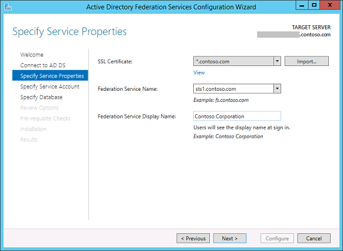
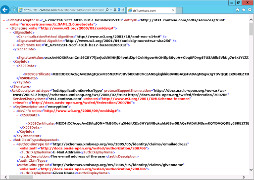

# Deploy and configure AD FS

A variety of identity providers can be used with [!INCLUDE[pn_microsoftcrm_server](../includes/pn-microsoftcrm-server.md)]. This document uses Active Directory Federation Services ([!INCLUDE[pn_adfs_short](../includes/pn-adfs-short.md)]) for the security token service. For information on configuring identity federation deployment between [!INCLUDE[pn_adfs_short](../includes/pn-adfs-short.md)] and other identity providers, see: [AD FS 2.0 Step-by-Step and How To Guides](https://technet.microsoft.com/library/adfs2-step-by-step-guides\(WS.10\).aspx).  
  
> [!IMPORTANT]
>  If you are deploying on [!INCLUDE[pn_windowsserver2012](../includes/pn-windowsserver2012.md)], and you are installing [!INCLUDE[pn_adfs_short](../includes/pn-adfs-short.md)] on the same server as [!INCLUDE[pn_microsoftcrm](../includes/pn-microsoftcrm.md)], [!INCLUDE[pn_adfs_short](../includes/pn-adfs-short.md)] installs on the default website. Before installing [!INCLUDE[pn_adfs_short](../includes/pn-adfs-short.md)], you must create a new website for [!INCLUDE[pn_microsoftcrm_server](../includes/pn-microsoftcrm-server.md)].  
>   
>  This does not apply to [!INCLUDE[pn_windows_server_2012_r2](../includes/pn-windows-server-2012-r2.md)] as [!INCLUDE[pn_adfs_short](../includes/pn-adfs-short.md)] in [!INCLUDE[pn_windows_server_2012_r2](../includes/pn-windows-server-2012-r2.md)] does not depend on IIS.  
  
## Deploy a federation server  
 For information on deploying an [!INCLUDE[pn_adfs_short](../includes/pn-adfs-short.md)] server, see [AD FS Deployment](/windows-server/identity/ad-fs/deployment/ad-fs-deployment-guide).  
  
## Configure AD FS for Windows Server 2012 R2  
 To configure [!INCLUDE[pn_adfs_short](../includes/pn-adfs-short.md)] as a stand-alone federation server for [!INCLUDE[pn_microsoftcrm_server](../includes/pn-microsoftcrm-server.md)] claims authentication, do the following:  
  
1.  Open the [!INCLUDE[pn_windows_server_2012_r2](../includes/pn-windows-server-2012-r2.md)] **Add Roles and Features Wizard** and add the **Active Directory Federation Services** server role.  
  
2.  Proceed through the wizard. Click **Configure the federation service on this server**.  
  
3.  On the **Welcome** page in the Active Directory Federation Services Configuration Wizard, choose an option for a federation server, and then click **Next**.  
  
4.  Proceed through the wizard. On the **Specify Service Properties** page, select your [!INCLUDE[pn_ssl_short](../includes/pn-ssl-short.md)] certificate, enter a **Federation Service Name**, and then enter a **Federation Service Display Name**.  
  
    > [!NOTE]
    >  You only add the federation service name if you are using a wildcard certificate for the [!INCLUDE[pn_adfs_short](../includes/pn-adfs-short.md)] website.  
    >   
    >  If you install [!INCLUDE[pn_adfs_short](../includes/pn-adfs-short.md)] and [!INCLUDE[pn_microsoftcrm_server](../includes/pn-microsoftcrm-server.md)] on the same server, do not use the same URL for the Federation Service name and internal claims access to [!INCLUDE[pn_microsoftcrm_server](../includes/pn-microsoftcrm-server.md)]. For example, if you use sts1.contoso.com for the Federation Service name, do not use https://sts1.contoso.com for internal [!INCLUDE[pn_microsoftcrm](../includes/pn-microsoftcrm.md)] data access.  
  
       
  
5.  Proceed through and complete the **Active Directory Federation Services Configuration Wizard**. Close the **Add Roles and Features Wizard**.  
  
6.  If you have not created a host record in DNS for the federation server name you specified in Step 4 previously, do so now.  
  
 For more information, see [Configure a Federation Server](/previous-versions/windows/it-pro/windows-server-2012-R2-and-2012/dn486807(v=ws.11)).  
  
## Verifying AD FS installation  
 Use the following steps to verify the [!INCLUDE[pn_adfs_short](../includes/pn-adfs-short.md)] installation:  
  
1.  On the [!INCLUDE[pn_adfs_short](../includes/pn-adfs-short.md)] server, open [!INCLUDE[pn_Internet_Explorer](../includes/pn-internet-explorer.md)].  
  
2.  Browse to the URL of the federation metadata. For example, https://sts1.contoso.com/federationmetadata/2007-06/federationmetadata.xml  
  
     You may need to turn on **Compatibility View** in [!INCLUDE[pn_Internet_Explorer](../includes/pn-internet-explorer.md)].  
  
3.  Verify that no certificate-related warnings appear. If necessary, check your certificate and DNS settings.  
  
   
  
## See Also  
 [Implement claims-based authentication: internal access](implement-claims-based-authentication-internal-access.md)

[!INCLUDE[footer-include](../../../includes/footer-banner.md)]
