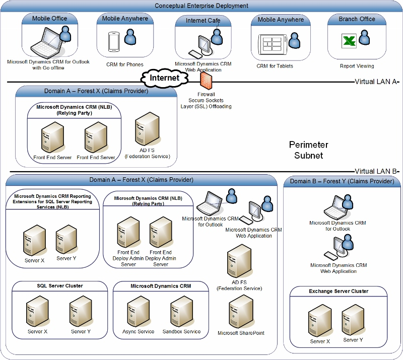

# Support for Dynamics 365 Customer Engagement (on-premises) multiple-server topologies

This section provides examples of various multiple-server topologies.  
  
   
## Five-server topology  
 The five-server topology is for small to midsize user bases, typically 25 or fewer users concurrently using [!INCLUDE[pn_microsoftcrm](../includes/pn-microsoftcrm.md)]. The following example depicts a possible configuration running a supported version of [!INCLUDE[pn_Windows_Server](../includes/pn-windows-server.md)] and the required and optional software technologies. It also includes a Full Server deployment of [!INCLUDE[pn_microsoftcrm_server](../includes/pn-microsoftcrm-server.md)] that is configured for an Internet-facing deployment (IFD). For a complete list of the supported versions of the required and optional technologies, see [Software requirements for Microsoft Dynamics 365 Server](software-requirements-for-microsoft-dynamics-365-server.md).  
  
 A five server topology can consist of the following configuration:  
  
-   Server 1: Running on [!INCLUDE[pn_ms_Windows_Server_long](../includes/pn-ms-windows-server-long.md)] as a functioning domain controller.  
  
-   Server 2: Running on [!INCLUDE[pn_Windows_Server](../includes/pn-windows-server.md)] as a secondary domain controller and [!INCLUDE[pn_Active_Dir_Fed_Svcs_AD_FS](../includes/pn-active-dir-fed-svcs-ad-fs.md)] server.  
  
-   Server 3: Running on [!INCLUDE[pn_Windows_Server](../includes/pn-windows-server.md)] with [!INCLUDE[pn_iis](../includes/pn-iis.md)] and an [!INCLUDE[pn_Active_Dir_Fed_Svcs_AD_FS](../includes/pn-active-dir-fed-svcs-ad-fs.md)] proxy.  
  
-   Server 4: Running on [!INCLUDE[pn_Windows_Server](../includes/pn-windows-server.md)] with an instance of [!INCLUDE[pn_MS_SQL_Server](../includes/pn-ms-sql-server.md)] the includes the database engine, [!INCLUDE[pn_SQL_Server_Reporting](../includes/pn-sql-server-reporting.md)], and [!INCLUDE[pn_CRM_Reporting_Extensions_server_side](../includes/pn-crm-reporting-extensions-server-side.md)].  
  
-   Server 5: Running on [!INCLUDE[pn_Windows_Server](../includes/pn-windows-server.md)], [!INCLUDE[pn_iis](../includes/pn-iis.md)], and a Full Server deployment of [!INCLUDE[pn_microsoftcrm_server](../includes/pn-microsoftcrm-server.md)] configured for [!INCLUDE[pn_Internet_facing_deployment](../includes/pn-internet-facing-deployment.md)].  
  
-   CRMWebClient, CRMforOutlook, tablet, and phone devices: These computers and devices are running applications that are available, connecting from the Internet or the LAN-based network, such as [!INCLUDE[pn_crm_for_outlook_short](../includes/pn-crm-for-outlook-short.md)], [!INCLUDE[pn_moca_full](../includes/pn-moca-full.md)], and [!INCLUDE[pn_Mobile_Express_long](../includes/pn-mobile-express-long.md)].  
 
<!--  
   
  
 Basic [!INCLUDE[pn_microsoftcrm](../includes/pn-microsoftcrm.md)] five-server topology with Internet access example  -->
  
   
## Multi-forest and multi-domain with Internet access Active Directory topology  
 For very large user bases that span multiple domains and, in some cases, forests, the following configuration is supported. The following example depicts a possible configuration running a particular version of [!INCLUDE[pn_Windows_Server](../includes/pn-windows-server.md)] and required software, such as [!INCLUDE[pn_SQL_Server_short](../includes/pn-sql-server-short.md)] and [!INCLUDE[pn_ms_SharePoint_long](../includes/pn-ms-sharepoint-long.md)].  
  
 This example shows a possible deployment that lets users access [!INCLUDE[pn_microsoftcrm](../includes/pn-microsoftcrm.md)] through the Internet by implementing [!INCLUDE[pn_Active_Dir_Fed_Svcs_AD_FS](../includes/pn-active-dir-fed-svcs-ad-fs.md)] supported by [!INCLUDE[Front_End_Server](../includes/front-end-server.md)] roles that are isolated from user and resource domains on a perimeter network (also known as DMZ, demilitarized zone, and screened subnet) model.  
  
 For a complete list of the supported versions of these software technologies, see [Software requirements for Microsoft Dynamics 365 Server](software-requirements-for-microsoft-dynamics-365-server.md).  
  
 **Forest X: Domain A: Perimeter subnet**  
  
-   Network Load Balanced (NLB) virtual server consisting of the following two nodes:  
  
    -   [!INCLUDE[Front_End_Server](../includes/front-end-server.md)]: Running [!INCLUDE[pn_Windows_Server](../includes/pn-windows-server.md)] and [!INCLUDE[pn_microsoftcrm_server](../includes/pn-microsoftcrm-server.md)] with the [!INCLUDE[Front_End_Server](../includes/front-end-server.md)] role.  
  
    -   [!INCLUDE[Front_End_Server](../includes/front-end-server.md)]: Another [!INCLUDE[pn_Windows_Server](../includes/pn-windows-server.md)] running [!INCLUDE[pn_microsoftcrm_server](../includes/pn-microsoftcrm-server.md)] with the [!INCLUDE[Front_End_Server](../includes/front-end-server.md)] role.  
  
    > [!NOTE]
    >  To use [!INCLUDE[pn_microsoftcrm_server](../includes/pn-microsoftcrm-server.md)] with NLB requires manual configuration.  
  
-   [!INCLUDE[pn_Active_Dir_Fed_Svcs_AD_FS](../includes/pn-active-dir-fed-svcs-ad-fs.md)] Server: Running on [!INCLUDE[pn_Windows_Server](../includes/pn-windows-server.md)] as the Internet-facing claims-based authentication security token service.  
  
 **Forest X: Domain A: Intranet**  
  
-   NLB virtual server consisting of the following two nodes:  
  
    -   [!INCLUDE[pn_Windows_Server](../includes/pn-windows-server.md)], [!INCLUDE[pn_SQL_Server_Reporting](../includes/pn-sql-server-reporting.md)], and [!INCLUDE[pn_crm_report_ext_SRS_short](../includes/pn-crm-report-ext-srs-short.md)] (Server X).  
  
    -   [!INCLUDE[pn_Windows_Server](../includes/pn-windows-server.md)], [!INCLUDE[pn_SQL_Server_Reporting](../includes/pn-sql-server-reporting.md)], and [!INCLUDE[pn_crm_report_ext_SRS_short](../includes/pn-crm-report-ext-srs-short.md)] (Server Y).  
  
-   NLB virtual server consisting of the following nodes:  
  
    -   [!INCLUDE[Front_End_Server](../includes/front-end-server.md)] and [!INCLUDE[pn_Deployment_Administration_Server](../includes/pn-deployment-administration-server.md)]: Running [!INCLUDE[pn_Windows_Server](../includes/pn-windows-server.md)] and [!INCLUDE[pn_microsoftcrm_server](../includes/pn-microsoftcrm-server.md)] with the [!INCLUDE[Front_End_Server](../includes/front-end-server.md)] and [!INCLUDE[pn_Deployment_Administration_Server](../includes/pn-deployment-administration-server.md)] roles.  
  
    -   [!INCLUDE[Front_End_Server](../includes/front-end-server.md)] and [!INCLUDE[pn_Deployment_Administration_Server](../includes/pn-deployment-administration-server.md)]: Another [!INCLUDE[pn_Windows_Server](../includes/pn-windows-server.md)] running [!INCLUDE[pn_microsoftcrm_server](../includes/pn-microsoftcrm-server.md)] with the [!INCLUDE[Front_End_Server](../includes/front-end-server.md)] and [!INCLUDE[pn_Deployment_Administration_Server](../includes/pn-deployment-administration-server.md)] roles.  
  <!-- 
    > [!NOTE]
    >  To use [!INCLUDE[pn_microsoftcrm_server](../includes/pn-microsoftcrm-server.md)] with NLB requires manual configuration.  -->
  
-   [!INCLUDE[pn_MS_SQL_Server](../includes/pn-ms-sql-server.md)] failover cluster running the following two nodes:  
  
    -   [!INCLUDE[pn_Windows_Server](../includes/pn-windows-server.md)], [!INCLUDE[pn_SQL_Server_short](../includes/pn-sql-server-short.md)] database engine (Server X).  
  
    -   [!INCLUDE[pn_Windows_Server](../includes/pn-windows-server.md)], [!INCLUDE[pn_SQL_Server_short](../includes/pn-sql-server-short.md)] database engine (Server Y).  
  <!-- 
    > [!NOTE]
    >  To use [!INCLUDE[pn_microsoftcrm_server](../includes/pn-microsoftcrm-server.md)] with [!INCLUDE[pn_SQL_Server_short](../includes/pn-sql-server-short.md)] failover clustering requires manual configuration. [!INCLUDE[proc_more_information](../includes/proc-more-information.md)][Set configuration and organization databases for SQL Server 2012 AlwaysOn failover](configuration-organization-databases-alwayson-failover.md)  -->
  
-   [!INCLUDE[pn_Windows_Server](../includes/pn-windows-server.md)] running the  [!INCLUDE[pn_Asynchronous_Service](../includes/pn-asynchronous-service.md)] server role.  
  
-   [!INCLUDE[pn_Windows_Server](../includes/pn-windows-server.md)] running the  [!INCLUDE[pn_Sandbox_Processing_Service](../includes/pn-sandbox-processing-service.md)] server role.  
  
-   [!INCLUDE[pn_Windows_Server](../includes/pn-windows-server.md)] running the [!INCLUDE[pn_Active_Dir_Fed_Svcs_AD_FS](../includes/pn-active-dir-fed-svcs-ad-fs.md)][!INCLUDE[pn_Windows_Server](../includes/pn-windows-server.md)] role.  
  
-   [!INCLUDE[pn_Windows_Server](../includes/pn-windows-server.md)] running [!INCLUDE[pn_ms_SharePoint_long](../includes/pn-ms-sharepoint-long.md)] (required for document management).  
  
 **Forest Y: Domain B: Intranet**  
  
-   [!INCLUDE[pn_Exchange_Server_short](../includes/pn-exchange-server-short.md)] failover cluster consisting of the following two nodes:  
  
    -   [!INCLUDE[pn_Windows_Server](../includes/pn-windows-server.md)] running [!INCLUDE[pn_Exchange_Server_short](../includes/pn-exchange-server-short.md)] (Server X).  
  
    -   [!INCLUDE[pn_Windows_Server](../includes/pn-windows-server.md)] running [!INCLUDE[pn_Exchange_Server_short](../includes/pn-exchange-server-short.md)] (Server Y).  
 <!--  
   
  
 Multiple forest with Internet access to [!INCLUDE[pn_microsoftcrm](../includes/pn-microsoftcrm.md)] topology example  -->
  
## See Also  
 [Microsoft Dynamics 365 multiple-server deployment](microsoft-dynamics-365-multiple-server-deployment.md)    
 [Upgrading from Microsoft Dynamics CRM](plan-your-upgrade-to-microsoft-dynamics-365-server.md)

[!INCLUDE[footer-include](../../../includes/footer-banner.md)]