# Monitor and troubleshoot Dynamics 365 Customer Engagement (on-premises)

In [!INCLUDE[pn_microsoftcrm](../includes/pn-microsoftcrm.md)], you can create trace files that monitor the actions that are performed by the server and client applications. Trace files are helpful when you have to troubleshoot error messages or other issues in [!INCLUDE[pn_microsoftcrm](../includes/pn-microsoftcrm.md)].  

To enable [!INCLUDE[pn_microsoftcrm_server](../includes/pn-microsoftcrm-server.md)] tracing, you can use deployment-level tracing or server-level tracing. Choosing either method determines the range of server roles monitored, the degree of control, and how to enable tracing and the location of the trace files.  

> [!IMPORTANT]
> Deployment-level tracing isn't supported with Dynamics 365 Customer Engagement (on-premises), version 9.1 or later versions.

Additionally, [!INCLUDE[pn_CRM_Reporting_Extensions_server_side](../includes/pn-crm-reporting-extensions-server-side.md)], [!INCLUDE[pn_crm_for_outlook_short](../includes/pn-crm-for-outlook-short.md)], and [!INCLUDE[pn_moca_full](../includes/pn-moca-full.md)] can be enabled for tracing.

::: moniker range="op-9-0"

<a name="BKMK_deploy-level_tracing"></a>

## Microsoft Dynamics 365 deployment-level tracing (on-premises versions only)

Deployment-level tracing monitors all [!INCLUDE[pn_microsoftcrm](../includes/pn-microsoftcrm.md)] server roles and services, regardless of the server roles installed on the local computer. When deployment-level tracing is enabled, all server roles are monitored such as [!INCLUDE[pn_Asynchronous_Service](../includes/pn-asynchronous-service.md)], [!INCLUDE[pn_Sandbox_Processing_Service](../includes/pn-sandbox-processing-service.md)], Unzip Service, Web application (w3wp), and [!INCLUDE[pn_Deployment_Tools](../includes/pn-deployment-tools.md)] (mmc-Tools). Corresponding trace files are created.  

Deployment-level tracing is set by using [!INCLUDE[pn_PowerShell](../includes/pn-powershell.md)] commands and is maintained in the MSCRM_CONFIG database. Deployment-level tracing can only be enabled from a computer that has the [!INCLUDE[pn_microsoftcrm](../includes/pn-microsoftcrm.md)][!INCLUDE[pn_Deployment_Tools](../includes/pn-deployment-tools.md)] server role.

The trace files are located in a folder on the computer where the [!INCLUDE[pn_microsoftcrm](../includes/pn-microsoftcrm.md)][!INCLUDE[pn_Deployment_Tools](../includes/pn-deployment-tools.md)] server role is running. By default, the location is C:\crmdrop\logs.  
  
> [!CAUTION]
>  Trace files may contain sensitive or personal information. Use discretion when you send trace files to other people, or when you give other people the ability to view the information in a trace file.  
>   
>  When you turn on tracing it can significantly affect performance of the application. We strongly recommend that you only turn on tracing for troubleshooting issues and turn off tracing after the issue is resolved.  
  
> [!IMPORTANT]
>  Before you run [!INCLUDE[pn_microsoftcrm](../includes/pn-microsoftcrm.md)][!INCLUDE[pn_PowerShell](../includes/pn-powershell.md)] commands, the Microsoft.Crm.PowerShell snap-in must be registered by running the `Add-PSSnapin Microsoft.Crm.PowerShell` command.  
>
>  For more information, see [Administer the deployment using Windows PowerShell](administer-the-deployment-using-windows-powershell.md).  
  
> [!TIP]
>  To get a list of the registered [!INCLUDE[pn_PowerShell](../includes/pn-powershell.md)] snap-ins, run the `Get-PsSnapin –registered` command.  
  
### View the current deployment-wide trace settings  
  
```powershell  
Get-CrmSetting TraceSettings   
```  
  
### Enable deployment-wide tracing

To turn on deployment-wide trace settings that record the maximum amount of information, including detailed logging with callstack information, run the following commands, in the order provided, from the [!INCLUDE[pn_PowerShell](../includes/pn-powershell.md)] console on the computer where the [!INCLUDE[pn_Deployment_Tools](../includes/pn-deployment-tools.md)] server role is running. To enable less detailed logging or to change the location of the log files, see [Optional parameters](monitor-and-troubleshoot-dynamics-365.md#optional).  

> [!IMPORTANT]
> Deployment-level tracing isn't supported with Dynamics 365 Customer Engagement (on-premises), version 9.1.5 or later version.

```powershell  
$Setting = Get-CrmSetting TraceSettings$Setting.Enabled = $True $Setting.CallStack=$True$Setting.Categories="*:Verbose"Set-CrmSetting $setting  
```  
  
<a name="optional"></a>

### Optional parameters
  
- **CallStack**. Records callstack information. For detailed troubleshooting, we recommend that you turn this on. By default, this is turned off.  
  
- **Categories**. Indicates the level of detail to record.  
  
  - **Error**. By default, the **Categories** value is **Error**, which is the least detailed and only records errors.  
  
  - **Warning**. Includes warnings and errors.  
  
  - **Info**. Includes warnings, errors, and additional information.  
  
  - **Verbose**. Records the most detailed information.  
  
- **Directory**. Specifies the location of the trace log file. By default, the location is c:\crmdrop\logs.  
  
- **FileSize**. Specifies the maximum file size of the log file in megabytes before information in the trace file is overwritten.  
  
### Disable deployment-level tracing (on-premises versions only)

 To disable tracing, run the following commands, in the order provided, from the [!INCLUDE[pn_PowerShell](../includes/pn-powershell.md)] console on the computer where the [!INCLUDE[pn_Deployment_Tools](../includes/pn-deployment-tools.md)] server role is running.  
  
```powershell  
$Setting = Get-CrmSetting TraceSettings$setting.Enabled = $FalseSet-CrmSetting $setting  
```  
  
Trace files aren’t deleted when tracing is disabled. Additionally, services used by [!INCLUDE[pn_microsoftcrm_server](../includes/pn-microsoftcrm-server.md)] lock open the trace files. Therefore, you may have to restart any [!INCLUDE[pn_microsoftcrm](../includes/pn-microsoftcrm.md)] services and the World Wide Web Publishing Service if these services are running on the computer where you want to delete the trace files.

> [!NOTE]
> If both deployment-level and server-level tracing are enabled on the same computer, only server-level tracing will be used.

::: moniker-end

<a name="BKMKserver-level_tracing"></a>

## Microsoft Dynamics 365 server-level tracing (on-premises versions only)

Server-level tracing only monitors those [!INCLUDE[pn_microsoftcrm](../includes/pn-microsoftcrm.md)] server roles that are running on the local computer where server-level tracing is enabled. When server-level tracing is enabled, trace files that are specific to the [!INCLUDE[pn_microsoftcrm](../includes/pn-microsoftcrm.md)] server roles or services that are running on the local computer are created. Server-level tracing does not require the [!INCLUDE[pn_Deployment_Tools](../includes/pn-deployment-tools.md)] role and can provide a greater degree of control where you can set specific trace values such as what [!INCLUDE[pn_microsoftcrm](../includes/pn-microsoftcrm.md)] features to trace or the maximum trace file size.  
  
For more information about setting server-level tracing properties in [!INCLUDE[pn_microsoftcrm](../includes/pn-microsoftcrm.md)], see [How to enable tracing in Microsoft Dynamics CRM](https://support.microsoft.com/kb/907490).  
  
Server-level tracing must be manually set in the [!INCLUDE[pn_Windows_registry](../includes/pn-windows-registry.md)] on the computer where one or more [!INCLUDE[pn_microsoftcrm](../includes/pn-microsoftcrm.md)] server roles are running.  
  
The server-level tracing files are located in the **Traces** folder of the [!INCLUDE[pn_microsoftcrm](../includes/pn-microsoftcrm.md)] installation folder. By default, the location is C:\Program Files\Microsoft Dynamics CRM\Trace.  
  
### Enable or disable server-level tracing  
  
> [!CAUTION]
> Trace files may contain sensitive or personal information. Use discretion when you send trace files to other people, or when you give other people the ability to view the information that a trace file contains.  
>
> When you turn on tracing it can significantly affect performance of the application. We strongly recommend that you only turn on tracing for troubleshooting issues and turn off tracing after the issue is resolved.  
  
> [!CAUTION]
> This task contains steps that tell you how to modify the registry. However, serious problems might occur if you modify the registry incorrectly. Therefore, make sure that you follow these steps carefully. For added protection, back up the registry before you modify it. Then, you can restore the registry if a problem occurs. For more information about how to back up and restore the registry, see: [How to back up and restore the registry in Windows](https://support.microsoft.com/kb/322756).  
  
 On the [!INCLUDE[pn_microsoftcrm_server](../includes/pn-microsoftcrm-server.md)] that you want to turn on server-level tracing, start RegEdit and locate the following registry location: `HKEY_LOCAL_MACHINE\SOFTWARE\MICROSOFT\MSCRM`  
  
 Create the following two required new values.  
  
|Value name|Type|Value|  
|----------------|----------|-----------|  
|TraceEnabled|DWORD (32-bit)|0 or 1<br /><br /> If you use a value of 0, tracing is disabled. If you use a value of 1, tracing is enabled.|  
|TraceRefresh|DWORD (32-bit)|A number between zero and 99<br /><br /> This value must change for [!INCLUDE[pn_microsoftcrm](../includes/pn-microsoftcrm.md)] to detect a change to any of the other trace values in the [!INCLUDE[pn_Windows_registry](../includes/pn-windows-registry.md)]. For example, if the value is 2, you can set it to 1 so that other trace values changes, such as a change to TraceCategories, will be applied.|  
  
<a name="BKMK_EnableTracing"></a>   
## Enable tracing for Microsoft Dynamics 365 Reporting Extensions for SQL Server Reporting Services (on-premises versions only)  
 In [!INCLUDE[pn_microsoftcrm](../includes/pn-microsoftcrm.md)], you can create trace files that monitor the actions that are performed by [!INCLUDE[pn_CRM_Reporting_Extensions_server_side](../includes/pn-crm-reporting-extensions-server-side.md)]. Trace files are helpful when you have to troubleshoot error messages or other issues in [!INCLUDE[pn_CRM_Reporting_Extensions_server_side](../includes/pn-crm-reporting-extensions-server-side.md)].  
  
> [!CAUTION]
> Trace files may contain sensitive or personal information. Use discretion when you send trace files to other people, or when you give others the ability to view the information that a trace file contains.  
>
> When you turn on tracing it can significantly affect performance of the application. We strongly recommend that you only turn on tracing for troubleshooting issues and turn off tracing after the issue is resolved.  
  
 You can enable tracing for [!INCLUDE[pn_CRM_Reporting_Extensions_server_side](../includes/pn-crm-reporting-extensions-server-side.md)] in two ways:  
  
 [Enable tracing using registry values](monitor-and-troubleshoot-dynamics-365.md#registry)  
  
 [Enable tracing using deployment properties](monitor-and-troubleshoot-dynamics-365.md#deployment_properties)  
  
> [!IMPORTANT]
>  Traces will not be generated if the folder specified in **TraceDirectory** does not exist.  
  
<a name="registry"></a>

### Enable tracing using registry values
  
> [!CAUTION]
> This task contains steps that tell you how to modify the registry. However, serious problems might occur if you modify the registry incorrectly. Therefore, make sure that you follow these steps carefully. For added protection, back up the registry before you modify it. Then, you can restore the registry if a problem occurs. For more information about how to back up and restore the registry, see: [How to back up and restore the registry in Windows](https://support.microsoft.com/kb/322756).  
  
1. On the computer where you have installed [!INCLUDE[pn_CRM_Reporting_Extensions_server_side](../includes/pn-crm-reporting-extensions-server-side.md)], locate and then select the following registry subkey: `HKEY_LOCAL_MACHINE\SOFTWARE\MICROSOFT\MSCRM`  
  
2. Set the following registry values:  
  
   - TraceEnabled = 1  
  
   - TraceDirectory = \<*directory path where traces will be stored*>  
  
   You can also set other row values like **TraceCategories**, but they already have defaults.  
  
3.  Restart [!INCLUDE[pn_SQL_Server_Reporting](../includes/pn-sql-server-reporting.md)].  
  
<a name="deployment_properties"></a>   
### Enable tracing using deployment properties  
  
1.  Go to the **DeploymentProperties** table in the Configuration Database.  
  
2.  Locate the row with the value "TraceEnabled" and set its "BitColumn" column’s value to "True".  
  
   Other row values like **TraceCategories**, **TraceDirectory** already have default values, but you can change these values.  
  
   You’ll start seeing the traces in the directory specified in the TraceDirectory row in the **DeploymentProperties** table.  
  
3.  Restart [!INCLUDE[pn_SQL_Server_Reporting](../includes/pn-sql-server-reporting.md)].  
  
Registry settings take precedence over deployment properties. If there are any invalid entries in the registry, for example, and **TraceDirectory** does not exist, the deployment properties are used.  
  
<a name="BKMK_OC_client_tracing"></a>

## Enable tracing for Microsoft Dynamics 365 for Outlook

 This section applies to [!INCLUDE[pn_CRM_Online](../includes/pn-crm-online.md)] and on-premises versions of [!INCLUDE[pn_microsoftcrm](../includes/pn-microsoftcrm.md)]. [!INCLUDE[pn_crm_for_outlook_short](../includes/pn-crm-for-outlook-short.md)] tracing monitors the instance of [!INCLUDE[pn_crm_for_outlook_short](../includes/pn-crm-for-outlook-short.md)] that is running on the local computer. If an issue is isolated to a particular user running [!INCLUDE[pn_crm_for_outlook_short](../includes/pn-crm-for-outlook-short.md)], enabling [!INCLUDE[pn_crm_for_outlook_short](../includes/pn-crm-for-outlook-short.md)] tracing can help determine the cause.  
  
 The [!INCLUDE[pn_crm_for_outlook_short](../includes/pn-crm-for-outlook-short.md)] tracing files are located in the C:\Users\\<username\>\AppData\Local\Microsoft\MSCRM\Traces folder.  
  
> [!CAUTION]
>  Trace files may contain sensitive or personal information. Use discretion when you send trace files to other people, or when you give other people the ability to view the information that a trace file contains.  
>   
>  When you turn on tracing it can significantly affect performance of the application. We strongly recommend that you only turn on tracing for troubleshooting issues and turn off tracing after the issue is resolved.  
  
### Enable or disable tracing for Microsoft Dynamics 365 for Outlook  
  
1.  On the computer running [!INCLUDE[pn_crm_for_outlook_short](../includes/pn-crm-for-outlook-short.md)], select **Start**, select **All Programs**, select **Microsoft Dynamics 365**, and then select **Diagnostics**.  
  
2.  Select the **Advanced Troubleshooting** tab, and then select **Tracing** to enable or select to clear **Tracing** to disable.  
  
3.  Select a Tracking level from the drop-down list.  
  
4.  Select **Save**.  
  
 You can reduce the amount of information during the trace by setting the `TraceCategories`[!INCLUDE[pn_Windows_registry](../includes/pn-windows-registry.md)] value. For example, you can set the value so that only error messages are recorded. Reducing the amount of logging can be helpful when you troubleshoot specific issues, such as when you receive error messages going offline. To do this, follow these steps.  
  
> [!CAUTION]
>  Turning on verbose tracing during process intense actions such as [!INCLUDE[pn_Outlook_short](../includes/pn-outlook-short.md)] startup, or going online and offline with [!INCLUDE[pn_crm_for_outlook_short](../includes/pn-crm-for-outlook-short.md)], is not recommended and could result in stability issues with [!INCLUDE[pn_crm_for_outlook_short](../includes/pn-crm-for-outlook-short.md)].  
>   
>  This task contains steps that tell you how to modify the registry. However, serious problems might occur if you modify the registry incorrectly. Therefore, make sure that you follow these steps carefully. For added protection, back up the registry before you modify it. Then, you can restore the registry if a problem occurs. For more information about how to back up and restore the registry, see [How to back up and restore the registry in Windows](https://support.microsoft.com/kb/322756).  
  
Notice that tracing must already be enabled for the following steps to work.  
  
1.  On the computer where you have installed [!INCLUDE[pn_crm_for_outlook_short](../includes/pn-crm-for-outlook-short.md)] start RegEdit and locate and then select the following registry subkey: HKEY_CURRENT_USER\Software\Microsoft\MSCRMClient.  
  
2.  If the TraceCategories string value does not exist add it. To do this, right-click **MSCRMClient**, select **New**, select **String Value**, type `TraceCategories` and then press ENTER.  
  
3.  Right-click **TraceCategories**, select **Modify**, type `Application.Outlook:Error`, and then select **OK**.  
  
 For more information about the values available for TraceCategories, see [How to enable tracing in Microsoft Dynamics CRM](https://support.microsoft.com/kb/907490).  
  
 Trace files are not deleted when tracing is disabled.  
  
<a name="BKMK_emailrouter_tracing"></a>   
## Enable tracing for Microsoft Dynamics 365 Email Router  
 This section applies to [!INCLUDE[pn_CRM_Online](../includes/pn-crm-online.md)] and on-premises versions of [!INCLUDE[pn_microsoftcrm](../includes/pn-microsoftcrm.md)]. [!INCLUDE[pn_CRM_E-Mail_Router](../includes/pn-crm-e-mail-router.md)] tracing monitors the [!INCLUDE[pn_emailrouter](../includes/pn-emailrouter.md)] service that is running on the local computer.  
  
#### Enable or disable tracing for Microsoft Dynamics 365 Email Router
  
1. On the computer where the [!INCLUDE[pn_CRM_E-Mail_Router](../includes/pn-crm-e-mail-router.md)] service (Microsoft Dynamics 365 Email Router) is running, open Microsoft.Crm.Tools.EmailAgent.xml using an XML or text editor. By default, Microsoft.Crm.Tools.EmailAgent.xml is located in the \<drive>:\Program Files\Microsoft CRM Email\Service folder.  
  
2. Add the following entries between the `<SystemConfiguration>` parent elements:  
  
     <`LogLevel`>*Level*</`LogLevel`>  
     Specifies the logging level. Acceptable values for *Level* are 0, 1, 2, or 3.  
  
   - 0. No logging. By default, logging is set to 0.  
  
   - 1. Error logging only.  
  
   - 2. Detailed information logging at the mailbox level.  
  
   - 3. Very detailed information logging at the message level.  
  
     <`LogFile`>*Path\Logfilename*</`LogFile`>  
     Specifies the full path of the location to the log file.  
  
3. Restart the [!INCLUDE[pn_emailrouter](../includes/pn-emailrouter.md)] service.  
  
### Sample Microsoft.Crm.Tools.EmailAgent.xml

The following Microsoft.Crm.Tools.EmailAgent.xml file sets the logging at level 1 and places the log file at c:\emailRouterLog.txt.  
  
```xml  
<?xml version="1.0" encoding="utf-8"?>  
<Configuration>  
<SystemConfiguration>  
<MaxThreads>50</MaxThreads>  
<MaxThreadExecution>600000</MaxThreadExecution>  
<SchedulingPeriod>1000</SchedulingPeriod>  
<ConfigRefreshPeriod>5000</ConfigRefreshPeriod>  
<ConfigUpdatePeriod>3600000</ConfigUpdatePeriod>  
<LogLevel>1</LogLevel>  
<LogFile>c:\emailRouterLog.txt</LogFile>  
<ProviderOverrides>  
<CacheCapacity>1024</CacheCapacity>  
<PendingStatusDelay>300000</PendingStatusDelay>  
<SendingStatusDelay>1800000</SendingStatusDelay>  
<MaximumDeliveryAttempts>10</MaximumDeliveryAttempts>  
<EWSRetrieveMessageCount>10</EWSRetrieveMessageCount>  
<BatchSize>5</BatchSize>  
<RequestBatchSize>5</RequestBatchSize>  
</ProviderOverrides>  
</SystemConfiguration>  
</Configuration>  
```  

<a name="BKMK_MoCA_tracing"></a>

## Enable tracing for Dynamics 365 for tablets

You can enable tracing in the [!INCLUDE[pn_moca_full](../includes/pn-moca-full.md)] app to diagnose issues. When you enable tracing, verbose information is recorded on the device. This information can be analyzed to help identify the source of an issue. The way to enable and view tracing differs depending on the tablet operating system.  
  
### Windows

Follow these steps to view events. Tracing is enabled by default.  
  
1. Open the [!INCLUDE[pn_Event_Viewer](../includes/pn-event-viewer.md)]. To do this, go to the Start screen, type `Run`, and then press or tap **ENTER**. In the Run box type `eventvwr`, and then press or tap **ENTER**.  
  
1. Select the **AppHost** folder under Application And Services Logs\Microsoft\Windows  
  
1. From the **View** menu, select **Show Analytic and Debug Logs**.  
  
     
  
1. Additional nodes will appear under the **AppHost** folder.  
  
   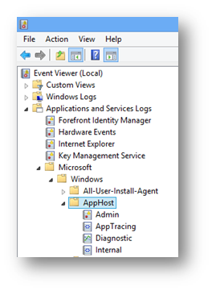  
  
1. Right-click (press and hold) the **AppTracing** node and then select **Enable Log**.  
  
   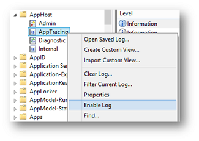  
  
1. Select **OK** to agree to the following warning.  
  
   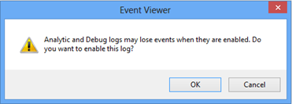  
  
1. After reproducing the issue, right-click (press and hold) **AppTracing** and then click or tap **Disable Log**.  
  
  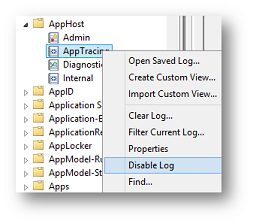  
  
1. Refresh the Event Viewer to view log events. You can use **F5** or right-click (press and hold) **AppTracing** and then select **Refresh**.  
  
  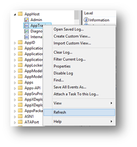  
  
1. Review the details of events that are logged. Look for entries containing “Dynamics 365” in the field under the **General** tab.  
  
  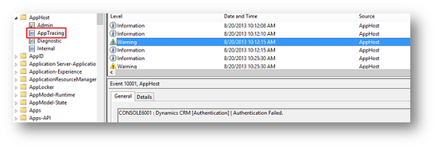  

  > [!TIP]
  > You can right-click (press and hold) **AppTracing** and then select **Find** to initiate a find. Then search for any events containing a word such as “Dynamics 365.” Ctrl + F is the keyboard shortcut.  
  
1. Also check the events logged under **Admin**.  
  
  To save an event log, right-click (press and hold) the log and select **Save All Events As**. Specify the directory where you want to save the log file.  
  
  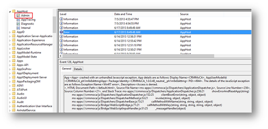  
  
### iPad

Follow these steps to set up and view logging on the [!INCLUDE[tn_ipad](../includes/tn-ipad.md)].  
  
##### Enable logging on the iPad  
  
1.  Open **Settings**.  
  
     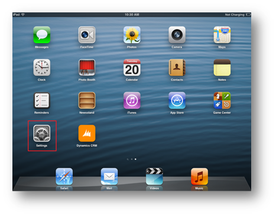  
  
2.  Select **Dynamics 365** from the Settings list.  
  
       
  
3.  The **Enable Logging** option is set to **OFF** by default.  Toggle this option to switch the setting to **ON**.  
  
     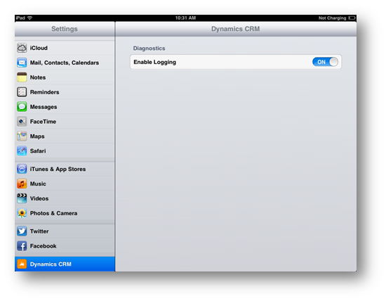  
  
4.  After reproducing the issue, toggle the **Enable Logging** setting to **OFF**.  
  
       
  
##### View the iPad log files  
  
1.  Connect your [!INCLUDE[tn_ipad](../includes/tn-ipad.md)] to your computer.  
  
2.  Open iTunes.  
  
3.  Select your device from the Devices section.  
  
     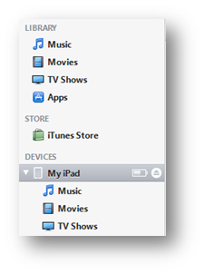  
  
4.  Select the Apps area from the header.  
  
       
  
5.  Locate the File Sharing section and select the Dynamics 365 app.  
  
       
  
     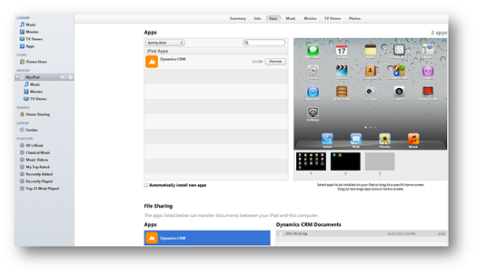  
  
6.  On the right-side column you should see a list of log files if logging was enabled for the app. Select a log file, press **Save to**, and then choose a location to save the log file.  
  
     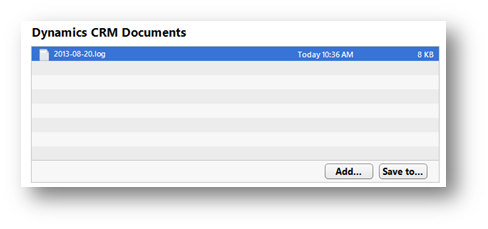  
  
7.  Locate the log file you saved and open it to view the log details.  
  
### Android  
 On an [!INCLUDE[tn_android](../includes/tn-android.md)] device, you can enable logging during or after configuration.  
  
-   If you’re setting up [!INCLUDE[pn_moca_short](../includes/pn-moca-short.md)], see **Enable logging on the setup page**.  
  
-   If you have already configured [!INCLUDE[pn_moca_short](../includes/pn-moca-short.md)] and encounter an error post configuration, you need to sign out or reconfigure to enable logging.  See **Enable logging after configuration**.  
  
> [!NOTE]
>  By default, logging is disabled. If you enable logging and close and reopen [!INCLUDE[pn_crm_shortest](../includes/pn-crm-shortest.md)], logging will be disabled,  
  
##### Enable logging on the setup page  
  
1.  On the setup page for [!INCLUDE[pn_moca_short](../includes/pn-moca-short.md)], tap the ellipses (…) to display the option to enable logging.  
  
       
  
2.  Tap the **Enable Logging** checkbox.  
  
##### Enable logging after configuration  
  
1.  Open the [!INCLUDE[pn_moca_CRM_Android](../includes/pn-moca-crm-android.md)] app.  
  
2.  While on the dashboard, tap the ellipses (…) in the bottom-right corner to display the command bar.  
  
       
  
3.  Tap **Settings**, and then tap **Sign out**.  
  
4.  On the sign-in page, tap the back button to go to the set up page.  
  
5.  On the setup page for [!INCLUDE[pn_moca_short](../includes/pn-moca-short.md)], tap the ellipses (…) to display the option to enable logging.  
  
       
  
6.  Tap the **Enable Logging** check box.  
  
##### View the Android log files  
  
1.  Logging is written to a log file in the MSCRM folder in the root directory of your device. You can connect your tablet to your computer with USB to browse the file system. You can also use other company’s [!INCLUDE[tn_android](../includes/tn-android.md)] apps to view the file system.  
  
2.  Open the MSCRM folder, then select and view the log file.  
  
     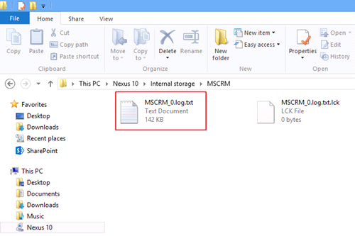  
  
### Sample log  
 The following example shows you what you might see in a log file.  
  
```Output  
2013-08-20 15:33:23 +0000 [INFO]: Unique install id | 5FDD3711-9E89-4D8B-B835-88B2C7C51703 2013-08-20 15:33:23 +0000 [INFO]: Application activated 2013-08-20 15:33:24 +0000 [INFO]: Application resume 2013-08-20 15:33:25 +0000 [ERROR]: App WebView Load failed | -1003 2013-08-20 15:33:32 +0000 [INFO]: [PAL] | Authentication: Starting 2013-08-20 15:33:32 +0000 [INFO]: [PAL] | Authentication: Starting authorization 2013-08-20 15:33:32 +0000 [INFO]: [PAL] | Authentication: Authorization error: -2147093999 2013-08-20 15:33:39 +0000 [INFO]: [PAL] | Authentication: Starting 2013-08-20 15:33:39 +0000 [INFO]: [PAL] | Authentication: Starting authorization 2013-08-20 15:33:39 +0000 [INFO]: [PAL] | Authentication: Authorization error: -2147093999 2013-08-20 15:33:42 +0000 [INFO]: Application Pause 2013-08-20 15:34:27 +0000 [INFO]: Unique install id | 5FDD3711-9E89-4D8B-B835-88B2C7C51703 2013-08-20 15:34:27 +0000 [INFO]: Application activated 2013-08-20 15:34:27 +0000 [INFO]: Application resume 2013-08-20 15:34:27 +0000 [INFO]: [PAL] | Authentication: Failed - cookie setup 2013-08-20 15:34:28 +0000 [INFO]: [PAL] | Authentication: Complete 2013-08-20 15:34:30 +0000 [INFO]: [PAL] | Authentication: Starting 2013-08-20 15:34:30 +0000 [INFO]: [PAL] | Authentication: Starting authorization 2013-08-20 15:34:30 +0000 [INFO]: [PAL] | Authentication: Authorization complete 2013-08-20 15:34:30 +0000 [INFO]: [PAL] | Authentication: Complete 2013-08-20 15:34:31 +0000 [INFO]: [PAL] | Error Messages: 1: Principal user (Id=d0961fb9-0f09-e311-b8aa-00155d05381a, type=8) is missing prvReadAccount privilege (Id=886b280c-6396-4d56-a0a3-2c1b0a50ceb0)2: Principal user (Id=d0961fb9-0f09-e311-b8aa-00155d05381a, type=8) is missing prvReadAccount privilege (Id=886b280c-6396-4d56-a0a3-2c1b0a50ceb0)2013-08-20 15:36:30 +0000 [INFO]: Application Pause  
```  

## See also

 [Operating Microsoft Dynamics 365](operating-microsoft-dynamics-365.md) </br>
 [Known issues for Dynamics 365 for tablets and phones](../../../mobile-app/troubleshooting-things-know-about-phones-tablets.md) </br>  
 [Dynamics 365 PowerShell Reference](/powershell/dynamics365/customer-engagement/overview)


[!INCLUDE[footer-include](../../../includes/footer-banner.md)]
