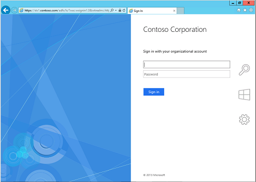

# Test external claims-based authentication

You should now be able to access [!INCLUDE[pn_microsoftcrm_server](../includes/pn-microsoftcrm-server.md)] externally using claims authentication. Browse to your [!INCLUDE[pn_microsoftcrm](../includes/pn-microsoftcrm.md)] website's external address (for example: https://orgname.contoso.com). You should see a screen like the following:  
  
   
  
 Sign in and verify that you have external access to [!INCLUDE[pn_microsoftcrm_server](../includes/pn-microsoftcrm-server.md)].  
  
> [!NOTE]
>  You might need to add the external access website as a trusted site. Use the wild card designator (for example: https://*.contoso.com).  
  
## See Also  
 [Implement claims-based authentication: external access](implement-claims-based-authentication-external-access.md)

[!INCLUDE[footer-include](../../../includes/footer-banner.md)]