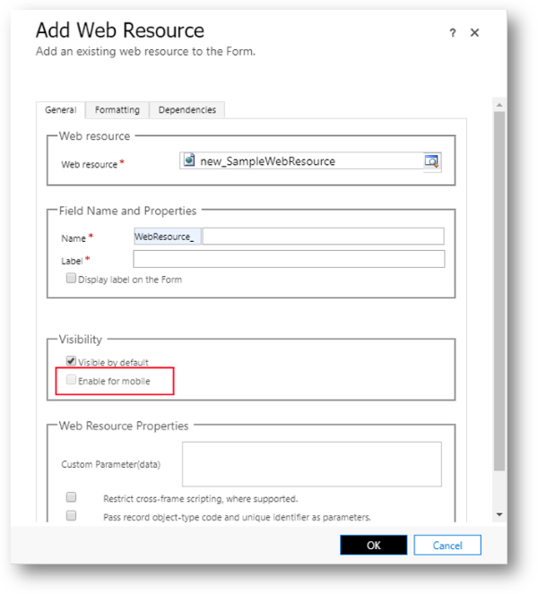

# Create web resources and IFrame content for use with the Dynamics 365 Customer Engagement (on-premises) for mobile clients

> [!NOTE]
> - The capability to display web resources and Iframes in phone clients was introduced in [!INCLUDE[../includes/pn-crm-9-0-0-online.md](../includes/pn-crm-9-0-0-online.md)].
> - The capability to display web resources and iframes in tablet clients was introdced in Dynamics CRM Online 2016 Update and CRM 2016 (on-premises).

You can create web resources and IFrames to use with mobile (tablet and phone) clients in all the client forms: iOS, [!INCLUDE[tn_android](../includes/tn-android.md)], and [!INCLUDE[pn_windows_10](../includes/pn-windows-10.md)]. 
  
 You can configure IFrames and web resources in forms and dashboards in the [!INCLUDE[pn_microsoftcrm](../includes/pn-microsoftcrm.md)] web app, which can be configured to display in mobile clients.  
  
   

## Configure a web resource to be displayed in mobile clients  

To use this feature, you can enable **Webpage (HTML)** and image types of web resources by selecting the **Enable for mobile** check box in the web resource form. The `WebResource.IsEnabledForMobileClient` attribute stores this data.  

Additionally, for these types of web resources, you can select the **Available Offline** check box to make a web resource available to users of mobile clients while working in the offline mode. The `WebResource.IsAvailableForMobileOffline` attribute stores this data.  

  

> [!NOTE]
> If your **Webpage (HTML)** web resources reference on any other type of web resource which is not enabled for offline use, you must set those web resources as dependences for the HTML web resource so that they will be enabled for use offline. More information: [Web resource dependencies](web-resource-dependencies.md)
  

## Configure a form or dashboard IFrame or web resource control to display in Dynamics 365 Customer Engagement (on-premises) for mobile clients  

When you add an IFrame or a web resource to a form or dashboard, you must select the **Enable for mobile** check box in the **Add Web Resource** dialog box. 
 This sets the `<ShowOnMobileClient>` parameter value for the control.  
  
   
  

## Known issues  

 These are some known issues with IFrames and web resources for mobile clients:  
  
- You can’t use popups for authentication or other purposes from within IFrames and web resources on mobile clients.    
- Authentication for embedded [!INCLUDE[pn_Office_365](../includes/pn-office-365.md)] sites isn’t available.    
- Errors and memory leaks in IFrames and web resources can cause mobile clients to malfunction and can cause client-side data loss.    
- [!INCLUDE[pn_MS_Silverlight_full](../includes/pn-ms-silverlight-full.md)] web resources aren’t available on mobile clients.  
  
### See also

[Web resources for Dynamics 365 Customer Engagement (on-premises)](web-resources.md) 
[Create accessible web resources](create-accessible-web-resources.md) 
[Create web resources and IFrame content for use with the Dynamics 365 Customer Engagement (on-premises) for mobile clients](create-web-resources-iframe-mobile.md) 
[Web resource dependencies](web-resource-dependencies.md) 
[Webpage (HTML) web resources](webpage-html-web-resources.md) 
[Silverlight (XAP) web resources](silverlight-xap-web-resources.md) 
[Script (JScript) web resources](script-jscript-web-resources.md) 
[Image web resources](image-web-resources.md) 
[Stylesheet (XSL) web resources](stylesheet-xsl-web-resources.md) 
[Data (XML) Web resources](data-xml-web-resources.md) 
[CSS web resources](css-web-resources.md) 
[RESX web resources](resx-web-resources.md) 
[WebResource entity messages and methods](webresource-entity-messages-methods.md) 
[Sample: Pass multiple values to a  web resource through the data parameter](sample-pass-multiple-values-web-resource-through-data-parameter.md) 
[Sample: Import files as web resources](sample-import-files-web-resources.md) 
[Sample: Web resource utility](sample-web-resource-utility.md)  
[iFrame and web resource support in Dynamics 365 for tablets](../customize/iframe-web-resource-support-dynamics-365-phones-tablets.md) 
