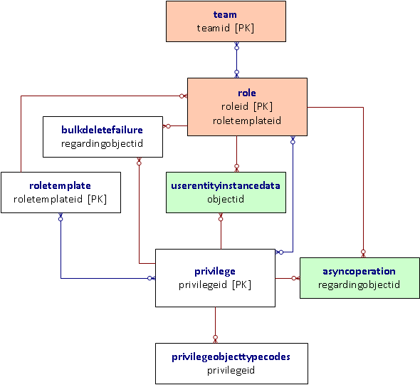

# Privilege and role entities

A *privilege* is a permission to perform an action on a specific entity type in [!INCLUDE[pn_microsoftcrm](../includes/pn-microsoftcrm.md)]. The platform checks for the privilege and fails if the user does not hold the privilege. A privilege has an associated access level that determines the depth within the organization to which the privilege applies.  
  
 A *role*, or security role, is a grouping of security privileges. Users are assigned roles that authorize their access to [!INCLUDE[pn_crm_shortest](../includes/pn-crm-shortest.md)]. A user must be assigned to at least one role. It isn’t sufficient to be a member of a team that has an assigned role.  
  
 For more information about access levels and roles, see [How Role-Based Security Can Be Used to Control Access to Entities In Dynamics 365 Customer Engagement (on-premises)](security-dev/how-role-based-security-control-access-entities.md).  
  
 The following illustration shows the entity relationships for this area. [!INCLUDE[proc_more_information](../includes/proc-more-information.md)] [Key to Entity Diagrams](key-entity-diagrams.md)  
  
   
  
### See also  
 [Role Entity](entities/role.md)   
 [Privilege Entity](entities/privilege.md)   
 [Sample: Assign a Security Role to Team](sample-associate-security-role-team.md)   
 [Sample: Associate a Security Role to a User](sample-associate-security-role-user.md)   
 [Sample: Determine Whether a User has a Role](sample-determine-user-role.md)   
 [Sample: Remove a Role for a User](sample-remove-role-user.md)   
 [Sample: Retrieve the Roles for an Organization](sample-retrieve-roles-organization.md)   
 [Administration and Security Entities](administration-security-entities.md)
