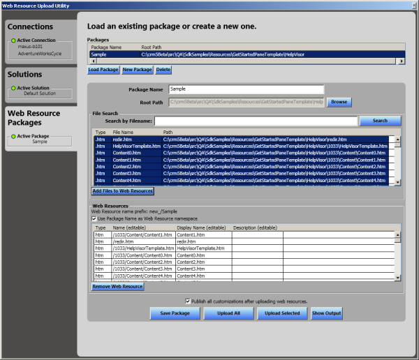

# Sample: Web resource utility

Manually creating Web resources one at a time using the customization tools can take a long time when you have to create many files. The Web Resource Utility is a WPF application project that you can compile and run to import many Web Resource eligible files from a folder structure with a consistent naming convention based on the folder structure.  
  
 Download the complete sample from here [Web Resource Utility sample](https://code.msdn.microsoft.com/Web-Resource-Utility-sample-eb3771e9). 

## Prerequisites
[!INCLUDE[sdk-prerequisite](../includes/sdk-prerequisite.md)]
  
## Requirements  
 For more information, see the Readme.docx file.  
  
 The solution must be built in [!INCLUDE[pn_Visual_Studio](../includes/pn-visual-studio.md)] before running. Double-click the **WebResourceUtility.sln** to open the source code in [!INCLUDE[pn_Visual_Studio](../includes/pn-visual-studio.md)]. Open and view the Solution Explorer.  
  
 This solution uses linked files and requires access to the following files in order to compile: 
  
> [!NOTE]
>  You may need to manually update the links for the files before trying to build the solution or you may experience compilation errors.
  
## Demonstrates  
 In addition to creating and updating Web Resources, the Web Resource Utility code demonstrates several applications of the [!INCLUDE[pn_dynamics_crm_online](../includes/pn-dynamics-crm-online.md)] APIs:  
  
 **Managing connections**  
 The Web Resource Utility preserves connections to multiple [!INCLUDE[pn_dynamics_crm_online](../includes/pn-dynamics-crm-online.md)] servers so the user doesn’t need to enter connection information each time.  
  
 **Retrieving data about solutions**  
 The Web Resource Utility retrieves data about available unmanaged solutions and creates Web Resources using the customization prefix defined by the publisher of the solution.  
  
## Web Resource Utility  
 The following screenshot shows the Web Resource Utility user interface:  
  
   
  
### See also  
 [Sample: Importing Files as Web Resources](sample-import-files-web-resources.md)   
 [Web Resource Messages and Methods](webresource-entity-messages-methods.md)   
 [Web Resources for Dynamics 365 Customer Engagement (on-premises)](web-resources.md)   
 [Streamline web resource development using Fiddler AutoResponder](streamline-javascript-development-fiddler-autoresponder.md)
