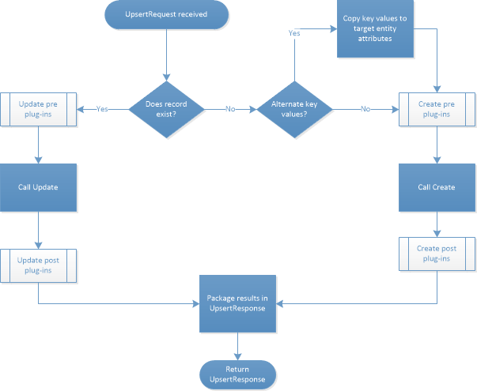

# Use Upsert to insert or update a record

You can reduce the complexity involved with data integration scenarios by using the <xref:Microsoft.Xrm.Sdk.Messages.UpsertRequest> message. When loading data into Dynamics 365 Customer Engagement (on-premises) from an external system, for example in a bulk data integration scenario, you may not know if a record already exists in [!INCLUDE[pn_crm_shortest](../includes/pn-crm-shortest.md)]. In such cases you won’t know if you should call an <xref:Microsoft.Xrm.Sdk.Messages.UpdateRequest> or a <xref:Microsoft.Xrm.Sdk.Messages.CreateRequest> operation. This results in your querying for the record first to determine if it exists before performing the appropriate operation. You can now reduce this complexity and load data into [!INCLUDE[pn_crm_shortest](../includes/pn-crm-shortest.md)] more efficiently by using the new <xref:Microsoft.Xrm.Sdk.Messages.UpsertRequest> (Update or Insert) message.  
  
   
## Using Upsert  
 It is best to use <xref:Microsoft.Xrm.Sdk.Messages.UpsertRequest> only when you aren’t sure if the record exists. That is, when you aren’t sure if you should call a <xref:Microsoft.Xrm.Sdk.Messages.CreateRequest> or an <xref:Microsoft.Xrm.Sdk.Messages.UpdateRequest> operation. There is a performance decrease in using <xref:Microsoft.Xrm.Sdk.Messages.UpsertRequest> versus using <xref:Microsoft.Xrm.Sdk.Messages.CreateRequest>. If you are sure the record doesn’t exist, use <xref:Microsoft.Xrm.Sdk.Messages.CreateRequest>.  
  
 The <xref:Microsoft.Xrm.Sdk.Messages.UpsertRequest> includes a property named <xref:Microsoft.Xrm.Sdk.Messages.UpsertRequest.Target>. This property contains the entity definition that will be used in an <xref:Microsoft.Xrm.Sdk.Messages.UpdateRequest> or a <xref:Microsoft.Xrm.Sdk.Messages.CreateRequest> operation. It also includes all the attributes required by the <xref:Microsoft.Xrm.Sdk.Messages.CreateRequest> for the target entity type so that the record can be created if it doesn’t exist.  
  
 You can inspect <xref:Microsoft.Xrm.Sdk.Messages.UpsertResponse.RecordCreated> to determine if the record was created. <xref:Microsoft.Xrm.Sdk.Messages.UpsertResponse.RecordCreated> will be true if the record didn’t exist and was created. It will be false if the record already existed and was updated. <xref:Microsoft.Xrm.Sdk.Messages.UpsertResponse.Target> will be an `EntityReference` to the record that was found to exist or to the record that was created.  
  
 To understand how <xref:Microsoft.Xrm.Sdk.Messages.UpsertRequest> works, see the following section.  
  
   
## Understanding the Upsert process  
 The following steps describe the processing logic when an <xref:Microsoft.Xrm.Sdk.Messages.UpsertRequest> is received:  
  
1. Send <xref:Microsoft.Xrm.Sdk.Messages.UpsertRequest> with enough data for a create or insert operation.  
  
2. Dynamics 365 Customer Engagement (on-premises) will look up the record targeted by the target entity.  
  
3. If the record exists:  
  
   1.  Set the ID property of the target entity with the ID of the found record.  
  
   2.  Call Update.  
  
   3.  Set the <xref:Microsoft.Xrm.Sdk.Messages.UpsertResponse.RecordCreated> to `false`.  
  
   4.  Create an <xref:Microsoft.Xrm.Sdk.EntityReference> from the target entity of the update as the value for <xref:Microsoft.Xrm.Sdk.Messages.UpsertResponse.Target>.  
  
   5.  Return the <xref:Microsoft.Xrm.Sdk.Messages.UpsertResponse>.  
  
4. If the record doesn’t exist:  
  
   1.  Copy any alternate key values into the target entity attributes.  
  
   2.  Call `Create`.  
  
   3.  Set the <xref:Microsoft.Xrm.Sdk.Messages.UpsertResponse.RecordCreated> to `true`.  
  
   4.  Create an <xref:Microsoft.Xrm.Sdk.EntityReference> from the target entity type and the ID result of the `Create` request as the value for <xref:Microsoft.Xrm.Sdk.Messages.UpsertResponse.Target>.  
  
   5.  Return the <xref:Microsoft.Xrm.Sdk.Messages.UpsertResponse>.  
  
   The following illustration shows the process that unfolds when an <xref:Microsoft.Xrm.Sdk.Messages.UpsertRequest> is received.  
  
     
  
   
## Sample code  
 The [Insert or update a record using Upsert](http://go.microsoft.com/fwlink/p/?LinkId=532924) sample [ProductUpsertSample.cs](https://code.msdn.microsoft.com/Insert-or-update-a-record-aa160870/sourcecode?fileId=136218&pathId=1243320355) file contains the following `ProcessUpsert` method to apply the `UpsertRequest` message on the contents of an XML file to create new records or update existing ones.  
  
 [!code-csharp[UpsertSample#ProductUpsertSample1](../snippets/csharp/CRMV8/upsertsample/cs/productupsertsample1.cs#productupsertsample1)]  
  
### See also  
 [Use change tracking to synchronize data with external systems](use-change-tracking-synchronize-data-external-systems.md)   
 [Define alternate keys for an entity](define-alternate-keys-entity.md)   
 [Using alternate keys](use-alternate-key-create-record.md)
