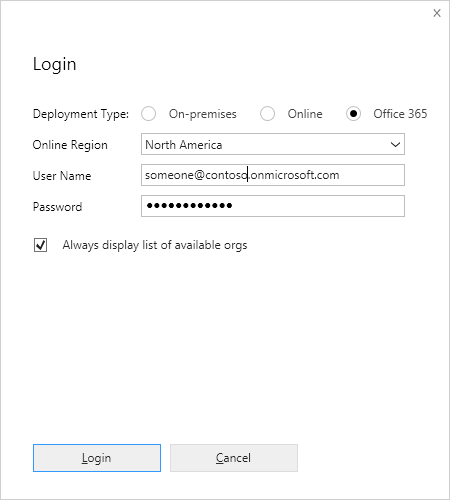
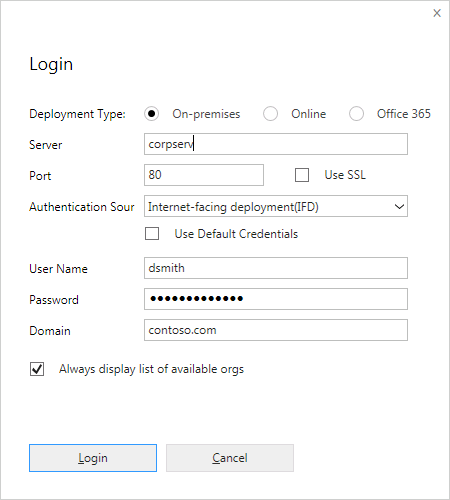
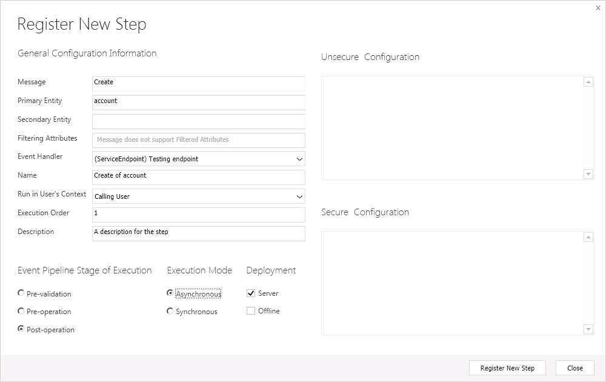

# Walkthrough: Register an Azure-aware plug-in using the Plug-in Registration Tool

This walkthrough demonstrates how to register a service endpoint step using the Plug-in Registration Tool. Once configured, [!INCLUDE[pn_dynamics_crm_online](../includes/pn-dynamics-crm-online.md)] can post the execution context of the current operation to a [!INCLUDE[pn_Windows_Azure](../includes/pn-windows-azure.md)] solution endpoint. For this walkthrough, the step is registered to post the execution context of the <xref:Microsoft.Xrm.Sdk.Messages.CreateRequest> message for an `Account` entity to the [!INCLUDE[windows_azure_service_bus](../includes/windows-azure-service-bus.md)].  

 The following prerequisites must be completed before you start this walkthrough:  

- Access to the Plug-in Registration Tool. [!INCLUDE[proc-download-plugin-registration-tool](../includes/proc-download-plugin-registration-tool.md)] 

- Your Dynamics 365 Customer Engagement (on-premises) system user account must have the System Customizer or System Administrator role. For more information, see [How Role-Based Security Can Be Used to Control Access to Entities In Dynamics 365 Customer Engagement](security-dev/how-role-based-security-control-access-entities.md).  

- Have access to a [!INCLUDE[pn_Windows_Azure](../includes/pn-windows-azure.md)] platform service namespace that is configured for SAS authorization, to which Dynamics 365 Customer Engagement (on-premises) will post a message.  

- If you plan to use any other [!INCLUDE[pn_azure_shortest](../includes/pn-azure-shortest.md)] messaging entity other than a queue, for example a relay, there must be a listener application actively listening to the specified solution endpoint for Dynamics 365 Customer Engagement (on-premises) to successfully post to the [!INCLUDE[windows_azure_service_bus](../includes/windows-azure-service-bus.md)]. For more information, see [Write a Listener for an Azure Solution](write-listener-application-azure-solution.md).  

- A configured service endpoint with SAS authorization is available in the target organization. [!INCLUDE[proc_more_information](../includes/proc-more-information.md)] [Walkthrough: Configure Microsoft Azure (SAS) for integration with Dynamics 365 Customer Engagement](walkthrough-configure-azure-sas-integration.md).  

## Steps  
 This walkthrough contains the following steps:  

1.  [Connect to the Dynamics 365 Server](#BKMK_Connect)  

2.  [Register a service endpoint step for an event](#BKMK_Register)  

3.  [Test the endpoint registration](#BKMK_Test)  

   
## Connect to the Dynamics 365 Server  
 Follow the steps below to connect to the Dynamics 365 Server using the Plug-in Registration tool.  

1. Run the Plug-in Registration tool.  

2. Click **Create New Connection**.  

3. In the **Login** dialog box, select the deployment type radio button corresponding to the Dynamics 365 Server you intend to register a service endpoint with. The **On-premises** radio button includes an IFD deployment and the **Office 365** button is for the [!INCLUDE[pn_MS_Online_Services](../includes/pn-ms-online-services.md)] provider of [!INCLUDE[pn_CRM_Online](../includes/pn-crm-online.md)].  

   |                                                                                                                                             |                                                                                                                                                                                 |
   |---------------------------------------------------------------------------------------------------------------------------------------------|---------------------------------------------------------------------------------------------------------------------------------------------------------------------------------|
   |  Login form for an online deployment |  Login form for an on-premises deployment |

4. If you check **Display list of available organizations**, you are presented with a list of organizations that you belong to after you click **Login**. This enables you to choose the organization that you want to register the service endpoint with. Otherwise, your default organization is used.  

5. Enter the indicated information about the server and login account, and then click **Login**.  

   
## Register a service endpoint step for an event  
 Follow the steps below to register a step for an event on the service endpoint.  

1. Select an existing service endpoint in the tab of the tab of the target organization.  

2. Navigate to the **Register** menu and click **Register New Step**.  

3. Fill out the **Register New Step** dialog box for an account create event as shown in the following figure.  

     

4. Click **Register New Step**.  

   Dynamics 365 Customer Engagement (on-premises) will now post the current message containing the execution context to the service bus whenever an account is created. The post is performed asynchronously and is not executed immediately.  

   
## Test the endpoint registration  
 After you register the endpoint you can test it. A listener must be running or a queue available on the target endpoint for the service bus post from the plug-in to happen.  

1. Open the Dynamics 365 Customer Engagement (on-premises) web application for the same organization that you registered the service endpoint under.  

2. Click the **Create** button , and then click **Account**.  

3. Enter an account name, for example `Adventure Works Cycle`, into the **Account Name** field, and then click **Save**.  

4. Wait about 10 minutes for the [!INCLUDE[windows_azure_service_bus](../includes/windows-azure-service-bus.md)] post to occur.  

5. Click **Settings > System Jobs**.  

6. Open the system job that has the same name that you specified for your service endpoint. Check the status to see if the post was successful, is waiting, or failed.  

   You can now unregister the endpoint, if so desired, by selecting it in the tool’s tree view and click **Unregister**.  

### See also  
 [Azure Extensions for Dynamics 365 Customer Engagement (on-premises)](azure-extensions.md)   
 [Introduction to Microsoft Azure Integration with Dynamics 365 Customer Engagement (on-premises)](azure-integration.md)
