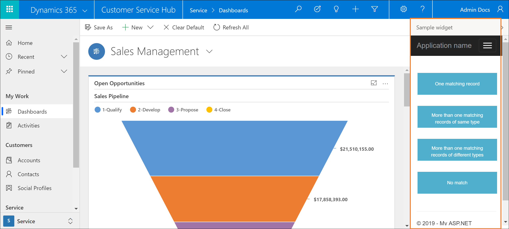

# Walkthrough: Search and open records on an incoming conversation

In this tutorial, we demonstrate how you can search and open records in Dynamics 365 on an incoming call using the Channel Integration Framework(CIF) APIs.

The sample given below covers four scenarios:

1. Customer's contact number matches one record in Dynamics 365. The record is retrieved using the [searchAndOpenRecords](reference/microsoft-ciframework/searchAndOpenRecords.md) API.
2. Customer's contact number matches multiple records of same entity type in Dynamics 365. The records are retrieved using the [searchAndOpenRecords](reference/microsoft-ciframework/searchAndOpenRecords.md) API.
3. Customer's contact number matches multiple records of multiple entity types in Dynamics 365. The Account entity and Contact entity records are searched for the contact number of the incoming call and then, the search results are displayed on the console.
4. Customer's contact number does not match any record in Dynamics 365, so we search and open empty results and then, create a new record for the customer using the [createRecord](reference/microsoft-ciframework/createRecord.md) API.

## Prerequisites

- Visual Studio 2017.
- A valid Microsoft Azure subscription is required to publish the sample app to Azure.

> [!IMPORTANT]
> This tutorial is in continuation of [Getting started with building a simple communication widget](getting-started-simple-widget.md). So, if you have not created a simple *Hello World!* widget yet that can be hosted on Channel Integration Framework, we suggest you read that first.

## Build the widget

1. Open the basic widget that you created using the steps mentioned in [Get started with building a simple communication widget](getting-started-simple-widget.md) in Visual Studio 2017.
2. Open the `Index.cshtml` file and replace the code in the file with the code given below. <br />
<br />

```html
<!DOCTYPE html>
<style>
    .button {
        background-color: #4FAFCD;
        border: none;
        color: white;
        padding: 15px 32px;
        text-align: center;
        text-decoration: none;
        display: inline-block;
        font-size: 16px;
        margin: 4px 2px;
        cursor: pointer;
        height: 55px;
        width: 200px;
        font-size: 12px;
    }
</style>

<html>
<body>
    <br /><br />
    <!--Replace <ORG-URL> in the script tag below with the URL of your Dynamics 365 instance -->
    <script type="text/javascript" src="<ORG-URL>/webresources/Widget/msdyn_ciLibrary.js" data-crmurl="<ORG-URL>" data-cifid="CIFMainLibrary">
    </script>
    <script>

        function singlematch() {
            // The customer phone number matches one contact in Dynamics 365
            // Search and screen pop to the contact
            var contactno = "555-5555"; // The contact number to be searched
            var entityname = "account"; // Entity type whose records to be searched

            Microsoft.CIFramework.searchAndOpenRecords(entityname, "?$select=name,telephone1&$filter=telephone1 eq '" + `${contactno}` + "'" + "&$search=" + `${contactno}`, false).then(
                function success(result) {
                    res = JSON.parse(result);
                    console.log(`Record values: Name: ${res[0].name}, Telephone number: ${res[0].telephone1}`);
                },
                function (error) {
                    console.log(error.message);
                }
            );
        }
        function multiplematchsingletype() {
            // More than one contacts are matched with same phone number
            // Search and show search results , then user selects one of the records, associate a record with the phone call
            var contactno = "555-5555";
            var entityname = "account";

            Microsoft.CIFramework.searchAndOpenRecords(entityname, "?$select=name,telephone1&$filter=telephone1 eq '" + `${contactno}` + "'" + "&$search=" + `${contactno}`, false).then(
                function success(result) {
                    res = JSON.parse(result);
                    console.log(`Record values: Name: ${res[0].name}, Telephone number: ${res[0].telephone1}`);
                },
                function (error) {
                    console.log(error.message);
                }
            );
        }

        function multiplematchmultipletype() {
            // More than one type of records are matched with the same phone number - account/contact
            // search and show search results , then user selects one of the records, associate a record with the phone call
            var contactno = "555-5555";

            // Search for contact number of the incoming call in Account entity records
            Microsoft.CIFramework.searchAndOpenRecords("account", "?$select=name,telephone1&$filter=telephone1 eq '" + `${contactno}` + "'" + "&$search=" + `${contactno}`, false).then(
                function success(result) {
                    res = JSON.parse(result);
                    console.log(`Record values: Name: ${res[0].name}, Telephone number: ${res[0].telephone1}`);
                },
                function (error) {
                    console.log(error.message);
                }
            );

            // Search for contact number of the incoming call in Contact entity records
            Microsoft.CIFramework.searchAndOpenRecords("contact", "?$select=name,telephone1&$filter=telephone1 eq '" + `${contactno}` + "'" + "&$search=" + `${contactno}`, false).then(
                function success(result) {
                    res = JSON.parse(result);
                    console.log(`Record values: Name: ${res[0].fullname}, Telephone number: ${res[0].telephone1}`);
                },
                function (error) {
                    console.log(error.message);
                }
            );
        }
        function nomatch() {
            // search and show empty search results
            // create new contact
            // associate new contact to session
            var contactno = "000040000021";
            var callername = "Contoso Ltd.";

            Microsoft.CIFramework.searchAndOpenRecords("account", "?$select=name,telephone1&$filter=telephone1 eq '" + `${contactno}` + "'" + "&$search=" + `${contactno}`, false).then(
                function success(result) {
                    res = JSON.parse(result);
                    console.log(res);
                    // Check if the JSON response returned by the request is empty
                    if (Object.keys(res).length == 0) {
                        console.log("No records with contact number as " + contactno);
                        console.log("Creating a new Account record");

                        // Creating new Account record
                        var entityLogicalName = "account";
                        var data = {
                            "name": callername,
                            "telephone1": contactno
                        }
                        var jsondata = JSON.stringify(data);
                        
                        // use createRecord API to create a new entity record
                        Microsoft.CIFramework.createRecord(entityLogicalName, jsondata).then(
                            function success(result) {
                                res = JSON.parse(result);
                                // Print the AccountID of the created Account record on the console
                                console.log("Account record created with ID: " + res.id);
                            })
                    }
                    else {
                        console.log(`Record values: Name: ${res[0].name}, Telephone number: ${res[0].telephone1}`);
                    } 
                },
                function (error) {
                    console.log(error.message);
                }
            );
        }
    </script>

    <button class="button" type="button" onclick="singlematch()">One matching record</button><br /><br />
    
    <button class="button" type="button" onclick="multiplematchsingletype()">More than one matching records of same type</button><br /><br />
    
    <button class="button" type="button" onclick="multiplematchmultipletype()">More than one matching records of different types</button><br /><br />
    
    <button class="button" type="button" onclick="nomatch()">No match</button><br /><br />

    
</body>
</html>
```

## Publish and configure the widget

Follow the steps mentioned in [Publish and configure the widget](getting-started-simple-widget.md#BKMK_publish) to publish the widget. The published widget should look like this.<br />

  <br />

## See also

[Get started with building a simple communication widget](getting-started-simple-widget.md)<br />
[Sample code for softphone integration](sample-softphone-integration.md)<br />
[Frequently asked questions](faq-channel-integration-framework.md)