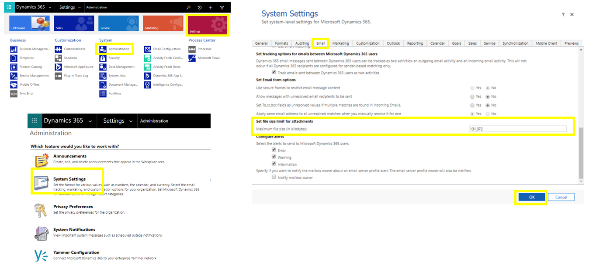
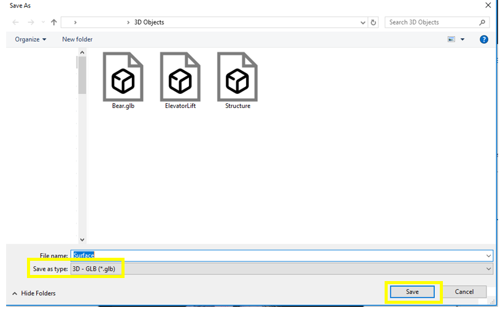
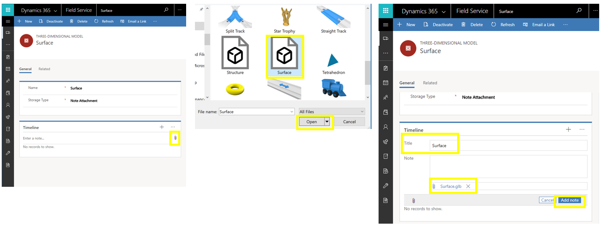

# Field Service Technician Productivity

Our latest version of Field Service will be introducing the 3D Model entity and, with it, an n:n relationship between 3D Models and Customer Assets. This will enable 3D content to be associated with Customer Assets. The value in this feature is that we have found that many of our customers have 3D content for their various assets that would be useful to provide to their technicians for use in the field when performing repairs. As opposed to having to record videos or write long manuals, companies can leverage pre-existing 3D content to generate what are effectively 3D knowledge articles.

**Feature Details:** The following will walk through how to configure a customer asset to have an associated 3D model record.

## Prerequisites

Dynamics 365 v9.0+ 

Field Service v8.0+

Increased storage for large 3D file sizes. Two options include **(1)** increasing attachment file size in D365 administration **(2)** using Azure BLOB storage.

> **(1)** increasing attachment file size in D365 administration

> 1. Navigate to **Settings > Administration > System Settings**
> 2. Select **Email** tab
> 3. Set the **file size limit for attachments** to t0 **131,072** KB (maximum)

> [!div class="mx-imgBorder"]
> 

> **(2)** using Azure BLOB storage

> Alternatively, you can configure 3D Model attachments to be stored in Azure BLOBs by using the Microsoft Labs Attachment Management solution. You can get it on AppSource [here](https://appsource.microsoft.com/en-us/product/dynamics-365/microsoft_labs.96257e65-dbbe-43db-b775-77cf1609530c?tab=Overview). 

Ensure 3D file types are not blocked for attachments

1. Navigate to the General tab
2. Scroll down to the **Set blocked file extensions for attachments** section
3. Ensure **GLB**, **GLTF**, and **OBJ** and **not listed**

> [!div class="mx-imgBorder"]
>  

> [!Note]
> Supported file types for 3D viewer: **GLB**, **GLTF**, and **OBJ**

## Open a 3D file

 If you already have a 3D file that you would like to use, you can use Paint 3D to open that file and save it as a GLB file. The following will walk through how to grab 3D samples in Paint 3D and save to GLB.

 1. Open up Paint 3D on your Windows 10 device
 2. Once open, click the **3D Library** tab at the top
 3. Select a model from the library to have it appear on the canvas and edit as desired.
 4. When done click on the **Menu** tab
 5. Click **3D Model** under the **Save as Copy** section

> [!div class="mx-imgBorder"]
>   

> [!div class="mx-imgBorder"]
>   

> [!div class="mx-imgBorder"]
>   

 

## Associate Customer Assets with 3D Content
**Associating 3D Content with a Customer Asset**

Once you have your GLB, GLTF, or OBJ file, and you have configured your organization as per the previous steps, you are ready to associate your 3D content with a customer asset.

> [!div class="mx-imgBorder"]
>   

> [!div class="mx-imgBorder"]
>   

> [!div class="mx-imgBorder"]
>   

> [!div class="mx-imgBorder"]
>   

> [!div class="mx-imgBorder"]
> 

## Additional notes
- 3D files are viewable on Field Service Mobile on Windows, iOS, and Android devices
