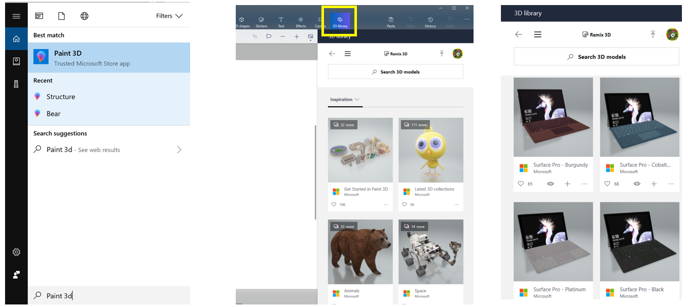
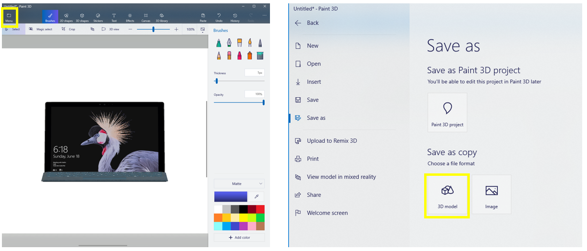
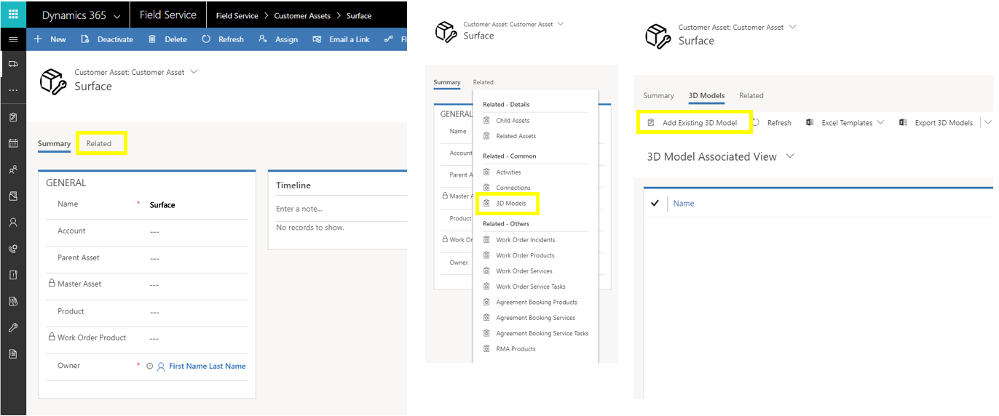
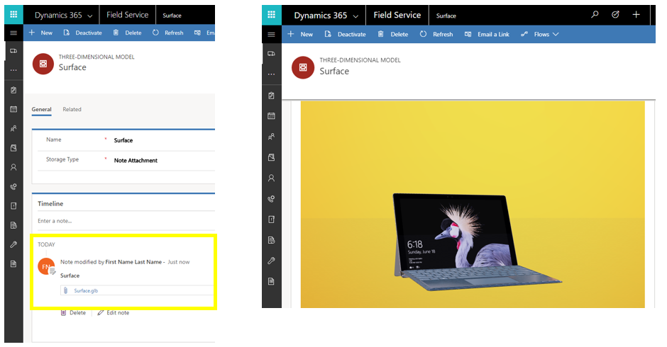

# 3D models for Field Service

Dynamics 365 Field Service allows organizations to upload 3D models for field technicians to reference in the field. Typically a 3d model relates to a specific product or customer asset and helps field technicians with equipment repair and other tasks. As opposed to recording videos or writing long manuals, field service organizations can leverage pre-existing 3D models to generate what are effectively 3D knowledge articles.

You can configure 3D models by using an N:N relationship between the 3D model and customer asset entities, which enables 3D models to be associated with customer assets.

In this topic, we'll walk through how to associate a 3D model record with a customer asset and then view the 3D model on Field Service Mobile.

## Prerequisites

- Dynamics 365 v9.0+ 
- Field Service v8.0+
- Ensure the **3D Viewer** solution is installed in **Settings** > **Customizations**
- Increased storage for large 3D file sizes. You can do this by increasing attachment file size limit in Dynamics 365 administration, or by using Azure Blob storage.

To increase attachment file size in D365 administration:

1. Go to **Settings > Administration > System Settings**
2. Select the **Email** tab
3. In the **Set file size limit for attachments section**, set the **Maximum file size (in Kilobytes)** to **131,072** KB. Then select **Ok**.

  > [!div class="mx-imgBorder"]
  > 

Finally, make sure that 3D file types are not blocked for attachments in the Dynamics 365 settings:

1. Go to the **General** tab
2. Scroll down to the **Set blocked file extensions for attachments** section
3. Make sure **GLB**, **GLTF**, and **OBJ** are not listed

  > [!div class="mx-imgBorder"]
  >  

  > [!Note]
  > The supported file 3D viewer types are **GLB**, **GLTF**, and **OBJ**.

## Open a 3D file

If you already have a 3D file, you can use Paint 3D to open it and save it as a GLB file. 

1. Open Paint 3D on your Windows 10 device.
2. Select the **3D Library** tab at the top.
3. Select a model from the library and open it on the canvas. Edit or make changes if necessary.

> [!div class="mx-imgBorder"]
>  

4.  When done, select the **Menu** tab, go to the **Save as copy** section, and select **3D Model**.

> [!div class="mx-imgBorder"]
>   

5. Enter a **File Name**. For **Save as type**, select **3D-GLB(.glb)**. Then **Save**.
> [!div class="mx-imgBorder"]
>   

 
## Associate customer assets with 3D models

Once you have your GLB, GLTF, or OBJ file, and you have configured your organization per the steps in this topic, you are ready to associate your 3D model with a customer asset.

1. Open up the desired customer asset record and select the **Related** tab.
2. Select **3D Models** from the drop down.
3. Select **Add Existing 3D Model**.

> [!div class="mx-imgBorder"]
>  

4. A quick create form for 3D model will open. Select **+New**.
5. Enter a **Name** for the 3D model.
6. Select the **Storage Type** drop-down, and choose **Note Attachment**. Then **Save** the form.

> [!div class="mx-imgBorder"]
> 

7. After saving the record, the **Timeline** section will appear. Select the paperclip icon to add a note with an attachment.
8. When the file prompt appears, select your 3D file and then **Open**.
9. After selecting a file, you should see the file attached with a paperclip icon next to it. Give the note a **Title** and then select **Add note**.

> [!div class="mx-imgBorder"]
>   

10. After saving the note, it will appear on the timeline with the attached 3D file.
11. To view the 3D file, scroll past the timeline section on the form. You can interact with the 3D viewer by scrolling, left-clicking, right-clicking and dragging. 

> [!div class="mx-imgBorder"]
>   

12. After saving and closing the form for the 3D model, you can then select it from the lookup on the 3D model quick create form. 
13. After selecting the 3D model record, select **Add** to associate that 3D model with the customer asset.
14. The 3D model can then be accessed through the 3D model associated view on the customer asset record.

> [!div class="mx-imgBorder"]
> 

## View 3D model on Field Service Mobile

Now that the 3D model is associated to a customer asset and viewable from the web, let's enable it to be viewable on the Field Service Mobile app for field technicians to reference during onsite work orders.

1.	Go to the Field Service Mobile configuration tool (Woodford).
2.	Open the mobile project that holds your customizations.
3.	Select the entity **Three-Dimensional Model** (**do not** select the paint brush icon).
4.	Select **Enable** - see the following screenshot for reference.

> [!div class="mx-imgBorder"]
> 
 
5.	Check the **File Type**, **File URL**, and **Storage Type** boxes to enable those fields for mobile.
6.	Select **Save**.

> [!div class="mx-imgBorder"]
> 

7.	Select the paint brush icon next to **Three-Dimensional Model**.
8.	Select **New Form**.

> [!div class="mx-imgBorder"]
> 

9.	Give the form a name and select **Ok**.
10.	Select the blank, white part of the form and the available fields should show on the right panel.
11.	Drag and drop the **Storage Type**, **File URL**, and **File Type** fields to the form.
12.	Add a notes list to the form by going to **Add List** > **Notes List**.

> [!div class="mx-imgBorder"]
> 

13.	Select **Add Iframe** in the top menu.

> [!div class="mx-imgBorder"]
> 

14.	Name the Iframe. The name will appear at the top of the 3D Model. Then select **Browse**.
15.	Select **viewer.html** and then **Ok**.

> [!div class="mx-imgBorder"]
> 

16.	Leave the defaults as shown in the following screenshot and select **Ok**.

> [!div class="mx-imgBorder"]
> 

17.	**Save** and **Close** the form

At this point the three-dimensional model is set up for mobile. Next, we'll need to make it viewable from the mobile customer asset form.

18. Go to the customer asset entity and then the related form.

> [!div class="mx-imgBorder"]
> 

19.  Select **Add List** at the top, then choose **Unrelated Entity List**.

> [!div class="mx-imgBorder"]
> 

20. Find the **Three-Dimensional Model** entity and select **OK**. This will ensure three-dimensional model records are accessible from the customer asset mobile form.

> [!div class="mx-imgBorder"]
> 

21. **Save & Close** the from, then **Publish** the mobile project.

The 3D model will now be viewable on the Field Service Mobile App by going to **Customer Assets** > **Three Dimensional Models**.

> 

## Additional notes
- You can view 3D files on Field Service Mobile for Windows, iOS, and Android devices.
- 3D models are viewable on Field Service Mobile in online and offline modes.

[!INCLUDE[footer-include](../includes/footer-banner.md)]
