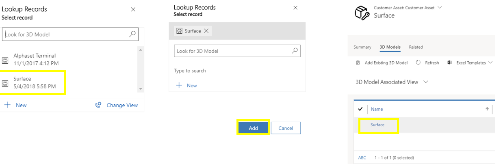

# 3D models for Field Service

Dynamics 365 for Field Service allows organizations to upload 3D models for field technicians to reference in the field. Typically a 3d model relates to a specific product or customer asset and helps field technicians with equipment repair and other tasks. As opposed to recording videos or writing long manuals, field service organizations can leverage pre-existing 3D models to generate what are effectively 3D knowledge articles.

You can configure 3D models by using an N:N relationship between the 3D model and customer asset entities, which enables 3D models to be associated with customer assets.

In this topic, we'll walk through how to associate a 3D model record with a customer asset.

## Prerequisites

- Dynamics 365 for Customer Engagement v9.0+ 
- Field Service v8.0+
- Increased storage for large 3D file sizes. You can do this by increasing attachment file size limit in Dynamics 365 administration, or by using Azure Blob storage.

To increase attachment file size in D365 administration:

1. Navigate to **Settings > Administration > System Settings**
2. Select the **Email** tab
3. In the **Set file size limit for attachments section**, set the **Maximum file size (in Kilobytes)** to **131,072** KB. Then select **Ok**.

  > [!div class="mx-imgBorder"]
  > 

To configure Azure Blob storage, use the [Microsoft Labs Attachment Management solution](https://appsource.microsoft.com/product/dynamics-365/microsoft_labs.96257e65-dbbe-43db-b775-77cf1609530c?tab=Overview).

Finally, make sure that 3D file types are not blocked for attachments in the Dynamics 365 settings:

1. Go to the **General** tab
2. Scroll down to the **Set blocked file extensions for attachments** section
3. Make sure **GLB**, **GLTF**, and **OBJ** are not listed

  > [!div class="mx-imgBorder"]
  >  

  > [!Note]
  > The supported file 3D viewer types are **GLB**, **GLTF**, and **OBJ**.

## Open a 3D file

If you already have a 3D file, you can use Paint 3D to open it and save it as a GLB file. 

1. Open Paint 3D on your Windows 10 device.
2. Select the **3D Library** tab at the top.
3. Select a model from the library and open it on the canvas. Edit or make changes if necessary.

> [!div class="mx-imgBorder"]
>  

4.  When done, select the **Menu** tab, go to the **Save as copy** section, and select **3D Model**.

> [!div class="mx-imgBorder"]
>   

5. Enter a **File Name**. For **Save as type**, select **3D-GLB(.glb)**. Then **Save**.
> [!div class="mx-imgBorder"]
>   

 
## Associate customer assets with 3D models

Once you have your GLB, GLTF, or OBJ file, and you have configured your organization per the steps in this topic, you are ready to associate your 3D model with a customer asset.

1. Open up the desired customer asset record and select the **Related** tab.
2. Select **3D Models** from the drop down.
3. Select **Add Existing 3D Model**.

> [!div class="mx-imgBorder"]
>  

4. A quick create form for 3D model will open. Select **+New**.
5. Enter a **Name** for the 3D model.
6. Select the **Storage Type** drop-down, and choose **Note Attachment**. Then **Save** the form.

> [!div class="mx-imgBorder"]
> 

7. After saving the record, the **Timeline** section will appear. Select the paperclip icon to add a note with an attachment.
8. When the file prompt appears, select your 3D file and then **Open**.
9. After selecting a file, you should see the file attached with a paperclip icon next to it. Give the note a **Title** and then select **Add note**.

> [!div class="mx-imgBorder"]
>   

10. After saving the note, it will appear on the timeline with the attached 3D file.
11. To view the 3D file, scroll past the timeline section on the form. You can interact with the 3D viewer by scrolling, left-clicking, right-clicking and dragging. 

> [!div class="mx-imgBorder"]
>   

12. After saving and closing the form for the 3D model, you can then select it from the lookup on the 3D model quick create form. 
13. After selecting the 3D model record, select **Add** to associate that 3D model with the customer asset.
14. The 3D model can then be accessed through the 3D model associated view on the customer asset record.

> [!div class="mx-imgBorder"]
> 

## Additional notes
- You can view 3D files on Field Service Mobile for Windows, iOS, and Android devices.
