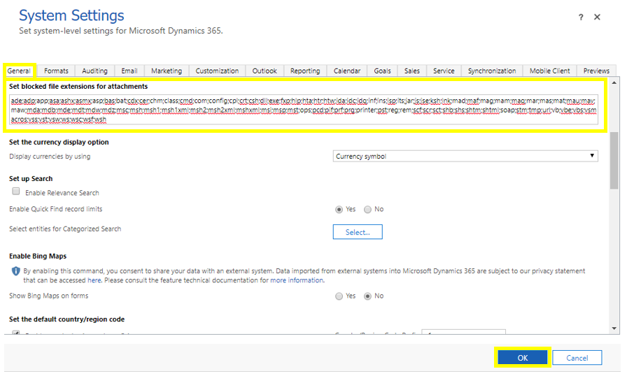

# Field Service Technician Productivity

Our latest version of Field Service will be introducing the 3D Model entity and, with it, an n:n relationship between 3D Models and Customer Assets. This will enable 3D content to be associated with Customer Assets. The value in this feature is that we have found that many of our customers have 3D content for their various assets that would be useful to provide to their technicians for use in the field when performing repairs. As opposed to having to record videos or write long manuals, companies can leverage pre-existing 3D content to generate what are effectively 3D knowledge articles.

**Feature Details:** The following will walk through how to configure a customer asset to have an associated 3D model record.

## Prerequisites

Dynamics 365 v9.0+ 

Field Service v8.0+

Increased storage for large 3D file sizes. Two options include **(1)** increasing attachment file size in D365 administration **(2)** using Azure BLOB storage.

> **(1)** increasing attachment file size in D365 administration

> 1. Navigate to **Settings > Administration > System Settings**
> 2. Select **Email** tab
> 3. In the **Set file size limit for attachments section** set the **Maximum file size (in Kilobytes)** to **131,072** KB. The click **Ok**.

> [!div class="mx-imgBorder"]
> 

> **(2)** using Azure BLOB storage

> Alternatively, you can configure 3D Model attachments to be stored in Azure BLOBs by using the Microsoft Labs Attachment Management solution. You can get it on AppSource [here](https://appsource.microsoft.com/en-us/product/dynamics-365/microsoft_labs.96257e65-dbbe-43db-b775-77cf1609530c?tab=Overview). 

Ensure 3D file types are not blocked for attachments

1. Navigate to the **General** tab
2. Scroll down to the **Set blocked file extensions for attachments** section
3. Ensure **GLB**, **GLTF**, and **OBJ** and **not listed**

> [!div class="mx-imgBorder"]
>  

> [!Note]
> Supported file types for 3D viewer: **GLB**, **GLTF**, and **OBJ**

## Open a 3D file

 If you already have a 3D file that you would like to use, you can use Paint 3D to open that file and save it as a GLB file. The following will walk through how to grab 3D samples in Paint 3D and save to GLB.

   1. Open up Paint 3D on your Windows 10 device
   2. Once open, click the **3D Library** tab at the top
   3. Select a model from the library to have it appear on the canvas and edit as desired.

> [!div class="mx-imgBorder"]
>  

   4.  When done click on the **Menu** tab
   5.  Click **3D Model** under the **Save as copy** section

> [!div class="mx-imgBorder"]
>   

   6. Enter a **File Name**. For Save as type, select **3D-GLB(*.glb)**. Then click **Save**.
> [!div class="mx-imgBorder"]
>   

 
## Associate Customer Assets with 3D Content

Once you have your GLB, GLTF, or OBJ file, and you have configured your organization as per the previous steps, you are ready to associate your 3D content with a customer asset.

1. Open up the desired customer asset record and select the **Related** tab
2. Select **3D Models** from the drop down
3. Click **Add Existing 3D Model**

> [!div class="mx-imgBorder"]
>  

4. A quick create form for 3D Model will open. Click on **+New**
5. Enter a **Name** for the 3D Model and then select the **Storage Type** drop-down
6. Select **Note Attachment**. Then click **Save** on the form.

> [!div class="mx-imgBorder"]
> 

7. After saving the record, the **Timeline** section will appear. Click on the paperclip icon to add a note with an attachment.
8. You will be prompted to select a file. Select the 3D file you saved as a GLB earlier and click **Open**.
9. After selecting a file, you should see the file attached with a paperclip icon next to it. Give the Note a **Title** and then click **Add note**.

> [!div class="mx-imgBorder"]
>   

10. After saving the note, you should see it appear on the timeline with the attached 3D file.
11. To view the 3D file, scroll past the timeline section on the form. You can interact with the 3D viewer by scrolling, left-clicking, right-clicking and dragging. 

> [!div class="mx-imgBorder"]
>   

12. After saving and closing the form for the 3D model, you can then select it from the lookup on the 3D Model quick create form. 
13. After selecting the 3D Model record, click **Add** to associate that 3D model with the Customer Asset.
14. The 3D Model can then be accessed via the 3D Model Associated View on the Customer Asset record.

> [!div class="mx-imgBorder"]
> 

## Additional notes
- 3D files are viewable on Field Service Mobile on Windows, iOS, and Android devices
