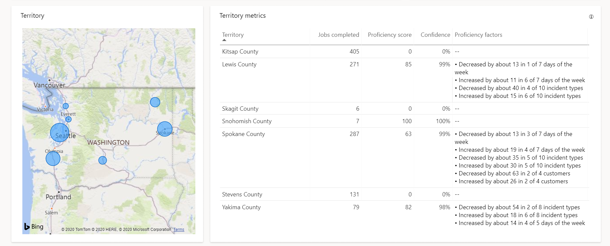
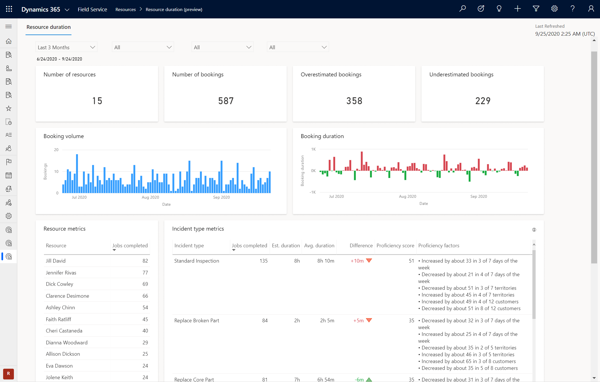

# Predictive work duration

// Predictive work duration helps dispatchers understand how the duration of their work orders and other jobs varies based on different factors and informs managers how the estimated duration compares to actual duration based on AI and ML data models. 

// https://msit.microsoftstream.com/video/09fba3ff-0400-96f3-c720-f1eaff6ef643

// please make the following better 

        Summary: Predict the duration of a work order using artificial intelligence to increase scheduling efficiency and utilization.

        Business Value: Currently, dispatchers assign a fixed duration for a job type, regardless of the various factors that may lengthen or shorten the work order. This can potentially cause cascading delays or low utilization, reducing the effectiveness of schedules.Feature Detail:  This feature predicts the duration for a given booking or requirement, based on various factors like resource performance, incident type, customer location, territorial differences, and seasonal changes. Powered by AI models, this feature learns from the historical booking completion times to compute a realistic duration. It also provides a blended efficiency rating for territories and incident types based on their completion times and allows dispatchers and service managers to drill down to detailed ratings for different technicians across incident types. This helps dispatchers easily identify the right technician for a given job at a customer location.

        Benefits

        Improve service for customers 

        Increase efficiency during high-demand seasons by allocating technicians that can perform the jobs faster
        Identifying ‘at-risk’ bookings that may overrun and have a cascading delay
        Provide realistic commitments on SLA

        Grow technician skillset

        Identify coaching & mentorship opportunities with new technicians and an aging workforce
        Provide fair and transparent analysis for improved performance
        Get technicians aligned with standardized duration instead of pushing them all to be faster

        Preventatively address unforeseen issues

        Isolate customers that take longer and work with for resolving time sinks
        Distinguish assets that have been historically problematic, taking longer time to fix
        Learn weather and seasonal effects on duration to gradually adjust as circumstances change
        Correct any broad inaccuracies on work duration

> [!Note]
> This feature is available as a public preview

## Prerequisites
- Field Service v8.x.x
- Go to Settings then under Analytics and insights section select Settings
Enable Predictive Work Duration preview

Enter a number in the **minimum number of resources per territory** field to define how big a territory must be in order to be used in the report. This is important for provacy considerations because if 

> [!div class="mx-imgBorder"]
> 

## Upcoming work duration

> [!div class="mx-imgBorder"]
> 

> [!div class="mx-imgBorder"]
> 

> [!Note]
> Estimated duration is calculated by..., actual duration is calculated by...

### Key performance indicators (KPIs)

Under allocated bookings	Number of bookings allocated under predicted duration.
Under allocated requirements	Number of requirements allocated under predicted duration.

### Charts

Scheduled bookings	Allocated duration:
Total allocation duration of a booking.
UnScheduled requirements	Requirement duration:
Total allocated duration of a requirement.

### Filters (slicers)

Duration	Slicer control to list pre-defined durations to filter data in all visuals. It has 4 values:
1. Last 3 months
2. Last 6 months
3. Last 1 year
4. Last 2 years
Incident type	Slicer control to list incident types.
Territory	Slicer control to list resource territories. It filters resources and related metrics.
Skill	Slicer control to list resource skill and proficiency level. It filters resources and related metrics.

## Territory duration

> [!div class="mx-imgBorder"]
> 

> [!div class="mx-imgBorder"]
> 

### Filters (slicers)

Duration	Slicer control to list pre-defined durations to filter data in all visuals. It has 4 values:
1. Last 3 months
2. Last 6 months
3. Last 1 year
4. Last 2 years
Incident type	Slicer control to list incident types.
Territory	Slicer control to list service territories.
Skill	Slicer control to list resource skill and proficiency level. It filters resources and related metrics.

### Key performance indicators (KPIs)

Number of resources	KPI to show number of resources involved in bookings.
Number of bookings	KPI to show number of completed bookings.
Overestimated bookings	KPI to show number of bookings which are over estimated than actual duration.
Underestimated bookings	KPI to show number of bookings which are under estimated than actual duration.
Overall proficiency score	 

### Charts

Booking volume	Visual to show number of bookings over the period.
Booking duration	Visual to compare over and under estimated bookings over the period.
Customer metrics	Bookings: 
Number of completed bookings per customer.

Difference
Difference between estimated and actual durations.

Under estimate:
Number of bookings which are under estimated than actual duration

Over estimate:
Number of bookings which are over estimated than actual duration
Incident type metrics	Jobs completed: 
Number of completed bookings of an incident type or a territory.

Est. duration:
Average estimated duration of completed bookings of an incident type or a territory.

Avg. duration:
Average actual duration of completed bookings of an incident type or a territory.

Difference
Difference between estimated and actual durations.
Territory metrics	Jobs completed: 
Number of completed bookings in a territory.

## Resource duration

> [!div class="mx-imgBorder"]
> 

> [!div class="mx-imgBorder"]
> 

### Key performance indicators (KPIs)

Number of resources	KPI to show number of resources involved in bookings.
Number of bookings	KPI to show number of completed bookings.
Overestimated bookings	KPI to show number of bookings which are over estimated than actual duration.
Underestimated bookings	KPI to show number of bookings which are under estimated than actual duration.

### Charts

Booking volume	Visual to show number of bookings over the period.
Booking duration	Visual to compare over and under estimated bookings over the period.
Resource metrics	Jobs completed: 
Number of completed bookings by the resource.
Incident type metrics	Jobs completed: 
Number of completed bookings of an incident type or a resource.

Est. duration:
Average estimated duration of completed bookings of an incident type or a resource.

Avg. duration:
Average actual duration of completed bookings of an incident type or a resource.

Difference
Difference between estimated and actual durations.

## Additional Notes

### Understanding estimated duration, actual duration, and predicted duration

**Estimated duration** - how much time your organization expects a job to take. In the system this value comes from the duration (msdyn_duration) of the resource requirement. Pro tip: the duration of the resource requirement is derived from the total duration of all work order incident types. 

**Actual duration** - how much time was actually spent working on a requirement. This is calculated by _End time_ of Booking - _actual arrival time_ of Booking - On break duration of the Booking Journal related to the Booking (formally called the "Bookable Resource Booking").

**Predicted duration** - how much time the AI model "thinks" the job will take based on hisotrical information. 