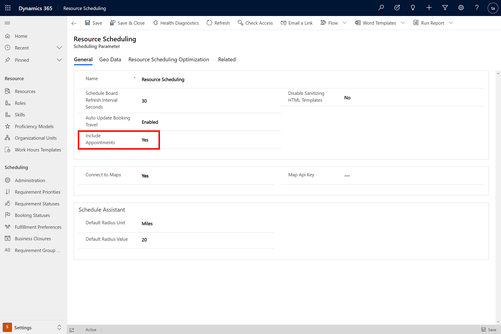

# Appointments included in resource scheduling

With this improved way of including appointments in resource scheduling, schedulers do not face the issue of bookings and appointments being inconsistent since appointments are included directly without needing corresponding bookings. Schedulers can have accurate availability information in one place and do not have to switch between multiple tools such as Outlook, Service Calendar and Field Service's new schedule board. This increases schedulers’ productivity and reduces avoidable scheduling errors.

## Prerequisites

- Field Service 8.8.40.x+

## Additional details 

This feature adds [Microsoft Dataverse appointments](https://docs.microsoft.com/en-us/dynamics365/customer-engagement/web-api/appointment) as an additional data source for resource scheduling. Previously the schedule board and scheduling operations used only [bookings](https://docs.microsoft.com/en-us/dynamics365/customer-engagement/web-api/bookableresourcebooking) as a data source. Thus, if you wanted to show appointments on the schedule board or respect them in resource availability, you would first need to create corresponding bookings. This created issues when changes in bookings did not reflect in appointments and vice versa. 

Now Microsoft Dataverse appointments are included directly in resource scheduling, so there is no longer any need to have bookings automatically created for appointments and to face the issue of changes in one not reflecting in the other. 

Dataverse appointments can be created in Dynamics Apps like Customer Service Hub (in Activities), but they could also originate in Outlook, and be synced to Dynamics 365 if [server-side synchronization](https://docs.microsoft.com/en-us/power-platform/admin/server-side-synchronization) has been set up. An Outlook appointment must be manually assigned the special  [Tracked to Dynamics 365](https://docs.microsoft.com/en-us/power-platform/admin/use-outlook-category-track-appointments-emails) category  so it appears as a Dataverse appointment record. 

> [!div class="mx-imgBorder"]
> 

<ul>
<li>Appointments will show in read-only mode on the new schedule board, and be considered in scheduling operations from the new schedule board and resource scheduling optimization, in conjunction with bookings.</li>
<li>Scheduling operations will consider appointments as location-agnostic.</li>
<li>If an appointment had related bookings those bookings will not be shown and will not be considered in scheduling operations. </li>
<li>This feature has an organization level setting, which turns on the feature for all resources. You can control individual resources using a resource level setting.</li>
</ul>

## Organization level setting to include appointments in Resource Scheduling

<ol>
<li>Go to **Resource Scheduling > Settings > Administration > Scheduling Parameters** and set **Include Appointments** to Yes.</li>
> [!div class="mx-imgBorder"]
> 

 
<li>Scheduling operations will consider appointments as location-agnostic.</li>
</ol>

> [!div class="mx-imgBorder"]
> 

With predictive travel enabled, resource scheduling optimization will generate a schedule that uses time-of-day dependent travel time that takes into account historical traffic.

> [!div class="mx-imgBorder"]
> 

> [!Note]
> Running an optimization with predictive travel time may change the order of the bookings to optimize objectives and constraints. Additionally, it may increase the runtime for the engine to optimize the requirements and bookings.

## Configuration considerations

- Predictive travel times that use historical data is a feature only available for scheduling with resource scheduling optimization. Predictive travel is not currently supported for the schedule assistant or manual scheduling.

- Since optimizations can take longer when considering historical traffic information, use predictive travel times for [automated overnight scheduling](rso-overnight-scheduling.md) where the optimization runs during non-working hours for the following working day.

- Predictive travel time can only be applied to optimization scopes with fewer than 500 requirements _and_ 500 resources. If your optimization scope exceeds this threshold, the optimization will still run but without predictive travel times. If you have more resources or requirements, consider splitting the scope into smaller scopes and apply predictive travel time to each related optimization goal.

- [Single resource optimization](rso-single-resource-optimization.md) does not currently support predictive travel times.

- Predictive travel time is only available for Bing Maps.

## Additional notes

- Running resource scheduling optimization with predictive travel times can result in different travel times and different sequences of schedules.

- Predictive travel time is not real-time traffic, so they will not reflect one-time events like traffic accidents or road closures. Instead, this feature will take into account general traffic patterns like high volumes of cars in the morning when many people are commuting to work.

[!INCLUDE[footer-include](../includes/footer-banner.md)]
