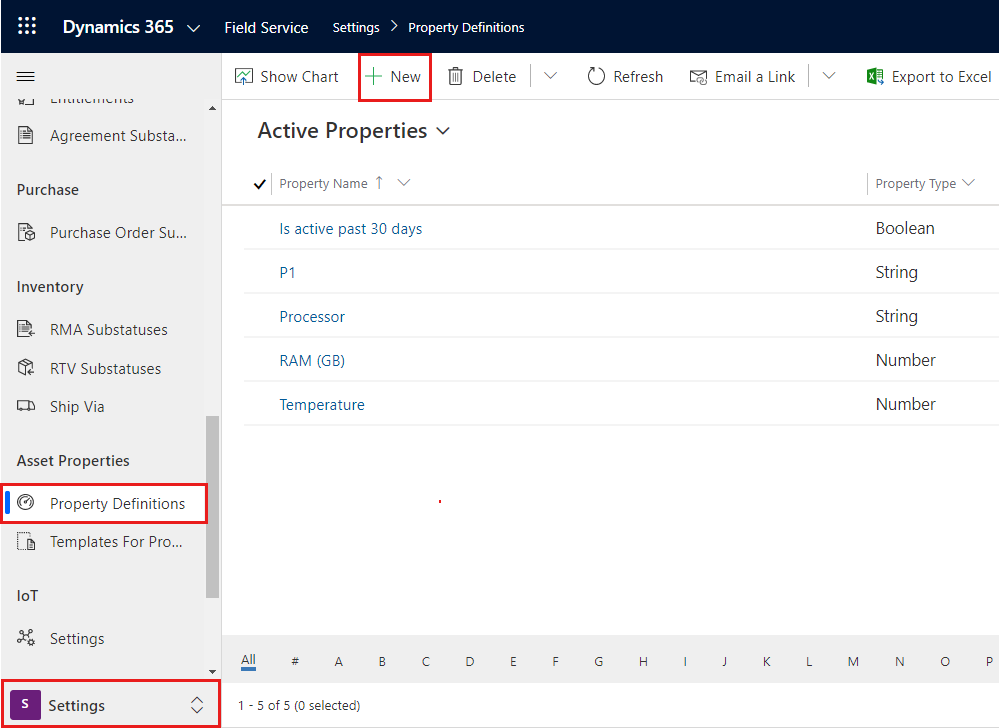
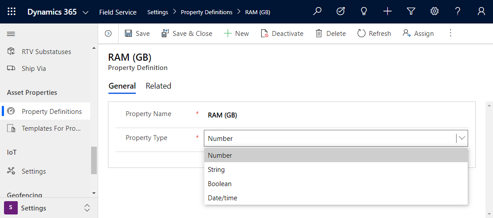

# Asset properties in Dynamics 365 Field Service

In cases where field service organizations service assets for their customers (like printers, laptops, air conditioners, and so on), it's important to be able to capture relevant information about those assets.

Asset properties allow you to record information about assets stored in Dynamics 365 Field Service.

Properties are flexible, and can be defined in multiple ways, as we'll look at in this article.

For more information, see this video:  [Create and configure asset properties](https://youtu.be/dhruNqBXMgw) 

## Prerequisites

- You'll need one or more existing assets in Field Service. For more information, see the article on [customer assets](configure-set-up-customer-assets.md).

## Create and assign asset categories (optional)

First, create an **Asset Category** to group your assets. This is optional; if your organization doesn't use asset categories, go to the next step to create property definitions. In our example, we're using the category **Laptop - high performance**.

> [!div class="mx-imgBorder"]
> 

Next, we create a new asset called **Contoso Laptop #113** and assign the new asset category.

> [!div class="mx-imgBorder"]
> 

## Create property definitions

Next, we'll need to create and define the various asset properties we want to associate with the asset. 

Go to **Settings** > **Property Definitions** to see a list of active properties.

> [!div class="mx-imgBorder"]
> 

Select **+New**. Give the property a name and select the type of value that will be associated with the property.

- **Number**: Select if the property will always be numeric 
- **String**: Select if the property will always be alphanumeric.
- **Boolean**: Select if the property will always be true or false.
- **Date**: Select if the property will always be a date value.
  
> [!div class="mx-imgBorder"]
> 

Since we need to manage a laptop in our example, we create a new property called **RAM (GB)**, where the property value will always be a number.

Save and close.

## Create templates for properties

Templates make it so you can quickly select a group of properties to apply to an asset or assets. For instance, laptops may always have the same set of properties that need to be captured. In this case, creating a property template that includes a group of properties can make life easier.

To create a property template, go to **Settings** > **Templates for Properties** and select **+New**.

Give the template a name, and **Save**.

> [!div class="mx-imgBorder"]
> 

From the template, you can associate defined properties. From the properties section, select New Property Template, and add properties that will always apply to this type of asset. In our example, we made a property template for laptops, which will always include:

- Temperature
- Is active past 30 days
- RAM (GB)
- Processor

## Relate templates to asset categories, assets, or both

From the template, you can also associate to asset categories. By associating a template with an asset category, all assets that relate to this asset category will apply to our new property template.

In the **Asset Categories** section, select **+New Asset Category Template** and select an existing category. In our example, we use the asset category we created at the beginning of this article.

> [!div class="mx-imgBorder"]
> 

From the template, you can also directly relate specific assets, which will then associate with the group of defined properties in this template.

> [!div class="mx-imgBorder"]
> 

## Add property logs

Once properties are defined for an asset, you can then add specific values for those properties, and build out a log of current and changing values. 

> [!Note]
> There is a known bug that hides the **Assets and Locations** and **Properties** tabs in the out-of-the-box product. 

Go to the customer asset > **Properties** > **New Property Log**.

> [!div class="mx-imgBorder"]
> 

Find the property you want to update, and give it a value. 

**Reading Time** represents the date and time the property equals its current value. By default, the reading time equals the current date and time. If you're logging a property value from earlier, you can set the time. After creating the log, reading time can't be edited.  

**Save and Close**.

In our example, we gave our laptop a value for RAM.

>[!Note]
> Only properties associated with the asset will show up in this list as options.

> [!div class="mx-imgBorder"]
> 

> [!div class="mx-imgBorder"]
> 

Repeat this process for all the asset properties you want to define.

## Maintain property logs

You may want to update the properties that were previously defined. In our example, let's say the laptop we service has downgraded RAM.

Select **+New Property Log** and select the relevant property, then add the new value. Select **Save and Close**.

> [!div class="mx-imgBorder"]
> 

The most current properties will show in the **Current Property Values** list.

The **Delta** value represents the difference between the newest updated value and the most recent, previous property value (new value minus previous value).  

All previous property values throughout the life of the asset will appear below in the **Property Log History**.

> [!div class="mx-imgBorder"]
> 

> [!Note]
> You may have to refresh the list to see updated delta calculations and log history.

### Manually add properties

In some cases, you may need to manually add asset properties for assets that don't belong to a template, or in situations where you need to add properties on top of template properties.  

Go to **Asset** > **Related** > **Property Asset Associations**.

Select **+Property Asset Association**.

Go back to the **Properties** tab and add a new property log.

The property you added will now show in the list of eligible properties for this asset.

## Additional Notes

- Both **Current Property Values** and **Property Log History** refer to the same entity, but with a differently filtered view.

- When a specific asset record is added to a property template, the template will show as a related record from the asset.

> [!div class="mx-imgBorder"]
> 

  From the asset, go to **Related** > **Asset Template Associations**.

> [!div class="mx-imgBorder"]
> 

- The **Value** field in the property log shows the value of the asset property, whether a string, number, boolean, or date and time. This value is not localized and is hidden by default on the property log form.  

> [!div class="mx-imgBorder"]
> 

[!INCLUDE[footer-include](../includes/footer-banner.md)]
