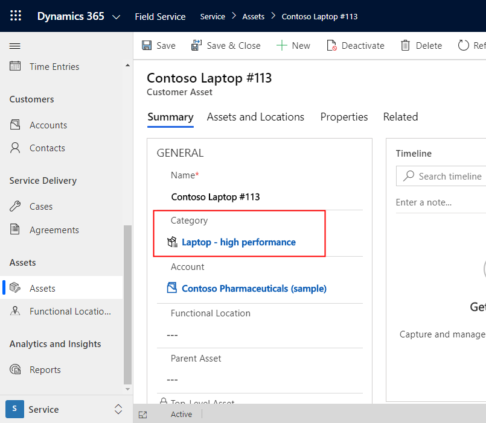
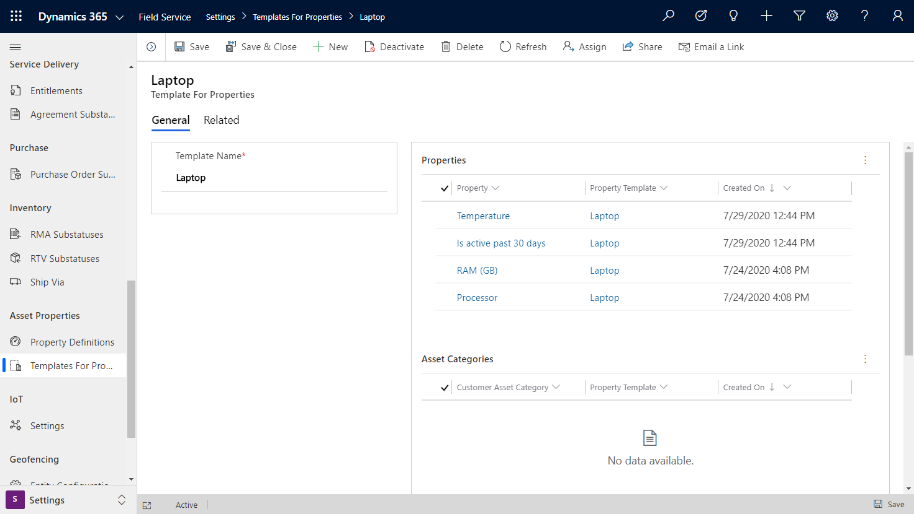
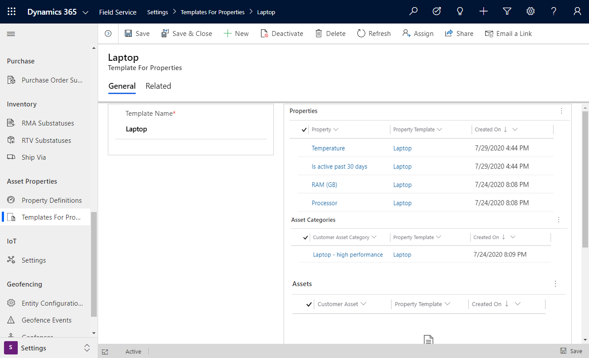
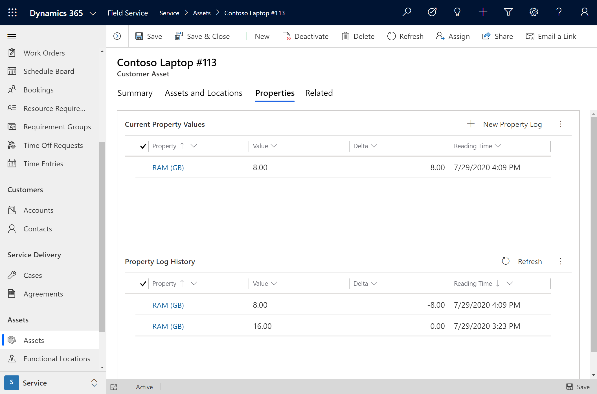

# Asset properties 

// https://msit.microsoftstream.com/video/1763a1ff-0400-a521-085b-f1eacb89ecd9?channelId=0bf6f71a-b361-4d7b-9668-62ff5207b60d
// keep in mind Dan talks about things in the video above that are not part of this feature but fetures later on that will be built on this capability. we dont want to cause confusion between what exists today and what is coming. 

## Prerequisites

Have one or more assets created in Field Service. For more informations see the topic on [Customer Assets](link)

## Create and assign asset categories

> [!div class="mx-imgBorder"]
> 

> [!div class="mx-imgBorder"]
> 

## Create property definitions

> [!div class="mx-imgBorder"]
> 

> [!div class="mx-imgBorder"]
> 

## Create templates for properties

> [!div class="mx-imgBorder"]
> 

## Relate templates to asset categories, assets or both 

> [!div class="mx-imgBorder"]
> 

> [!div class="mx-imgBorder"]
> 

## Add property logs

For a particular asset, define the properties of that asset.

> [!div class="mx-imgBorder"]
> 

Only the properties from your template will display as options

> [!div class="mx-imgBorder"]
> 

Choose a property then enter a value for that property. In the example below we entered a number value for the laptop's RAM.

**Reading time** represents the date and time the property equals its current value. By default reading time equals the current date and time but if you are logging a property value from earlier you can set the time. After creating the log the Reading Time cannot be edited. 

> [!div class="mx-imgBorder"]
> 

Repeat this process for all the asset properties you want to define.

## Maintain property logs

You may want to update the properties that were previously defined.

+New Property Log

Choose an existing property and add a new value.

> [!div class="mx-imgBorder"]
> 

The most current properties will show in the Current Property Values list.

All previous property values thoughtout the life span of the asset will appear below in the Property Log History.

> [!div class="mx-imgBorder"]
> 

> [!Note]
> You may have to refresh the list to see updated delta calculations and log history.

## Configuration considerations

### Manually add properties

In some cases you will need to manually add asset properties for assets that do not belong to a template or in situations where you need to add properties "al la cart" in addition to template properties.  

**Asset record > Related > Property Asset Associations**

+property asset association

then go back to the Properties tab and add a new property log 

the property you added will now show in the lsit of eligible properties

## Additional Notes

- Both Current Property Values and Property Log History refer to the same entity but with a differently filtered view.

- When a specific asset record is added to a property template, the template will show as a related record from the asset.

> [!div class="mx-imgBorder"]
> 

From the asset go to **Related > Asset template associations**

> [!div class="mx-imgBorder"]
> 

- The "Value" field in the property log shows the value of the asset property whether a string, number, boolean, or Date and Time. This value is not localized and is hidden by default on the property log form.  

> [!div class="mx-imgBorder"]
> 

