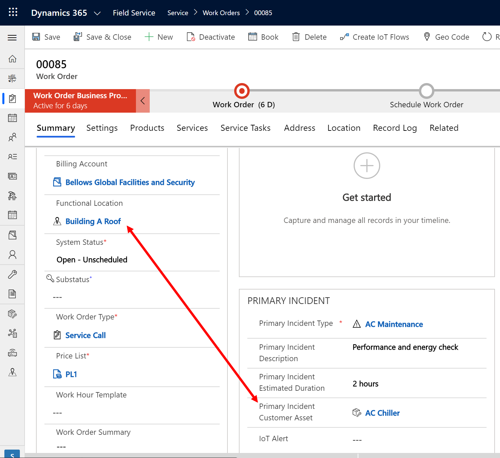
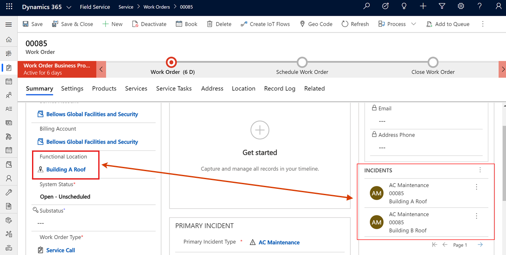

# Functional location of assets and work orders

Field Service organizations often service customers that have large or complex worksites - like a farm or a multi-story office building, for instance. In such cases, it's important that a technician can find specifically where they need to go to perform their work.

Functional location provides for more granularity on location information in a few Field Service scenario such as:

- Within a service account
- On an asset
- On a specific work order

// https://msit.microsoftstream.com/video/9ec8a3ff-0400-a936-c3da-f1eaab7ee13c?channelId=0bf6f71a-b361-4d7b-9668-62ff5207b60d

A functional location provides more clarity for locations within a service account, locations of assets, locations where work orders need to be performed and thus where technicians need to travel to.

A functional location is hierarchichal meaning --- as an example room 1 is in building A which is in campus 2

## Prerequisites

- Early access August 1, 2020, 
- generally available October 1st 2020 
- Field Service v8.8.x (will know exact number closer to Aug 1)

## Create a service account

First create a service account or choose one that is already created. Service accounts are required to create work orders and define the customer and service location of the work order.

Ensure the service account has an address and is geocoded. You will know the service account record is geocoded if it appears on the map and the latitiude and longitude fields have values. 

> [!div class="mx-imgBorder"]
> 

> [!Note]
> In Field Service Settings there is a setting called Auto Geo Code addresses. Set this field to Yes to have records auto geocoded as addresses are entered.

## Create functional locations

Use functional locations to define areas and locations within the service account. 

From the service account record go to the **Assets and Locations** section. 

> [!div class="mx-imgBorder"]
> 

> [!div class="mx-imgBorder"]
> 

> [!div class="mx-imgBorder"]
> 

## Create or add assets to the functional location tree

> [!div class="mx-imgBorder"]
> 

> [!div class="mx-imgBorder"]
> 

> [!Note]
> You cannot drag a sub asset to a functional location different from the parent asset's functional location.

## Use functional location for work orders

> [!div class="mx-imgBorder"]
> 

Add a functional location or add a customer asset within that functional location.

### Add multiple functional locations to a single work order

> [!div class="mx-imgBorder"]
> 

> [!div class="mx-imgBorder"]
> 

> [!Note]
> Address of work order only reflects the functional location on the work order and on the primary incident type not the location of the additional incident types.

## Use functional location for cases

> [!div class="mx-imgBorder"]
> 

## Use functional location for agreements

Go to **Agreements > select an agreement > Agreement Booking Setup > Agreement Booking Incident**

> [!div class="mx-imgBorder"]
> 

## Configuration considerations
// use question &answer part of video

### multiple accounts can be associated to a functional location tree

### Mobile

## Additional Notes
// use question &answer part of video
