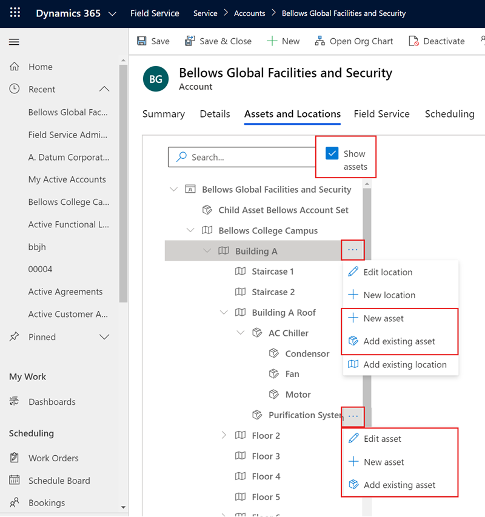
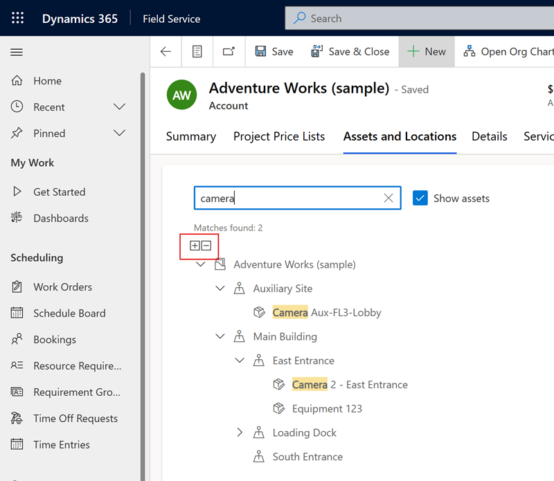
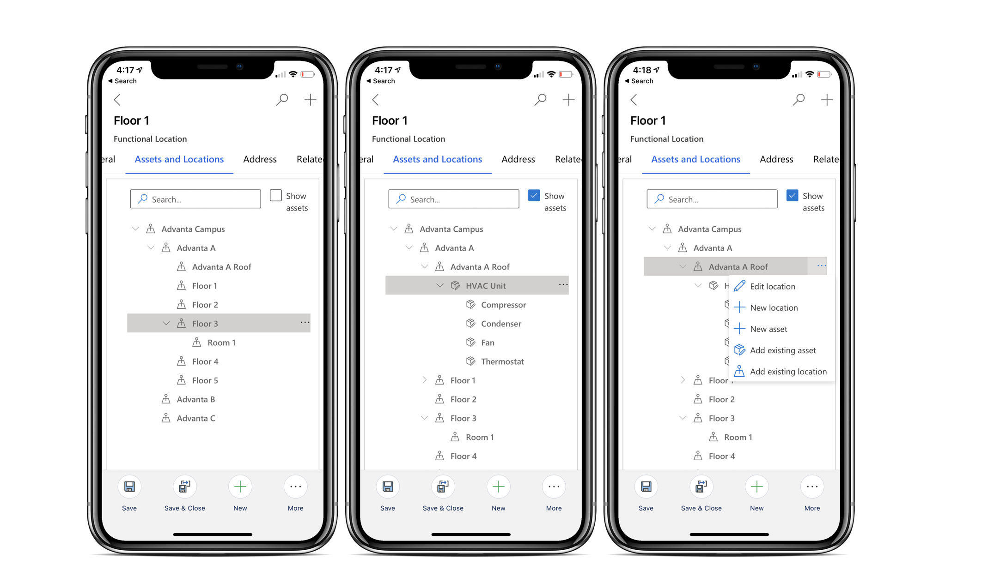
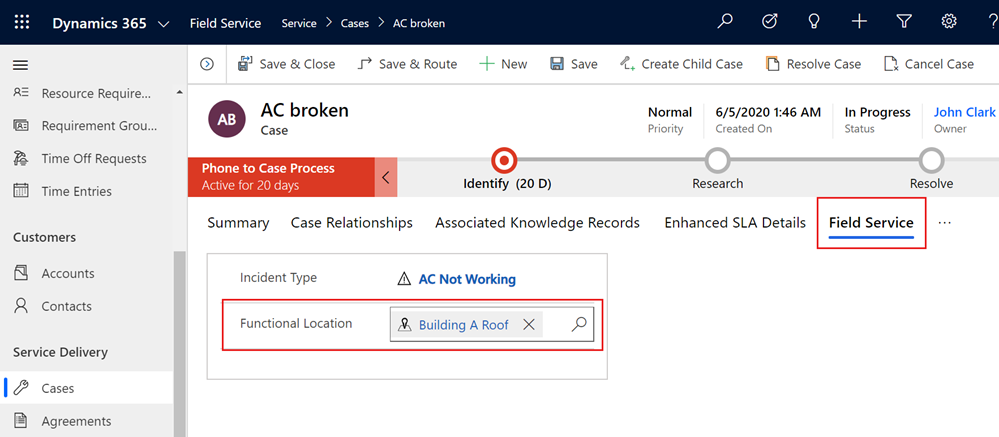

# Functional location in Dynamics 365 Field Service

Field service organizations often work for customers that have large or complex worksites. For example, a warehouse or a multi-story office building. It's important that a technician knows exactly where they need to go to perform their work.

Functional locations in Field Service allow granular locations and can represent hierarchical relationships. For example, a printer on the third floor in building A on a customer's campus would be represented as the following nested relationship:

- Campus
  - Building A
    - Floor 3
      - Printer

In this article, we'll look at how to define functional locations and relationships in Field Service.

## Prerequisites

- Field Service v8.8.x.
- [Service accounts created](accounts.md).

## Create functional locations

Let's create a functional location on a service account.

1. In Field Service, change to the **Service** area.

1. Go to **Customers** > **Accounts** and open a service account record.

1. Go to the **Assets and Locations** tab, select the ellipsis (...) and select **New location**.

   :::image type="content" source="media/assets-functional-location-new-location.png" alt-text="Screenshot of the assets and locations tab on an account record.":::

1. Provide a **Name** and other information if needed. Then, **Save** the record.

The new location appears in the list, where you can drag it around and nest it as needed.

In our example, we've created "Building A Roof" as a location under "Building A," which is located on the Bellows College Campus. The following screenshot shows this relationship in the list of functional locations on the service account.

:::image type="content" source="media/assets-functional-location-tree.png" alt-text="Screenshot of the assets and locations on a service account.":::

Select any location in the list for more details, such as latitude and longitude.

## Create or add assets to the functional location tree

Often, technicians must perform their work on a [customer asset](configure-set-up-customer-assets.md), at a specific location.

Assets can also be associated directly to a functional location, which helps technicians to find them and perform their work.

From the service account's **Assets and Locations** section, select the **Show Assets** option to see a list of associated assets.

To add a new asset, select the ellipses (...), and select **New asset** or **Add existing asset**.

> [!div class="mx-imgBorder"]
> 

> [!TIP]
> When nesting assets, you can't drag a sub asset to a functional location different from the parent asset's functional location.
> When dragging an sub asset under a new parent with a different functional location, the asset's functional location will be cleared, and the new parent's functional location will be used instead.

## Search the functional location tree

Use the search bar to search for functional locations and associated assets. Select the **Show Assets** box to include assets in search. Matching search results are highlighted.

> [!div class="mx-imgBorder"]
> 

For larger or more complex trees, you can also expand or collapse all the results by using the **Plus** and **Minus** icons at the top of the tree.

For a guided walkthrough, check out the following video.

> [!VIDEO https://www.microsoft.com/videoplayer/embed/RWOjSM]

## Use functional location for work orders

Once defined, functional locations help flesh out [work order details](create-work-order.md), once again making it easier for technicians to see where they must perform their work.

Functional locations can be associated directly to the work order.

> [!div class="mx-imgBorder"]
> 

Once the functional location is selected, more detailed information appears in the **Location** tab of the work order.

### Add multiple functional locations to a single work order

Use more work order incidents to define more work that needs to be done in addition to the primary work order incident.

> [!div class="mx-imgBorder"]
> 

For each work order incident, you can define a functional location in scenarios where they must be completed at a different location than the one defined on the work order.

For example, imagine as part of one work order, a technician needs to go to three different buildings to perform a different task at each. In this scenario, add three work order incidents with each one having the respective functional location. Use the primary incident duration as either the most important work order incident or the location that the technician should travel to first.

> [!div class="mx-imgBorder"]
> 

> [!Note]
> Work order address only reflects the functional location on the work order and on the primary incident type, not the location of the additional incident types.

## Use functional locations on the mobile app

Technicians can see the functional location of a work order on the Dynamics 365 Field Service mobile app.

> [!div class="mx-imgBorder"]
> 

Technicians can also view and interact with functional location and customer asset hierarchies on the mobile app.

> [!div class="mx-imgBorder"]
> 

> [!Note]
> Internet connectivity is required to view and interact with functional location and customer asset hierarchy trees on the Field Service mobile app.

For a guided walkthrough of functional locations on the Field Service mobile app, check out the following video.

> [!VIDEO https://www.microsoft.com/videoplayer/embed/RE4I2pU]

## Use functional location for cases

In cases where organizations start with a **Case** in their workflow, functional locations can be associated there as well.

On a case record, go to the Field Service section, and associate a functional location there.

> [!div class="mx-imgBorder"]
> 

## Use functional location for agreements

To use functional locations on an agreement, select an agreement. Go to **Agreement Booking Setup**, and then **Agreement Booking Incident**, where you can associate a functional location.

> [!div class="mx-imgBorder"]
> 

## Configuration considerations

- Multiple accounts can be associated to a functional location tree.
- Field Service technicians can see functional locations from their Field Service mobile apps, but cannot see or manage the larger location and asset hierarchies.

### Functional location is not automatically associated to account in custom apps

1. Open any custom app designer where this issue is seen.
2. Add functional location entity to the app from **Add** > **Entities**.
3. Select form components of functional location entity, uncheck *All* and select only quick create form for functional location.
4. Publish the app and verify that functional location form will open quick create form in the tree view control.
5. Newly created functional locations should appear in tree view control.

[!INCLUDE[footer-include](../includes/footer-banner.md)]
