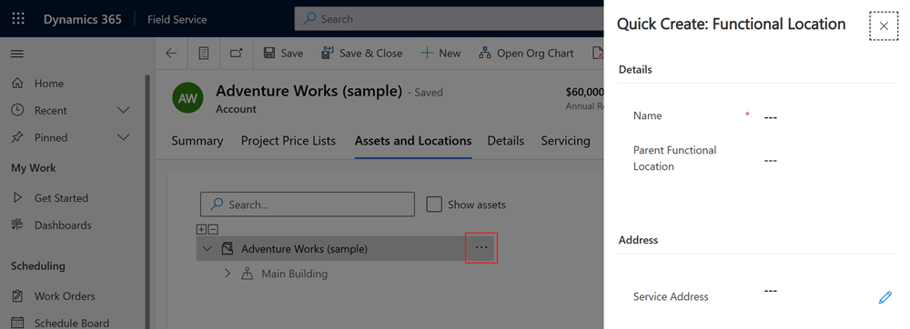
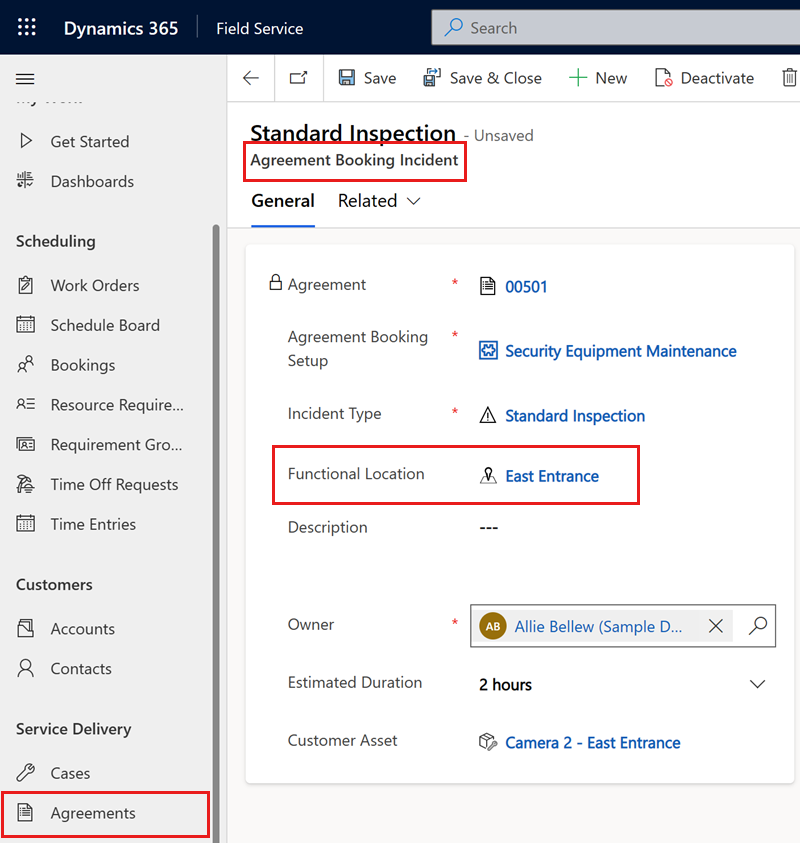

# Functional location of assets and work orders

Field Service organizations often service customers that have large or complex worksites - like a warehouse or a multi-story office building, for instance. In such cases, it's important that a technician can find specifically where they need to go to perform their work.

Functional location in Field Service allows for more location granularity on a few relevant Field Service entities, such as:

- Within a service account
- On an asset
- On a specific work order

Additionally, functional locations can be represented by hierarchical relationships. For example, a printer might be located on the third floor, in building A on a customer's campus. This relationship would be represented as the following nested relationship:

- Building A
  - Floor 3
    - Printer 1

In this article, we'll look at how to define functional relationships within Field Service.

## Prerequisites

> [!Note]
> As of August 2020, functional location is available as an early access feature. For more information, see the article on [how to opt-in to early access features](https://docs.microsoft.com/power-platform/admin/opt-in-early-access-updates#how-to-enable-early-access-updates).

- Functional location is in early access as of August 1, 2020.
- This feature will be generally available October 1, 2020.
- Field Service v8.8.x.

## Create a service account

First, create a service account or choose an existing one. Service accounts are required to create work orders and define the customer and service location of the work order.

Make sure the service account has an address and is geocoded. You can see that the service account record is geocoded if it appears on the map and the latitude and longitude fields have values.

> [!div class="mx-imgBorder"]
> 

> [!Note]
> In Field Service settings, there is a setting called **Auto Geo Code Addresses**. Set this field to **Yes** to have records autogeocoded as addresses are entered.

## Create functional locations

Next, we'll create a functional location on a service account.

From the service account, go to the **Assets and Locations** tab. Select **New location**.

> [!div class="mx-imgBorder"]
> 

Give the location a name and then save. The new location will appear in this list, and can be dragged around and even nested as necessary. 

In our example, we've created "Building A Roof" as a location under "Building A," which is located on the Bellows College Campus. The following screenshot shows this relationship in the list of functional locations on the service account.

> [!div class="mx-imgBorder"]
> 

Select any location in the list for additional details, such as latitude and longitude.

> [!div class="mx-imgBorder"]
> 

## Create or add assets to the functional location tree

Often, technicians must perform their work on a customer asset, which exists at a specific location at a work site.

Assets can also be associated directly to a functional location, making it easy for technicians to find and perform their work.

From the service account's **Assets and Locations** section, select the **Show Assets** option to see a list of associated assets. 

> [!div class="mx-imgBorder"]
> 

To add a new asset, select the ellipses icon, and either add a new asset, or relate an existing asset to this particular location.

> [!div class="mx-imgBorder"]
> 

> [!Note]
> You can't drag a sub asset to a functional location different from the parent asset's functional location.

## Use functional location for work orders

Once defined, functional locations help flesh out work order details, once again making it easier for technicians to see where they must perform their work.

As seen in the following screenshot, functional locations can be associated directly to the work order.

> [!div class="mx-imgBorder"]
> 

Add a functional location or add a customer asset within that functional location.

Once the functional location is selected, you'll see that more detailed information will appear in the **Location** tab of the work order. If the functional location has a specific address, this information will populate on the **Locations** tab. If the functional location has no address, but has a latitude and longitude, no address will populate, but the latitude and longitude will.

### Add multiple functional locations to a single work order

Use additional work order incident types to define more work that needs to be done in addition to the primary incident type.

> [!div class="mx-imgBorder"]
> 

For each work order incident type, you can define a functional location in scenarios where they must be completed at a different location than the one defined on the work order.

For example, imagine as part of one work order, a technician needs to go to three different buildings to perform a different task at each. In this scenario, add three work order incident types with each one having the respective functional location. Use the primary incident duration as either the most important work order incident or the location that the technician should travel to first.

> [!div class="mx-imgBorder"]
> 

> [!Note]
> Work order address only reflects the functional location on the work order and on the primary incident type, not the location of the additional incident types.

## Use functional location for cases

In cases where organizations start with a **Case** in their workflow, functional locations can be associated there as well.

On a case record, go to the Field Service section, and associate a functional location there.

> [!div class="mx-imgBorder"]
> 

## Use functional location for agreements

To use functional locations on an agreement, select an agreement. Go to **Agreement Booking Setup**, and then **Agreement Booking Incident**, where you can associate a functional location.

> [!div class="mx-imgBorder"]
> 

## Configuration considerations

- Multiple accounts can be associated to a functional location tree.
- Field Service technicians can see functional locations from their Field Service mobile apps, but cannot see or manage the larger location and asset hierarchies.
