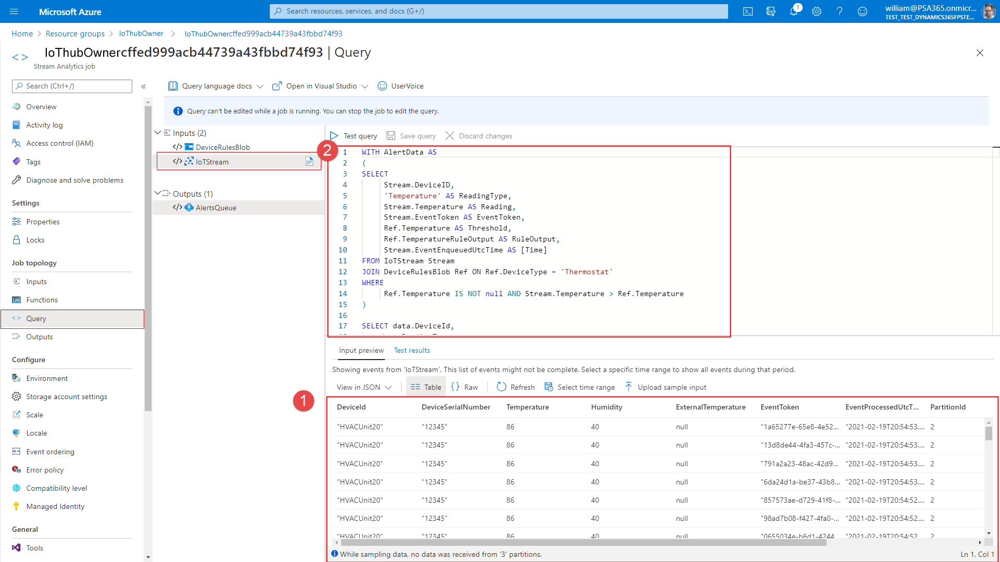
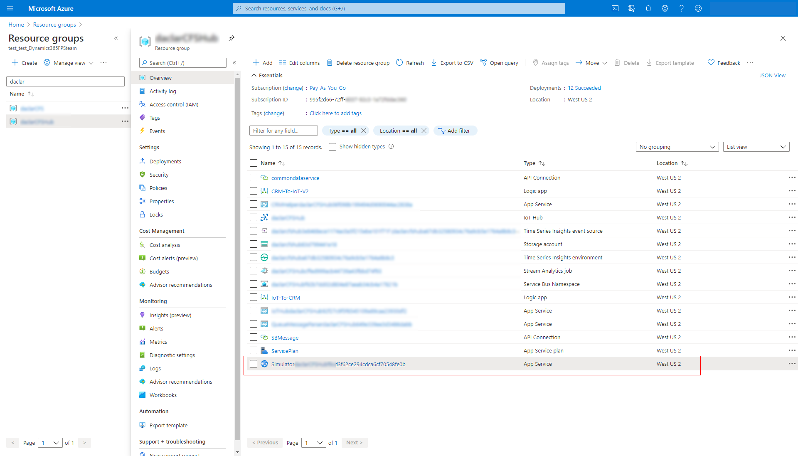
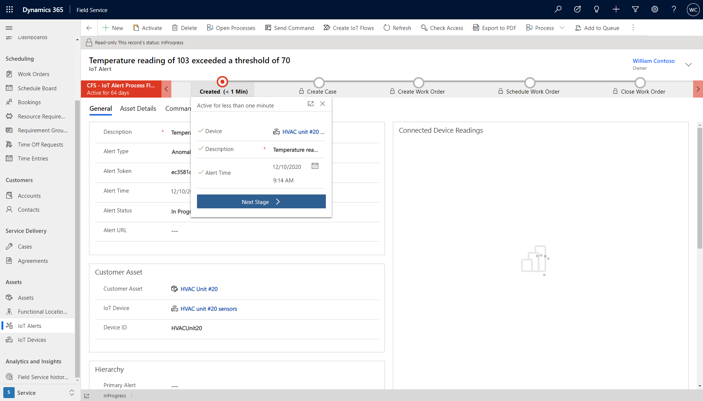

# Create IoT Alerts and convert IoT Alerts into work orders

IoT alerts are a subset of IoT messages that may require attention. 

// https://msit.microsoftstream.com/video/7a11a1ff-0400-b564-2c53-f1eb658dc97a

In this doc we will review how IoT alerts are triggered, how to view IoT Alerts in Field Service, and then how to create work orders based on the IoT Alerts. 

## Trigger IoT Alerts in Azure IoT Hub 

As IoT messages flow into Azure IoT Hub, you can create rules that dicatate when IoT alerts should be created based on the IoT messages.

> [!div class="mx-imgBorder"]
> 

View and edit the criteria in Stream Analytics in your Resource Group.

> [!div class="mx-imgBorder"]
> 

Go to Query in the left pane then select **IoTStream**. 

> [!div class="mx-imgBorder"]
> 

**(1)** the bottom pane shows all incoming IoT messages from the connected device 

**(2)** the top pane shows the JSON that creates IoT Alerts from IoT messages.

### Trigger IoT Alerts with the simulator

Set up the simulator to simulate IoT devices and data and begin to see device data pulled into Field Service.

To find the simulator URL, sign in to your Azure subscription, and then select the App Service resource type under the newly created resource group. You’ll see the URL is in the top-right corner. Copy the URL and complete the following steps:  
  
1. Paste the URL into your browser’s address bar to load the page.  
  
2. When the simulator page opens, select **Configuration**.  
  
3. Enter the IoT hub host name and key. The host is simply the name of the IoT Hub resource in Azure portal. 

> [!div class="mx-imgBorder"]
> 

 The key can be accessed by selecting the IoT Hub resource and going to the shared access policies, then copying the primary key for **iothubowner** as seen in the following screenshot.

> [!div class="mx-imgBorder"]
> 
  
1. Select the IoT hub in the **Resource Group**.  
  
2. On the left under **General**, select **Shared access policies** to get the host name and primary key.  
  
3. Make sure **Connection status**  is marked as **Connected** and then close the dialog box.  

Now you can send a test command by using the sample simulator. For example, select the temperature and increase it to above 70 degrees. The simulator is preprogrammed to create an IoT alert if temperature is above 70 degrees.

> [!div class="mx-imgBorder"]
> 

The go to the simualtor URL. 

> [!div class="mx-imgBorder"]
> 

> [!div class="mx-imgBorder"]
> 

> [!Note]
> **Not using Azure IoT Hub?** Creating IoT Alerts in Field Service based on IoT messages in your custom IoT provider is supported. See the topic on [Extensible IoT data sources for Connected Field Service](cfs-custom-iot-provider.md) for more details. 

## View IoT Alerts in Field Service

> [!div class="mx-imgBorder"]
> 

> [!div class="mx-imgBorder"]
> 

## Convert an IoT Alert to a work order

> [!div class="mx-imgBorder"]
> 

> [!div class="mx-imgBorder"]
> 

> [!div class="mx-imgBorder"]
> 

> [!div class="mx-imgBorder"]
> 

## Organize IoT Alerts

Group IoT alerts

> [!div class="mx-imgBorder"]
> 

> [!div class="mx-imgBorder"]
> 

[IoT alert AI suggestions](iot-alerts-ai-based-suggestions)

> [!div class="mx-imgBorder"]
> 

## Configuration considerations
## Additional Notes
