# Create IoT alerts and convert IoT alerts into work orders

Within Dynamics 365 Field Service, IoT alerts are a subset of IoT messages that may require attention. For instance, maybe a configured sensor in a refrigerator you service has alerted that humidity has risen above an acceptable threshold. To help with proactive service delivery, you can convert that incoming IoT alert directly to a work order, which can then be scheduled and assigned to a service technician. 

In this aritlce, we will review:

- How IoT alerts are triggered 
- How to see IoT alerts in Field Service 
- How to create work orders based on the IoT alerts. 

For a guided walkthrough, check out the following video:  [Connected Field Service: IoT Alerts](https://youtu.be/tkBSLhKNfmQ). 

## Trigger IoT alerts in Azure IoT Hub 

As IoT device information flows into Azure IoT Hub, you can create rules that dictate when IoT alerts should be created based on the IoT messages.

> [!div class="mx-imgBorder"]
> 

You can find and edit these criteria in **Stream Analytics** in your resource group.

> [!div class="mx-imgBorder"]
> 

Go to **Query** in the left pane, then select **IoTStream**. 

> [!div class="mx-imgBorder"]
> 

With reference to the callouts in the previous image:

- **(1)**: the bottom pane shows all incoming IoT messages from the connected device. 
- **(2)**: the top pane shows the JSON that creates IoT alerts from IoT messages.

### Trigger IoT alerts with the simulator

Set up the simulator to simulate IoT devices and data in order to see device data pulled into Field Service.

To find the simulator URL, sign in to your Azure subscription, and then select the app service resource type under the newly created resource group. 

> [!div class="mx-imgBorder"]
> 

You’ll see the URL in the top-right corner. Copy the URL. 

> [!div class="mx-imgBorder"]
> 

Complete the following steps:
  
1. Paste the URL into your browser’s address bar to load the page.  
  
2. When the simulator page opens, select **Connection** at the top.  
  
3. Enter the IoT hub host name and key. The host is the name of the IoT Hub resource in the Azure portal. 

> [!div class="mx-imgBorder"]
> 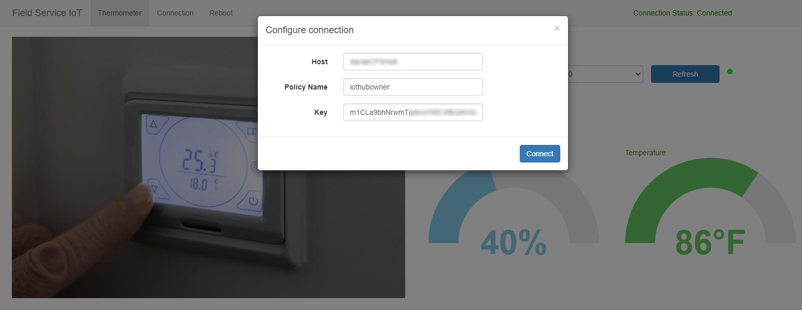

 The key can be accessed by selecting the IoT Hub resource and going to the shared access policies, then copying the primary key for **iothubowner**, as seen in the following screenshot.

> [!div class="mx-imgBorder"]
> 
  
1. Select the IoT hub in the **Resource Group**.  
  
2. On the left under **General**, select **Shared access policies** to get the host name and primary key.  
  
3. Make sure **Connection status**  is marked as **Connected** and then close the dialog box.  

Now you can send a test command by using the sample simulator. For example, select the temperature and increase it to above 70 degrees. The simulator is preprogrammed to create an IoT alert if temperature is above 70 degrees.

> [!div class="mx-imgBorder"]
> 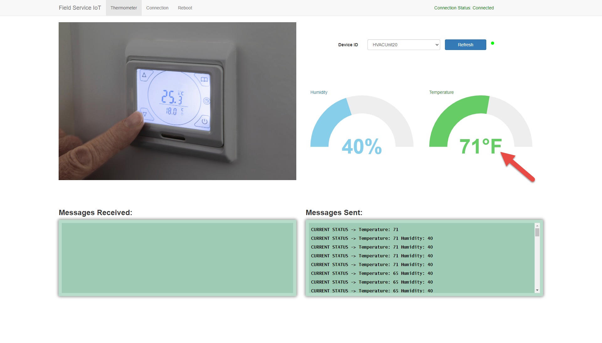

> [!Note]
> **Not using Azure IoT Hub?** Creating IoT alerts in Field Service based on IoT messages in your custom IoT provider is supported. For more information, see this article: [Extensible IoT data sources for Connected Field Service](cfs-custom-iot-provider.md). 

After the rule is created in Stream Analytics, the logic app will create IoT alerts based on the rule criteria. 

> [!div class="mx-imgBorder"]
> 

## View IoT alerts in Field Service

In our example with the simulator, an IoT alert was created in Field Service because the temperature reading in an IoT message exceeded 70 degrees. 

> [!div class="mx-imgBorder"]
> 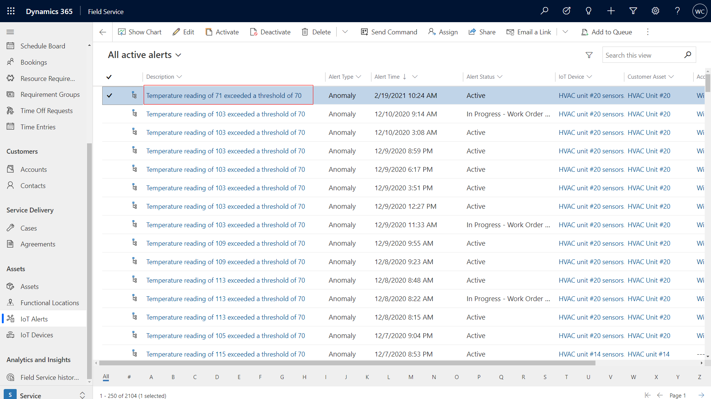

The IoT alert form shows more details and the **Alert Data** section shows the details in the JSON message. 

> [!div class="mx-imgBorder"]
> 

## Convert an IoT alert to a work order

Use the business process flow to take action against the IoT alert.

> [!div class="mx-imgBorder"]
> 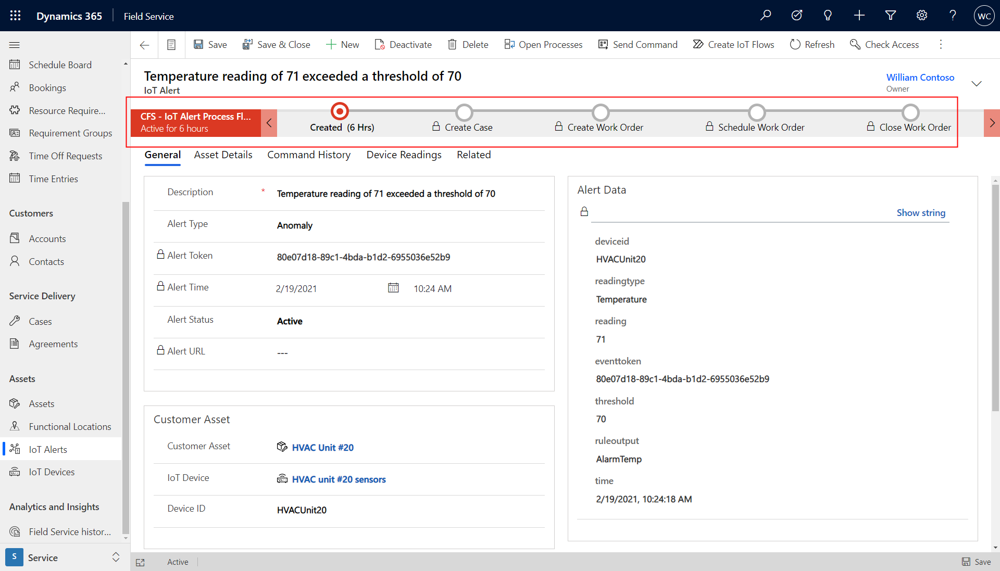

Create a case related the IoT alert to investigate remotely.

> [!div class="mx-imgBorder"]
> 

If the potential issue can't be identified or resolved, advance to the next step in the business process flow to create a work order. 

> [!div class="mx-imgBorder"]
> 

The IoT alert is referenced on the work order form and can be accessed by the technician on their mobile device. 

> [!div class="mx-imgBorder"]
> 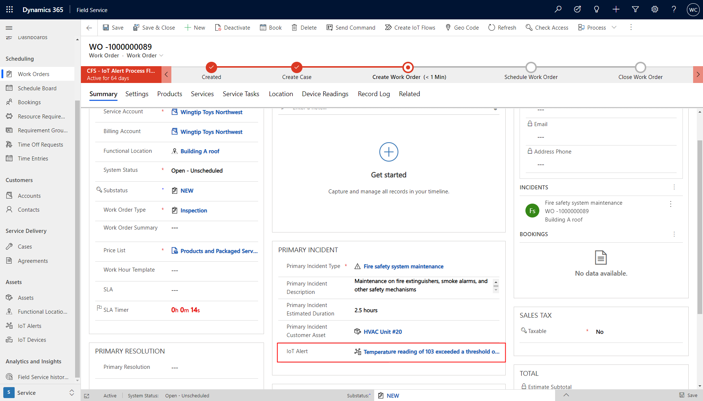

## Organize IoT alerts

It is possible for multiple IoT alerts to be created for the same IoT device for the same issue.

The system recognizes similar IoT alerts and groups them together. 

> [!div class="mx-imgBorder"]
> 

Select the group icon next to an IoT alert to see similar IoT alerts for the same device around the same time. 

> [!div class="mx-imgBorder"]
> 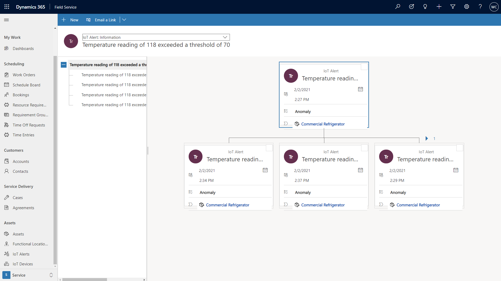

You can also use AI to suggest which IoT alerts are higher priority based on historical data, like which IoT alerts were converted to work orders. For more information, see this article: [IoT alert AI suggestions](iot-alerts-ai-based-suggestions.md). 

> [!div class="mx-imgBorder"]
> 

## IoT alerts parenting

When an IoT alert is created in Connected Field Service, there are aggregation rules that decide if the alert should be parented under another existing alert since the alert may be for a device or asset that already has an open alert. With autoparenting, you can avoid overrunning the alert list with many alerts for the same issue.

To configure which fields should be used to decide if an alert should be parented, go to **IoT Settings** > **Alert Aggregation Rules tab**.

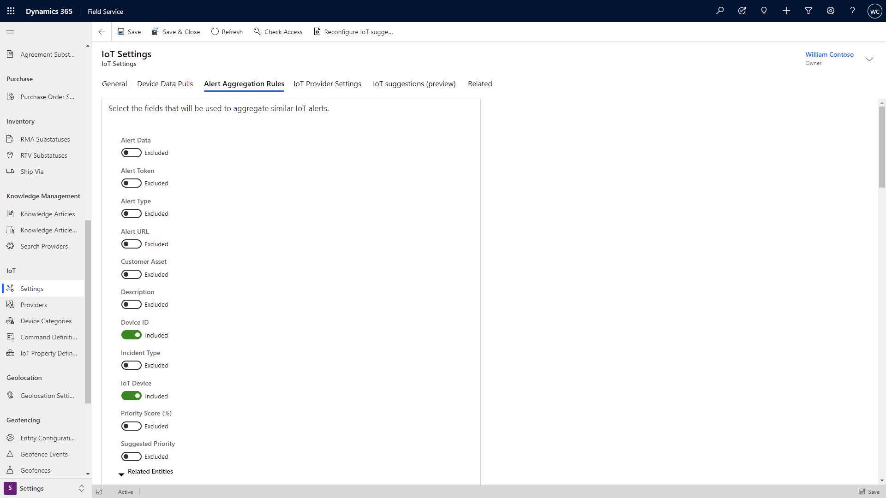

If all the selected fields match, the alert will be parented if the alert time falls within five minutes of the previous alert.

If you disable all the fields in the alert aggregation settings, there is still a default where it will parent the alert if the device ID matches, and the alert time falls within five minutes.

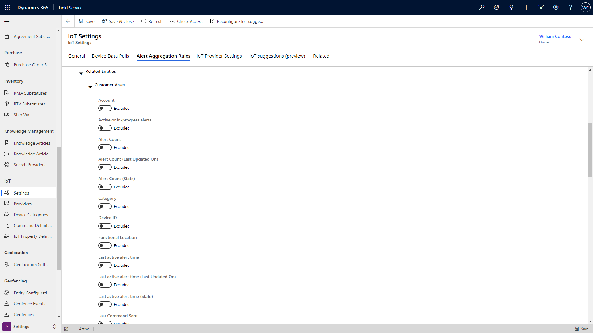

If there is no value in the alert time field, the system uses the **Created On** field on the IoT alert record to make sure it falls within five minutes of other matching alerts.

To edit the five-minute rule to include alerts that are created outside of that five-minute window, or if you want to make that window shorter, you can modify the flow or workflow "debounce" period.

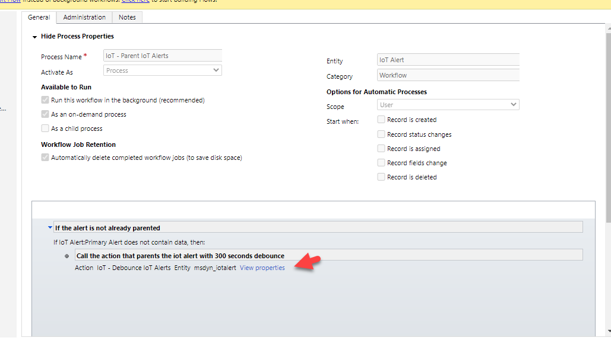

When a parent alert is found, we first check to see if the matched alert has a parent, in which case the new alert is linked to the existing parent alert of the alert that matched. If the matching alert does not have a parent, the new alert is linked to that matching alert, which is now the parent alert.

To completely turn off the autoparent feature, disable the workflow or flow (depending on whether your organization uses enhanced background processing controlled through Field Service settings. For more information, see this [article on default settings in Field Service](/dynamics365/field-service/configure-default-settings#other-settings).

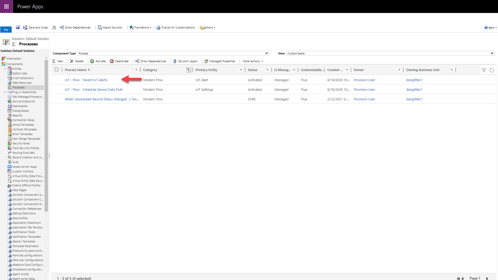

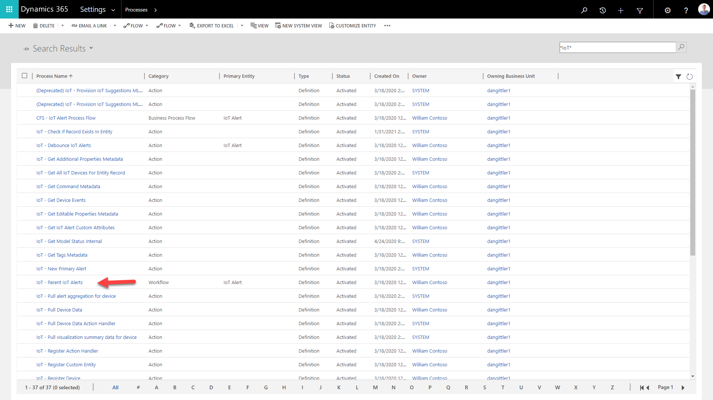
