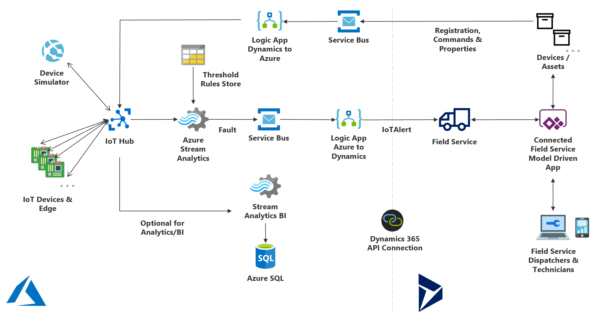

# Connected Field Service with IoTHub Architecture

Connected Field Service with IoTHub brings together AzureIoT and Dynamics 365 for Field Service, here is an explanation of the architecture.

> [!div class="mx-imgBorder"]
> 

**IoT Devices & Edge** - Internet connected sensors on equipment send data to IoTHub typically via WiFi or cellular connectivity. A single piece of equipment can have multiple sensors each taking different measurements such as temperature and pressure. If a building or area has a collection of equipment each with multiple sensors then an **Edge device** can be used to organize them and broker telemetry and messages sent to IoTHub.

**Device Simulator** - administrators can simulate devices and telemetry for testing and development purposes before the hardware (devices) are set up and then see how simulated alerts flow to Dynamics 365 for Field Service and create work orders.

**IoTHub** - the gateway to the cloud that is capable of ingesting data at a very large scale. IoTHub is a collection of applications and processes tailored to connected device scenarios that are also customizable. Deploying IoTHub wil deploy a resource group with this collection of applications and processes.

**Azure Stream Analytics** - queries device data as it enters IoTHub. Data simply passes through and is not stored.

**Threshold Rules Store** - helps decide if device data is abnormal and beyond acceptable boundaries. Abnormal data is characterized as a **Fault**.

**Service Bus** - takes faults and enters them into a queue to systematically keep track of them. The queue is helpful for scenarios where faults fail to get transferred to Dynamics 365 and should be attempted again after some time.

**Stream Analytics & Azure SQL** - used to store device data for longer time periods to perform data analysis. As an example, this would be an option for organizations interested in analyzing large amounts of historical data to predict device failures in the future. This generally incurs a greater Azure cost.

**Logic App Azure to Dynamics** - connects Azure with Dynamics 365 (and other applications and platforms). Serves as a way to apply more logic, map entities, and trigger the appropriate actions in dynamics such as the creation of an **IoT Alert** record.

## Prerequisites
> [!Note]
>

## Configuration considerations
## Additional Notes

### See also