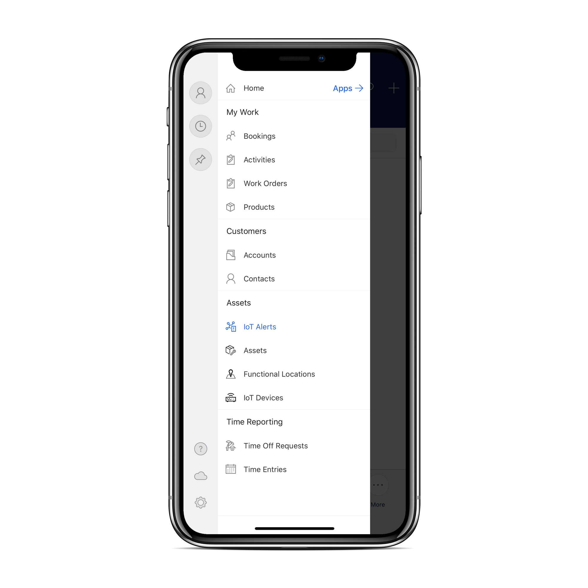
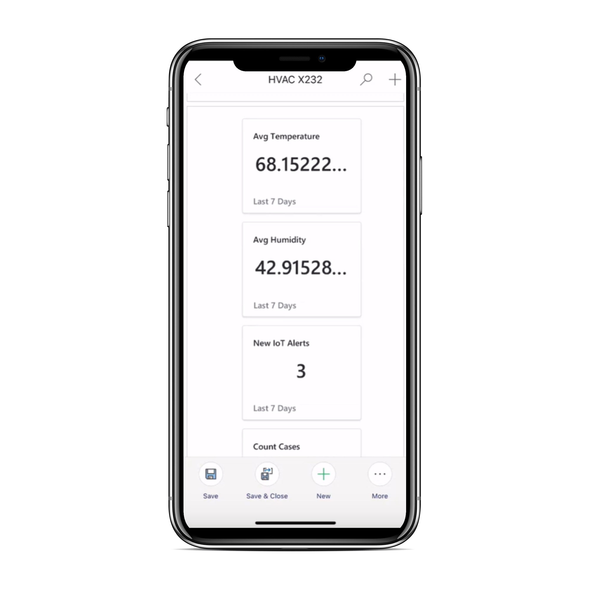

# Connected Field Service on Field Service (Dynamics 365) mobile app

Organizations that are using Connected Field Service to create work orders from IoT data can provide technicians with IoT data and Connected Field Service actions to improve onsite service delivery.

Most often technicians will use Connected Field Service to

1) **view IoT data** related to assets to better understand the context of a repair
2) **register new IoT devices** when installing and asset to connect it to Azure IoT or a custom IoT provider
3) **send commands** to troubleshoot issues

// use for more details https://msit.microsoftstream.com/video/45cca3ff-0400-a521-d802-f1ead10982ec?list=studio

With the latest version of Field Service and the Field Service (Dynamics 365) mobile app technicians will find Connected Field Service entities in the sitemap. 

> [!div class="mx-imgBorder"]
> 

## Prerequisites

Connected Field Service is included with Field Service

Set up Connected Field Service

Set up Field Service (Dynamics 365) mobile app - latest mobile app and latest Field Service version

Internet connection, not offline
> [!Note]
>

## View summary tiles and device readings

While performing a work order for an asset, technicians may want to view recent IoT data for devices related to that asset. 

Go to the customer asset record and on the summary tab you will find summary tiles.

Summary tiles give an overview of recent IoT activity related to the asset.

> [!div class="mx-imgBorder"]
> 

Furthermore, go to the Device Readings section to view the most recent IoT measurements plotted on a graph.

Summary tiles and device readings are only visible after an asset is related to a connected device. Otherwise this information is displayed on the IoT device.

## Register new IoT Devices

During asset installations technicians may want to connect new IoT devices to Azure IoT. From the mobile app with an internet connection, go to the IoT device record or create a new one and select **More ... > Register**.

> [!div class="mx-imgBorder"]
> 

This will create the IoT device in Azure IoT.

## Troubleshoot by sending commands

After an adminsitrator has configured commands in Azure IoT, technicians can run the commands from the Field Service mobile powerapp.

Common commands include restart and shutdown among other custom commands that are device specific.

From the IoT device record go to **More ... > Send command** then choose a specific command. 
