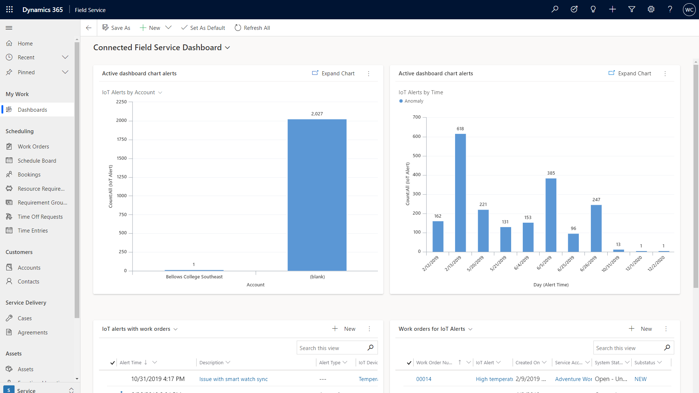
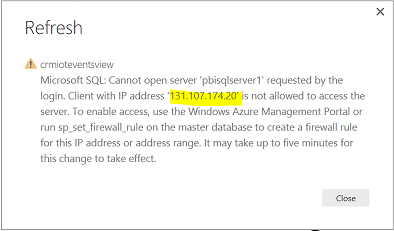

# Reports for Connected Field Service

## View the IoT dashboard

 The default IoT dashboard provides data on registered devices and alerts. [!INCLUDE[proc_more_information](../includes/proc-more-information.md)] [Create or customize dashboards](../customerengagement/on-premises/customize/create-edit-dashboards.md)

 > [!div class="mx-imgBorder"]
> 

1. From the main menu, go to **Dashboards** then switch to the **Connected Field Service Dashboard**.

2. Select **Dashboard**.

    - The first chart shows alerts that you can sort by selecting the IoT **Alerts by** menu.

    - The second chart shows alerts by time.

    - The third chart shows alerts along with the action taken to resolve the issue.

### Set up a Power BI chart (optional)  

 Set up Power BI  accounts and open the sample .pbix report.  
  
1. Go to [https://powerbi.microsoft.com](https://powerbi.microsoft.com) and create a free Power BI account.  
  
2. [Install Power BI Desktop](https://powerbi.microsoft.com/desktop/).  
  
3. Sign in to Power BI Desktop with the Power BI user credentials (we recommend that this user is the same as the Dynamics 365 user).  
  
4. Download and open the sample Power BI template.  
  
   The Power BI report will open with errors because it was created with a sample SQL database and user. Update the query with your SQL database and user, and then publish the report to Power BI.  
  
#### Update the query to point to your SQL database  
  
1. Select **Edit Queries**.  
  
2. Select **Advanced Editor**.  
  
3. Replace the source SQL database with the database provisioned in your Azure resource group.  
  
4. Select **Close and Apply**.  
  
    You can find your SQL server name in the SQL database in the Azure portal.  
  
5. Add your IP address to the SQL server firewall to allow Power BI Desktop to connect to the SQL server.  
  
6. Copy the IP address when you see this message.  
  
     
  
7. Go to the Azure portal, open the SQL server, and add your IP address to the firewall.  
  
#### Publish to your Power BI account  
  
1. Save your changes and publish.  
  
2. Once you publish, Power BI Desktop will provide a link and message that instructs you to open the report and provide credentials.  
  
3. Once the report is open, you’ll see notifications to edit your credentials.  
  
4. Enter the SQL server admin user name and password to allow Power BI to access your database.  
  
5. In the Power BI  sidebar, open the report and pin these tiles to a dashboard. You can create a dashboard or pin to an existing one.  
  
6. Save the dashboard, and then share it with any users who have permissions to see the dashboard and tiles.  
  
    - In the top-right corner of the dashboard, select **Share**, enter the users email address, and select the **Share** button.  
  
#### Pin the tile in Dynamics 365  
  
1. Open the device, alert, or asset form.  
  
    > [!IMPORTANT]
    >  The device that is related to any of the open forms must have a device ID and be registered; otherwise, the PowerBI section will be hidden.

2. The first time you  will need to specify the tile you want pinned. After that, the tile will load when you go to the page.

    1. Select the **Add** button.

    2. A configuration window displays. Sign in if prompted.

    3. Pick your dashboard and tile.

         A preview of the tile will load; however, if you have not run the simulator for that device, there will be no data, as shown here.

3. Save the tile.

4. The config window closes, and the Power BI section reloads with the pinned tile.

5. The tile is filtered to the device ID of the current entity.

6. The next time you load any of the device, alert, or asset forms, the Power BI section will load the tile automatically, filtered to the current entity device ID (if there is a device ID and the device has been registered).

- Microsoft Power BI PRO and the sample report template. [!INCLUDE[proc_more_information](../includes/proc-more-information.md)] [Download the Power BI Template for Connected Field Service](https://download.microsoft.com/download/E/B/5/EB5ED97A-A36A-4CAE-8C04-333A1E463B4F/PowerBI%20Report%20Template%20for%20Connected%20Field%20Service%20for%20Microsoft%20Dynamics%20365.pbix) 

[!INCLUDE[footer-include](../includes/footer-banner.md)]