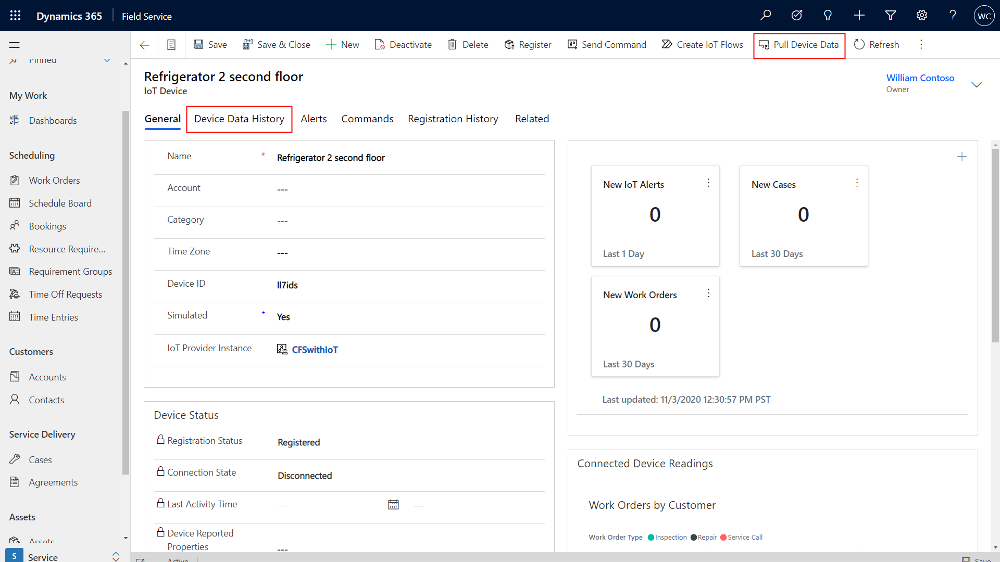
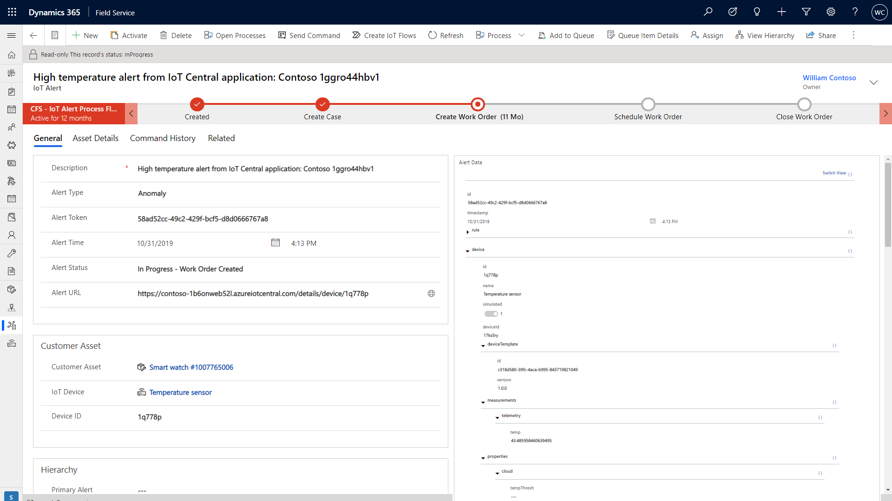
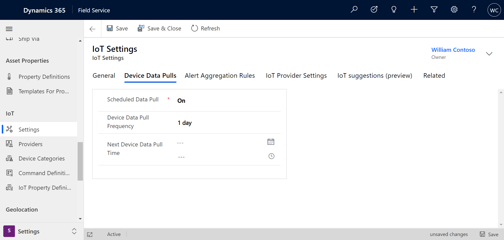

# Pull device data

// https://msit.microsoftstream.com/video/fafca0ff-0400-96f3-1c3e-f1eafceaca3b?channelId=0bf6f71a-b361-4d7b-9668-62ff5207b60d - no need to watch after 5'53

## Prerequisites

- [Register your IoT Devices](cfs-register-devices.md) before you can pull the latest data into Field Service. 

## Pull device data

Pull the latest device data by selecting the **Pull Device Data** button in the ribbon of the IoT Device record.

> [!div class="mx-imgBorder"]
> 

See a history of data pulls in the Deveice Data History section of the form.

> [!Note]
> You can pull device data from a customer asset if the customer asset is [connected to IoT devices](https://docs.microsoft.com/dynamics365/field-service/cfs-register-devices#connect-to-asset). Select the **Pull Device Data** button in the ribbon of the Customer Asset record.

## Device data on IoT Alerts

Device data is automatically pulled if an IoT alert is triggered for the IoT device.

> [!div class="mx-imgBorder"]
> 

## Schedule device data pulls

Confiogure the system to pull device data on a defined cadence.

> [!div class="mx-imgBorder"]
> 

