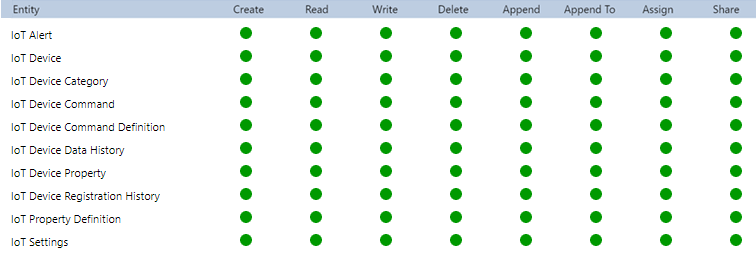

# Security Roles for Connected Field Service

Security for connected field service entities should be added to existing field service security roles for field service administrators, dispatchers, and resources/technicians. 

Doing this will give appropriate access to IoT entities including but not limited to IoT Alerts, Assets, Devices and Commands which are included with Field Service v8.3+.

> [!div class="mx-imgBorder"]
> 

In general, access to IoT entities should mimic access to the Customer Asset entity for field service administrators, dispatchers, and resources/technicians.

## Prerequisites

- Field Service v8.3+
- It is highly recommended to make copies of the Field Service security roles and assign the copied security roles to users. This will prevent product updates from overwriting your custom security. You can copy a security role by navigating to **Settings > Security > Security Roles** then selecting a security role record and choosing **Actions > Copy Role**.
> [!div class="mx-imgBorder"]
>  

## Add IoT security to administrator security role

Field service administrators should be given full access to IoT entities as these users may need a full view of IoT alerts across all devices and the ability to register new IoT devices.

Field Service administrators are typically given a copy of the **Field Service - Administrator** security role. 

If your organization is utilizing Connected Field Service, these users should also be assigned a copy of the **IoT - Administrator** security role.

Ensure this gives field service administrators full access to IoT entities according to the image below.

> [!div class="mx-imgBorder"]
> 

In addition, the field service administrator security role should be given full access to the "CFS - IoT Alert Process Flow," which is a business process flow for CFS. 

> [!div class="mx-imgBorder"]
> 

## Add IoT security to dispatcher role

Field service dispatchers also need some level of access to IoT entities and records. As an example, if a work order is created as a result of an IoT alert, the dispatcher should know this information to communicate with the customer and schedule to the appropriate resources/technicians.

Find the dispatcher security role your organization assigns to dispatchers (typically a copy of the **Field Service - Dispatcher** security role) and manually assign limited access to IoT entities according to the image below.

> [!div class="mx-imgBorder"]
> 

Next, add access to the "CFS - IoT Alert Process Flow" according to the image below.

> [!div class="mx-imgBorder"]
> 

## Add IoT security to resource security role

Finally, resources/technicians also need access to IoT related entities and records related to the work they are responsible for.

Find the resource security role your organization assigns to resources/technicians (typically a copy of the **Field Service - Resource** security role) and manually assign limited access to IoT entities according to the image below.

> [!div class="mx-imgBorder"]
> 

Because business process flows are not displayed on the Field Service Mobile app, resources/technicians do not need access to the "CFS - IoT Alert Process Flow."

## Additional notes

- Any user who needs to do device registration and device data pulls (IoT Hub operations) should be given the **IoT Administrator** and **IoT Endpoint User** security roles.

