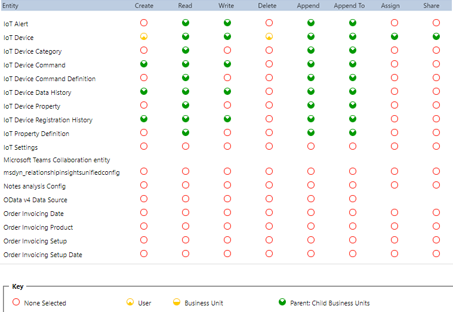
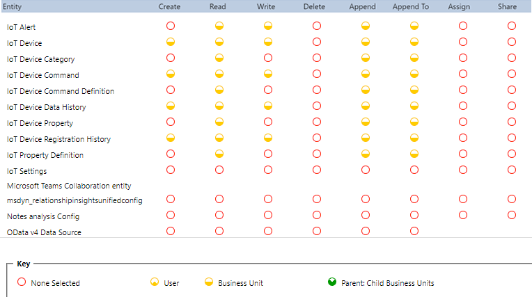

# Security roles for Connected Field Service

Security roles for Connected Field Service allow administrators to give appropriate access to Internet of Things (IoT) entities, including alerts, assets, devices, and commands, which are all included with Field Service v8.3+. These security roles should be added to existing Field Service security roles for field service administrators, dispatchers, and resources. 

In general, access to IoT entities should mimic access to the customer asset entity for field service administrators, dispatchers, and resources.

## Prerequisites

- Field Service v8.3+

- Dynamics 365 system administrator access

- General knowledge of Field Service security roles. For more information, see the topic on [setting up field service users and security roles](view-user-accounts-security-roles.md).

> [!Note]
> We strongly recommended making copies of the Field Service security roles and assigning the copied security roles to users. This prevents product updates from overwriting your custom security configurations. To copy a security role, go to **Settings > Security > Security Roles**, then select a security role record and choose **Actions > Copy Role**. See the following screenshot for reference.
> [!div class="mx-imgBorder"]
> 

## Add IoT security to administrator security role

Field Service administrators should typically have full access to IoT entities, as these users may need a full view of IoT alerts across all devices and the ability to register new IoT devices. They are typically given a copy of the **Field Service - Administrator** security role. 

If your organization is using Connected Field Service, these administrators should also be assigned a copy of the **IoT - Administrator** security role.

With fully enabled IoT administrator permissions, Field Service administrators should have access to all IoT entities, allowing them to: 

- Create
- Read
- Write
- Delete
- Append
- Append to
- Assign
- Share

See the following screenshot for reference.

> [!div class="mx-imgBorder"]
> 

The Field Service administrator security role should also be given full access to the **CFS - IoT Alert Process Flow**, which is a business process flow for Connected Field Service. 

> [!div class="mx-imgBorder"]
> 

## Add IoT security to dispatcher role

Field Service dispatchers also need some level of access to IoT entities and records. For example, if a work order is created as a result of an IoT alert, the dispatcher should be aware so that they can communicate with the customer and schedule to the appropriate resources.

Find the dispatcher security role your organization assigns to dispatchers (typically a copy of the **Field Service - Dispatcher** security role) and manually assign limited access to IoT entities according to the following screenshot.

> [!div class="mx-imgBorder"]
> 

Next, add access to the **CFS - IoT Alert Process Flow** according to the following screenshot. Dispatchers can use the Connected Field Service business process flow to update and track the stages of work orders resulting from IoT alerts.

> [!div class="mx-imgBorder"]
> 

## Add IoT security to resource security role

Finally, resources also need access to IoT entities and records related to the work they are responsible for.

Find the resource security role your organization assigns to resources or technicians (typically a copy of the **Field Service - Resource** security role), and manually assign limited access to IoT entities according to the following screenshot.

> [!div class="mx-imgBorder"]
> 

Because business process flows are not displayed on the Field Service Mobile app, resources don't need access to the **CFS - IoT Alert Process Flow.**

## Additional notes

- Any user who needs to work with device registration and device data pulls (IoT Hub operations) should be given the **IoT Administrator** and **IoT Endpoint User** security roles.

[!INCLUDE[footer-include](../includes/footer-banner.md)]
