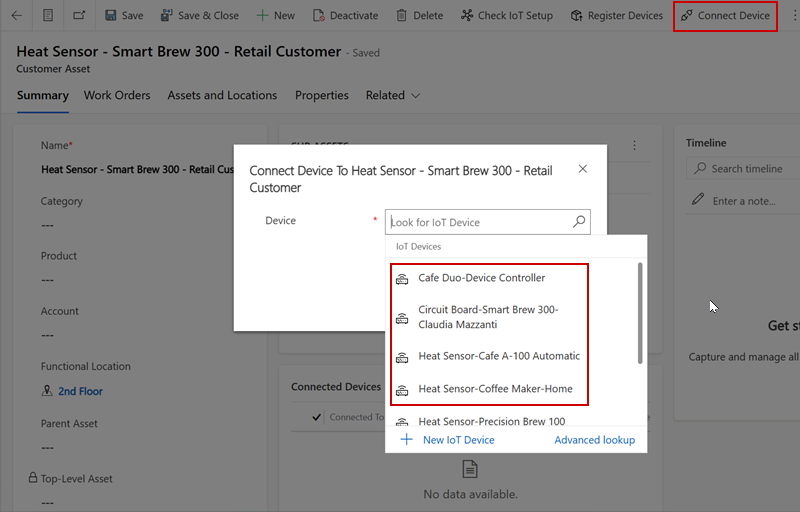

# Asset servicing in Dynamics 365 Field Service

Customer assets let you track equipment that requires inspections, maintenance, and occasional repairs. Customer assets indicate which products are located at a [functional location](assets-functional-location.md). You can also use them to [track service history of all past and present work orders](service-history.md) for each asset. If you're using [Connected Field Service](cfs-iot-overview.md), [connect customer assets to sensors](cfs-register-devices.md) that monitor the asset and [trigger IoT alerts](cfs-iot-alerts.md) as needed.

For a guided walkthrough of servicing a customer asset based on an IoT alert, check out the following video.

> [!VIDEO https://www.microsoft.com/videoplayer/embed/RE4Ly0y]

## Create customer assets

You can [create customer assets individually](#manually-create-customer-assets), in bulk via Excel import, and [automatically when using a work order product](#automatically-create-customer-assets-from-work-order-products).

### Manually create customer assets

1. In **Field Service** open the **Service** area.

1. Go to **Assets** > **Assets** and select **New**.  **Customer Assets** > **+New**.  

   :::image type="content" source="media/customer-asset-create-manually.PNG" alt-text="Screenshot of a customer asset.":::

1. Enter a reference **Name** for the customer asset. For example, the make and model of the asset, the name of the product in the product catalog, a general name like *HVAC Unit*, or descriptive information like *HVAC Unit second Floor*.

1. Provide optional details for the customer asset:

    - **Category**: Add or create a customer asset category that serves as a label to organize assets into groups.

    - **Account**: Choose a [service account to represent the location and customer of the customer asset](accounts.md). As a simple rule, if you were going to create a work order to repair the customer asset, the service account of the work order and the service account of the customer asset should be the same.

    - **Functional location**: Choose a [functional location](assets-functional-location.md) where this customer asset is located.

    - **Parent Customer Asset**: Field Service supports hierarchical asset structures. For example, a part can be the child of a component, which is the child of a machine. Use this field to specify the direct parent. The **Master Asset** shows the top-level parent in the relationship automatically. After creating the asset record, you can use the **Sub Asset** grid on the form to add child assets.

    - **Manufacturer**: Choose the service account that manufactures the asset.

    - Model: <!-- updated with info from luis-->

    - **Product**: If the customer asset correlates with a [product in your product catalog](create-product-or-service.md), choose it from the lookup.

    - **Asset Tag**: A single-line text string that represents the asset tag.

1. Select **Save**.  

### Automatically create customer assets from work order products  

1. In Field Service, open the **Inventory** area.

1. Go to **Inventory** > **Product Inventory**.

1. Select product want to turn into a customer asset when it's added to a work order and used while when completing a work order.

1. In the **Field Service** section of the product record, set **Convert to Customer Asset** to **Yes**.

   :::image type="content" source="media/customer-asset-product-convert-to-customer-asset.PNG" alt-text="Screenshot of a product on the Field Service tab.":::

   > [!NOTE]
   > You can't turn services into customer assets.

1. Select **Save**.

Adding a product to a work order [creates a work order product](create-product-or-service.md#add-a-product-or-service-to-a-work-order). The **Quantity** and a  **Line Status** set to **Used** indicate that the work order product was installed. 
> [!div class="mx-imgBorder"]
> 

When the work order system status changes to **Open-Completed** or **Closed-Posted**, the system automatically generates the customer asset record and associates it with the service account listed on the work order. Regardless of the quantity of the work order product, only one customer asset is created. The customer asset will have reference to the work order product that shows the exact quantity.

> [!TIP]
> By default, you can only use assets related to the service account on a work order. Field Service lets you can change this logic in the settings. For more information, see [Validate customer assets on work orders](asset-validation.md)

## Connect customer assets to Connected Field Service

[Connected Field Service](connected-field-service.md) uses customers assets to make better use of IoT data.

See basic configuration information, see this [video on setting up Connected Field Service with Azure IoTCentral](https://youtu.be/Sp7_JoXjHDk).

Connected Field Service uses **Devices**, which represent sensors that are connected to the internet. For example, a smart thermometer that can send data over the internet. You can relate devices to customer assets in a one-to-many relationship, meaning one customer asset can have many related devices. For example, a single HVAC unit (customer asset) can have multiple device sensors (thermometer and hygrometer) that communicate with Connected Field Service.

To establish a relationship with a device, open a customer asset and select **Connect Device**. Choose the IoT device from the drop-down menu.

> [!div class="mx-imgBorder"]
> 

IoT alerts from the connected device now also reference the related customer asset. If a work order is created from the IoT alert, it references the alert and the asset.

> [!div class="mx-imgBorder"]
> 

Select **Check IoT Setup** to get information about the IoT setup of the environment. For example, if IoT is deployed or if there are devices available.

[!INCLUDE[footer-include](../includes/footer-banner.md)]
