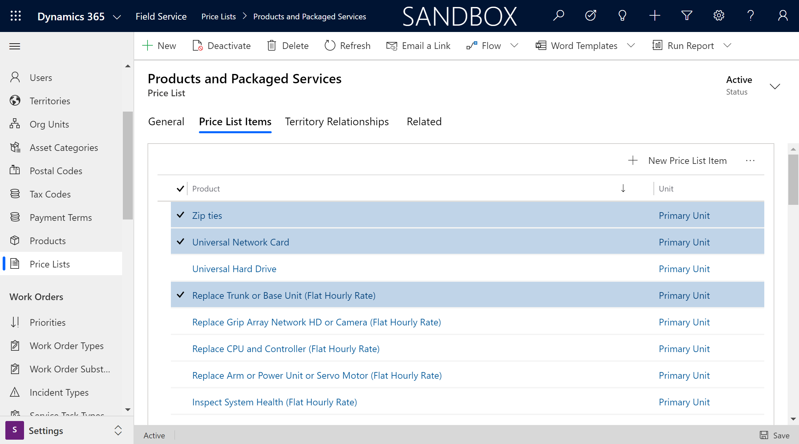
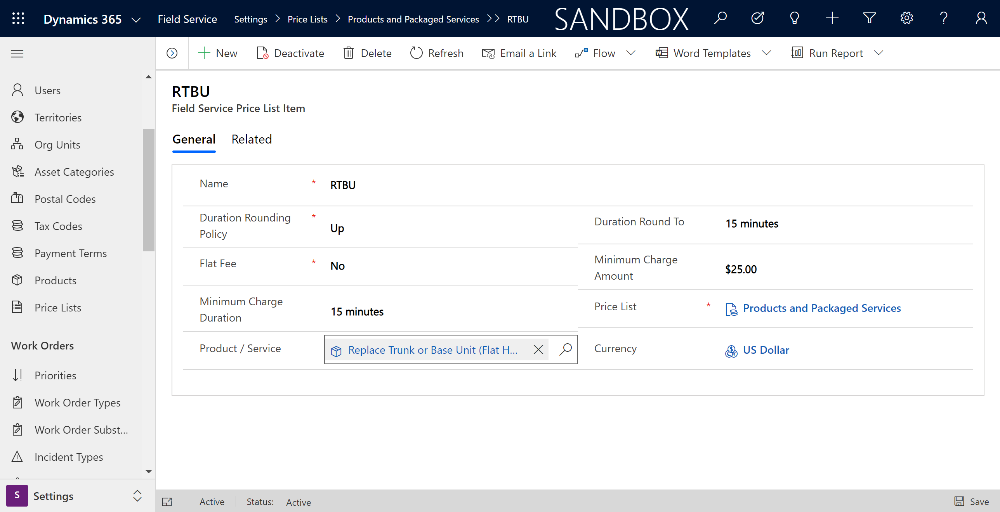

# Using and extending Price lists for Field Service

Field Service uses and extends Dynamics 365 price lists and product catalog. This means products and services are added to work orders with appropriate pricing.  

For work order products that represents parts used during on site service, simply use price lists and price list items as you would for Dynamics 365 for Sales.

For work order services that represent labor performed during on site service, you can use price lists with price list items to define an hourly rate, or you can use price lists with **Field Service Price List Items** for additional pricing options.

In this article let's explore creating products, services, and price lists to use on work orders.

## Prerequisites 

Using Dynamics price lists product catalog for Field Service is available for all version of Dynamics 365 Field Service

Basic knowledge of Dynamics 365 [product catalog](https://docs.microsoft.com/en-us/dynamics365/sales-enterprise/set-up-product-catalog-walkthrough) and [price lists](https://docs.microsoft.com/en-us/dynamics365/sales-enterprise/create-price-lists-price-list-items-define-pricing-products) is encouraged. 

## Create products and services

First create Field Service products and services that can be added to work orders. This is done by creating products and entering a Field Service Product Type.

For more explicit instructions, see the topic on [creating Field Service products and services](./create-product-or-service.md). 

In summary, go to **Field Service app > Settings > Products > +New** and use the tooltips to add basic details about the product or service.

For this exercise in using Field Service Price List Items to extend price lists, start by creating a service.

> [!div class="mx-imgBorder"]
> 

In the Field Service section, enter a **Field Service Product Type** = Service.

> [!div class="mx-imgBorder"]
> 

- **Inventory**: This option is used for products of high value, or products that are inventoried and have quantities tracked in a warehouse.  
  
- **Non-inventory**: This option is used for low-value items that are typically not inventoried. Examples of this are consumables like stickers or zip ties.  
  
- **Service**: The service option is used to create service products, which is the labor that you sell to your customers. The quantity of service products is measured with a duration of time. Only service products can be associated with a work order as a service. 

Here are examples of inventory and non-inventory products.

> [!div class="mx-imgBorder"]
> 

> [!div class="mx-imgBorder"]
> 

> [!Note]
> It's important to add a List Price to the product that will be used as a back up for when this product may be used on a work order but does not belong to the work order's price list as a price list item or field service price list item, as described later in this article.

After saving, enter a **Default Price list** in the product details section, then **Save** again.

## Create price list  
  
Go to **Field Service** > **Settings** > **Price Lists** > **+New**.  
  
Use the tooltips to help fill in your information, and then click **Save**.  

For more information see the topic on [creating a price list (Project Service Automation)](../project-service/create-price-list.md). 

## Add price list items  

Next, add the products and services as price list items to the price lists of your choice.

> [!div class="mx-imgBorder"]
> 

At its simplest enter the following information:

**Pricing Amount** enter *Currency Amount*

**Amount** enter the price of the product or service. Note that the price in the price list item for services represents an hourly rate.

To understand the other standard pricing options with Dynamics 365 price lists see the topic on [adding price list items](https://docs.microsoft.com/en-us/dynamics365/sales-enterprise/create-price-lists-price-list-items-define-pricing-products#add-items-to-the-price-list-sales)

## Add Field Service Price list items

You can add additional pricing options for services by creating Field Service Price List Items. A service is defined as a product record where Field Service Product Type = Service.

From the Price List go to **Related > Field Service Price List Items**

Click **Add New Field Service Price List Item**.  

> [!div class="mx-imgBorder"]
> 
  
### Flat Fee

Makes a service a fixed price regardless of duration. The fixed price will be derived first from the price list item amount and then the list price on the product record.

### Minimum Charge Duration

First X amount of time free. 

### Minimum Charge Amount

Sets minimum amount for a visit. Value will be added on to final price regardless of amount charged.

### Duration Rounding Policy & Duration Rounding To

Allows you to round service duration and choose the granularity. As an example, if a service duration is 94 minutes, you can automatically round it to 90 minutes, 95 minutes, remain as 94 minutes or other options.

          
> [!Note]
> By leaving the Product / Service lookup blank, the above options will apply to all services added to the work order with the chosen price list. This is helpful if for example, you want to add a minimum charge amount to all services in the price list, you do not need to add all services as Field Service Price List Items, saving time.
 

**Save & Close**.  

## Add price lists to work orders

When creating a work order, you must enter a price list. The price list can be entered manually, or automatically populated based on the price list of the billing account or work order type when chosen.

> [!div class="mx-imgBorder"]
> 

When a price list is added to a work order, it is automatically propagated to all work order products and services; however the price list of an individual work order product or service can be manually overridden as needed.

> [!div class="mx-imgBorder"]
> 

In this example, the field technician set the Work Order Service **Line Status** to *Used* from his or her mobile app, and the dispatcher can see the pricing in the Duration & Sale Amount section.

With a **Duration to Bill** of 1 hour, the subtotal is $460, because of a $580 hourly rate as derived from the price list item **Amount**, and factoring 15 free minutes from the **Minimum Charge Duration** and a $25 surcharge from the **Minimum Charge Amount**.

indicating the service had a price of $580 per hour based on the price list item. We set the Line Status 
  
## Additional notes

- You can add a Field Service Price List Item even if the product or service is not a price list item. In this case the list price on the product record will be used for calculations.

**Add territory relationships** - Add default price lists for territories or customer segments. This makes it easier for your [!INCLUDE[pn_field_service](../includes/pn-field-service.md)] team to see the default price list for the area they are working in. You can have one price list as the default for multiple territories.  
  
1. In the price list record, in the **Territory Relationships** section, click **+Add Connection record**.  
  
2. In the **Connections** form, in **Name**, click the **Lookup** button, and then select a territory.  
  
3.  Click **Save & Close**.  
  
4.  In the price list form, click the **Auto Save** button.  
  
### See also    
  
 [Create a product or service](../field-service/create-product-or-service.md)   
 [Getting started with Field Service](../field-service/user-guide.md)
 [Create work order templates with incident types](../field-service/configure-incident-types.md)

> [!div class="mx-imgBorder"]
> 