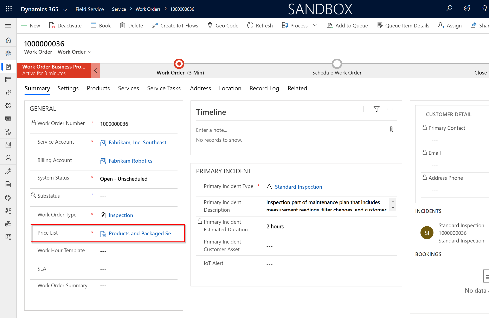

# Use price lists

Dynamics 365 Field Service builds on [Dynamics 365 Sales price lists](../sales/create-price-lists-price-list-items-define-pricing-products.md) and [product catalogs](../sales/set-up-product-catalog-walkthrough.md). This means products and services are added to work orders with appropriate pricing.  

For work order [products and services](create-product-or-service.md) that represent parts or labor billed to your customers, use price lists and price list items. You can also use price lists with **Field Service Price List Items** for additional pricing options.

## Create a price list

Define basic properties of the *Price List* record.
  
1. In Field Service, change to the **Settings** area.

1. In the **General** section, select **Price Lists**.

1. Select **New**.

1. Enter information in the **General** tab.

   - **Name** to distinguish the price list.
   - **Context** of the price list- Choose between **Sales**, **Purchase**, and **Cost**.
   - Optional **Start/End Date** to define when the price list is effective.
   - **Currency** used on the price list.
   - **Time Unit** for role prices.

   :::image type="content" source="media/price-list-general-tab.png" alt-text="Screenshot of a price list in Field Service.":::

1. Select **Save** to create the *Price List* record.

## Add price list items  

Add products and services as price list items to the price list.

1. Open a *Price List* record.

1. On the **Price List Items** tab, select **New Price List Item**.

1. Choose a product or service in the **Product** field.

1. On the **Pricing information** tab:

   - **Pricing Method**: Choose **Currency Amount**.
   - **Amount**: Enter the price of the product or service. Enter the hourly rate for services.
   - **Discount List**: Don't use this setting. Field Service currently doesn't support discount lists price list items. You can configure discounts directly on work order products and services.

For more information about options for price list items, go to [Define product pricing with price lists and price list items](../sales/create-price-lists-price-list-items-define-pricing-products.md).

## Add Field Service price list items

You can add additional pricing options for services by creating *Field Service Price List Items*. A service is defined as a product record where **Field Service Product Type** is **Service**.

1. Open a *Price List* record.

1. Select **Related** > **Field Service Price List Item**.

1. Select **Add Field Service Price List Item**.

1. On the **General** tab:

   - Provide a **Name**.
   - Choose the **Duration Rounding Policy**.
   - Set the **Flat Fee** option. Flat fee applies a fixed price to a service, regardless of duration. The fixed price is derived first from the price list item amount, and then the list price on the product record.
   - **Minimum Charge Duration** specifies the time *not billed* before charging the customer.
   - Choose a **Product/Service**. By not adding a product or service, the options apply to all services added to a work order when selecting the parent price list. This is helpful if, for example, you want to add a minimum charge amount to all services in the price list. It saves time because you don't need to add all services as Field Service Price List Items.
   - Set **Duration Round To** for your preferred rounding option.
   - **Minimum Charge Amount** defines a base fee for a service. The amount will be added on to final price regardless of amount charged.
  
   :::image type="content" source="media/price-list-field-service-price-list-item.png" alt-text="Screenshot of a Field Service price list item.":::

1. Select **Save & Close**.  

## Add price list to work orders

When creating a work order, you must enter a price list. The price list can be entered manually, or can be automatically populated based on the price list of the billing account or work order type when chosen.

> [!div class="mx-imgBorder"]
> 

When a price list is added to a work order, it's automatically propagated to all work order products and services; however, the price list of an individual work order product or service can be manually overridden as needed or via entitlements.

> [!div class="mx-imgBorder"]
> 

In our example, the field technician set the work order service **Line Status** to **Used** from their mobile app, and the dispatcher can see the pricing in the **Duration & Sale Amount** section.

With a **Duration to Bill** of 1 hour, the subtotal is $460, because of a $580 hourly rate as derived from the price list item **Amount**, and factoring 15 free minutes from the **Minimum Charge Duration** and a $25 surcharge from the **Minimum Charge Amount**.

## Configuration considerations

- Consider using [Entitlements](./work-order-entitlements.md) to dynamically adjust the price of work order products and services based on a number of factors (such as account, incident type, and customer asset).

## Additional notes

- You can add a Field Service price list item even if the product or service is not a price list item. In this case, the list price on the product record will be used for calculations.

### Add territory relationships

Add default price lists for territories or customer segments. This makes it easier for your Field Service team to see the default price list for the area they are working in. You can have one price list as the default for multiple territories.  
  
1. In the price list record, in the **Territory Relationships** section, select **+Add Connection record**.  
  
2. In the **Connections** form, in **Name**, select the **Lookup** button, and then select a territory.  
  
3. Select **Save & Close**.  
  
4. In the price list form, select the **Auto Save** button.  

[!INCLUDE[footer-include](../includes/footer-banner.md)]
