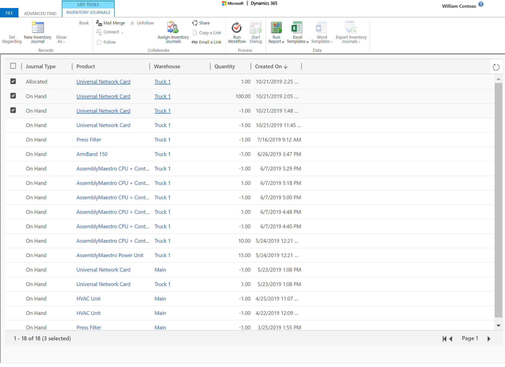
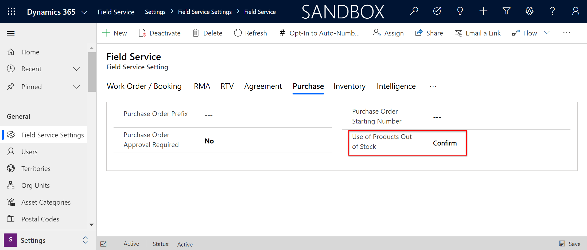

# Create products or services for Work Orders

Field Service utilizes the Dynamics 365 product catalog for on site service. This means the same list of products sales persons use for Opportunities, Quotes, and Orders; field technicians can use on work orders.

By using the Product entity you can create products and services to add to work orders.

- **Products** represent physical items a field technician may use while completing a work order and may bill the client for, measured in quantity of units.
- **Services** represent labor a field technician may perform and may bill the client for, measured in time duration. 

After products and services are added to work orders, field technicians may use the products or perform the services during the on site service and will mark so in the Field Service Mobile app. Used products and services can be invoiced to customers based on the applicable price list or entitlement. Used products can be deducted from inventory levels either in the Field Service inventory module, Dynamics 365 Finance & Operations, or an external ERP system.

In this article, let's explore creating products and services, adding and using them on work orders, and invoicing and inventory considerations.

## Prerequisites

Using the product catalog for Field Service is available for all version of Dynamics 365 Field Service

Basic knowledge of Dynamics 365 [product catalog](https://docs.microsoft.com/en-us/dynamics365/sales-enterprise/set-up-product-catalog-walkthrough) and [price lists](https://docs.microsoft.com/en-us/dynamics365/sales-enterprise/create-price-lists-price-list-items-define-pricing-products) is encouraged. 

## Create a product or service

Go to **Field Service > Settings > Products > +New**.

In previous versions click **Field Service** > **Administration**, and then choose **Product**. 

> [!div class="mx-imgBorder"]
> 

Enter relevant information

  - **Unit Group**: Select a unit group. A unit group is a collection of various units a product is sold in, and defines how individual items are grouped into larger quantities. For example, if you're adding seeds as a product, you may have created a unit group called "Seeds", and defined its primary unit as "packet".  
  
   - **Unit**: Select the most common unit in which the product will be sold. Units are the quantities or measurements that you sell your products in. For example, if you've added seeds as a product, you can sell them in packets, boxes, or pallets. Each of these becomes a unit of the product. If seeds are mostly sold in packets, select packets as the unit.  
  
   [!INCLUDE[proc_more_information](../includes/proc-more-information.md)] [Create a unit group and add units to that group (Sales app)](../sales-enterprise/create-unit-group-add-units-that-group.md)  
  
> [!NOTE]
> The **Valid From** and **Valid To** fields define how long a product is valid for. There's no business logic associated with these fields, except that the **Valid To** date must be later than the **Valid From** date. If required, you can implement your own business logic in these fields with a workflow, plug-in, or by using the [!INCLUDE[pn_sdk](../includes/pn-sdk.md)]. For example, run a scheduled job to automatically retire last season's products using the date selected in the **Valid To** field.  

> [!div class="mx-imgBorder"]
> 

In the **Field Service** section, enter a **Field Service Product Type**:

> [!Note]
> A Field Service Product Type is required to add the product or service to a work order. 

> - **Inventory**: This option is used for products of high value, or products that are inventoried and have quantities tracked in a warehouse.  
  
> - **Non-inventory**: This option is used for low-value items that are typically not inventoried. Examples of this are consumables like stickers or zip ties.  
  
> - **Service**: The service option is used to create service products, which is the labor that you sell to your customers. The quantity of service products is measured with a duration of time. Only service products can be associated with a work order as a service. 

- **Convert to Customer Asset**: If set to **Yes**, a customer asset record will automatically be created when this product is used on a work order product. Allows for tracking service history.

- **List Price**: Enter a default price of this product or service. This price will be used if the product is not added to a price list. For services, this price represents an hourly rate.
- **Default vendor**: Enter a vendor where this product was purchased from. This is the default vendor for RTVs.
  
- **Taxable**: Choose whether the product or service is taxable.  
  
**Save**. 

After saving, enter a **Default Price list** in the product details section, then **Save** again.

For this exercise, we created two more products; a service and a non-inventory one.

> [!div class="mx-imgBorder"]
> 

> [!div class="mx-imgBorder"]
> 

### Price list

Next, add the products and services as price list items to the price lists of your choice.

> [!div class="mx-imgBorder"]
> 

For more information see the topic on [!INCLUDE[proc_more_information](../includes/proc-more-information.md)] [creating a price list (Project Service Automation)](../project-service/create-price-list.md). 

**Pro Tip:** From the Price List go to **Related > Field Service Price List Items** to add additional pricing options for Field Service products and services.

## Add a product or service to a work order

Next let's utilize the products and services on work orders. 

First create a work order.

> [!div class="mx-imgBorder"]
> 

### General

In the Products section of the Work Order, create a new Work Order Product and choose the product you just created.

- **Line Status**: When a product or service is added to a work order, a new Work Order Product or Work Order Service record is created. It is given a status of **Estimated** by default, which means it has not been utilized yet. When a field technician actually uses the product or performs the service, he or she will change the work order product or service status to **Used** from the mobile device. Even after the product or service is used, field technicians and back office workers still have the option to bill the client or not.

- **Taxable**: Set to Yes if you want to Sales Tax of the work order added on top of the price.

- **Allocated**: Set to **Yes** if you want to set aside units of this product from a warehouse before actually using and decrementing them from inventory.
  
- **Warehouse**: If the product is allocated or used, you need to enter the warehouse it came from. The field technician can enter this as well after using the product when on site.

### Estimate Information

Add an **Estimate Quantity**. This represents how many units you think may be needed to complete the job.

Price information is taken from the price list first, then the product record and calculated based on the quantity.

### Product Relates To

Work Order Products can be related to different aspects of the work order either automatically or manually.

> [!div class="mx-imgBorder"]
> 

As an example, if the product or service is added from a work order incident type, the related work order incident type will be populated. If the work order incident type was for a specific customer asset, that asset will be populated here. 

> [!Note]
> Work Order Products and Service are typically added to work orders via work order incident types. For more information see the topic on [creating work order templates with incident types](https://docs.microsoft.com/en-us/dynamics365/field-service/configure-incident-types).

### Other

In the Other section, you have the ability to change the price list of a specific product or service from the work order price list which it will have by default. 

You also have the ability to apply or disable an entitlement, which are generally automatically applied based on factors like service account and incident type. See the topic on [entitlements](./work-order-entitlements.md) for more details.

- add or edit quanity
- add or edit price list

In addition to inventory products, non-inventory products are added as work order products as well.

Service type products (labor) should be added as work order services.

Adding a work order service is very similar to a work order product, however there is no inventory allocation or warehouse, and there is an estimate duration rather than estimate quantity.

> [!div class="mx-imgBorder"]
> 

## Use and consume products and services

- FSM

> [!div class="mx-imgBorder"]
> 

> [!div class="mx-imgBorder"]
> 

- calculations

> [!Note]
> calculations happen in online mode or on sync

> [!div class="mx-imgBorder"]
> 

> [!div class="mx-imgBorder"]
> 

> [!div class="mx-imgBorder"]
> 

- invoice  
Used products and services will appear on the invoice generated from the closed-posted work order and the price of each

> [!div class="mx-imgBorder"]
> 

## Add and consume product inventory (Optional)

- warehouse
- inventory adjustment

> [!div class="mx-imgBorder"]
> 

- inventory adjustment product

> [!div class="mx-imgBorder"]
> 

> [!div class="mx-imgBorder"]
> 

> [!div class="mx-imgBorder"]
> 
- add quantity

> [!div class="mx-imgBorder"]
> 

> [!div class="mx-imgBorder"]
> 

no inv journals for service or non inventory products

## Configuration considerations

System Settings on the Sales tab related to Product setup. 
Product in Active Status upon creation.  Best practice is to set this to Yes.
Minimum # of Products in a Bundle.
Max # of Properties allowed for a Product or Bundle. 

> [!div class="mx-imgBorder"]
> 

FS settings
- allocated by default

> [!div class="mx-imgBorder"]
> 

- use inventory past 0

> [!div class="mx-imgBorder"]
> 

## Additional notes

  
### See also  
 - [Create a price list](../field-service/create-price-list.md)    
 - [Create a warehouse](../field-service/create-warehouse.md)   

