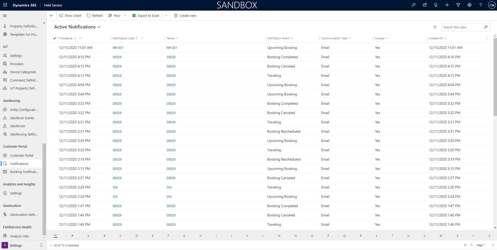

# Set up notifications for the Field Service Portal (preview)

The portal uses Power Automate flows to trigger notifications for customers. Before we can send notifications, choose which channels to use and configure the flows accordingly. To send text messages, you'll need an SMS provider with a Power Automate connector. For emails, we recommend an Office 365 Outlook account.

> [!CAUTION]
> When enabled, the system sends notifications to contacts of the account associated with bookings. When using real customer data to test this feature, prevent accidental communication by [adding accounts to exclusion lists](create-configure-customer-portal.md#self-scheduling-preview-tab).

## Configure email and SMS connectors in Power Automate

The Customer Portal settings in Field Service links directly to the default Power Automate flows for email and SMS.

<!--can't repro these steps as I don't have flow quota in my trial env -->

1. Access the flows by going to the [Power Apps Maker portal](https://make.powerapps.com) > **Solutions** > **Dynamics 365 Field Service PowerApps Portal – Flow**.
1. Select **Objects** > **Cloud flows** to see the list of flows.
1. *Field Service PowerApps Power Flow Email Notifications* and *Field Service PowerApps Power Flow SMS Notifications* flows are off by default. Configure the flows before turning them on.
1. Select and open the flow you want to configure. On the flow, select **Save as** and create a copy of the default flow.
1. Open the flow you just created and select **Edit**. Authenticate or update the connections and **Save** the flow.
1. Then, select **Turn on** to enable the flow.

## Manually send an invite to a contact

Before customers can use the Field Service portal, make sure you [configured the portal settings](create-configure-customer-portal.md) and enabled notifications.

On a Field Service contact record, you can manually generate a portal invite code by selecting **Create Invitation**. Additionally, you need to assign the **Web Api Users** web role to the user before they can access the portal.

To set the required role:

1. On the the contact record, select **Related** > **Web Roles**.
1. Select **Add Existing Web Role** and choose the **Web API User** role.
1. Select **Add** and save the changes.

## List of notifications

After configuring your portal and enabling notifications, emails and SMS messages will be sent to the contact associated to the resulting work orders. You can [customize some aspects for the portal](create-configure-customer-portal.md#customize-the-portal-design), which also apply to the notifications.

The portal sends a notification for the following events:

- **Upcoming Booking**: Reminder messages are sent seven days before the scheduled service time. This message includes the scheduled service time and a link to the portal with information about the booking. By default, reminders are sent daily at 10:00 AM UTC for any bookings in the time period. You can change this time by editing the **Create notification items for bookings** flow. <!--this seems wrong. the flow recurrence is set to 1 hour and I don't see a setting to change the time period (7 days)-->

- **Traveling**: Sent when the booking status changes to *Traveling*. This message communicates estimated time of arrival while considering traffic on the planned route. It links to the customer portal where your customer can see additional details.

- **Booking Completed**: Sent when booking status changes to *Complete*. This message confirms work was completed, along with date and time of completion.

- **Booking Rescheduled**: Sent if a booking reminder was sent and the scheduled start time changes by more than 10 minutes.

- **Booking Canceled**: Sent if a booking reminder was sent and a scheduled service appointment is canceled.

## View sent notifications

Notification settings provide a read-only view of all messages sent to customers. Find out which customers have received a message, the type of message, and the state of the message.

In Field Service, go to the **Settings** area. Under **Customer Portal**, select **Notifications** to view the list.

> [!div class="mx-imgBorder"]
> 

## Configure booking notification codes

With booking notification codes, Field Service admins can extend, expire, or block access to a portal link that has been shared with a customer.

In Field Service, go to the **Settings** area. Under **Customer Portal**, select **Booking Notification Codes** to create and manage codes.

<!-- I don't understand how that works and can't repro notifications. It's also very clunky to configure since I would need to create a share code first, then map this to a booking notification code. Who would do this manually? Need the team to provide details for this section. Also - who comes up with these long names? Isn't this essentially a token for a user session that is unique and valid for a given time? -->

> [!div class="mx-imgBorder"]
> 

> [!div class="mx-imgBorder"]
> 
