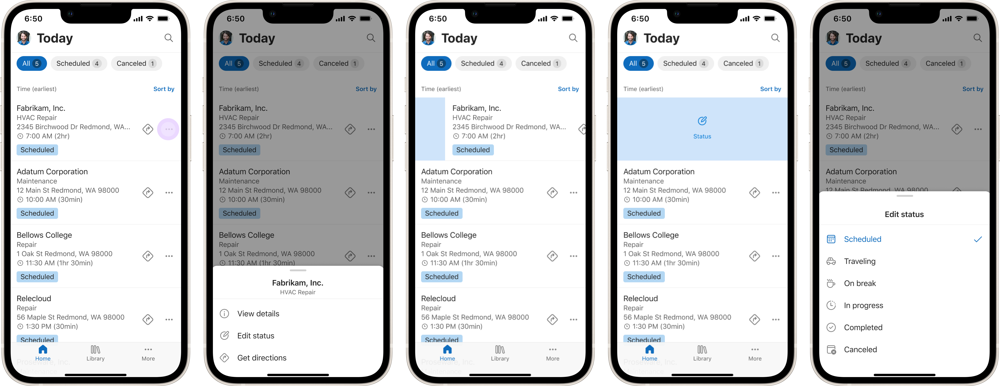
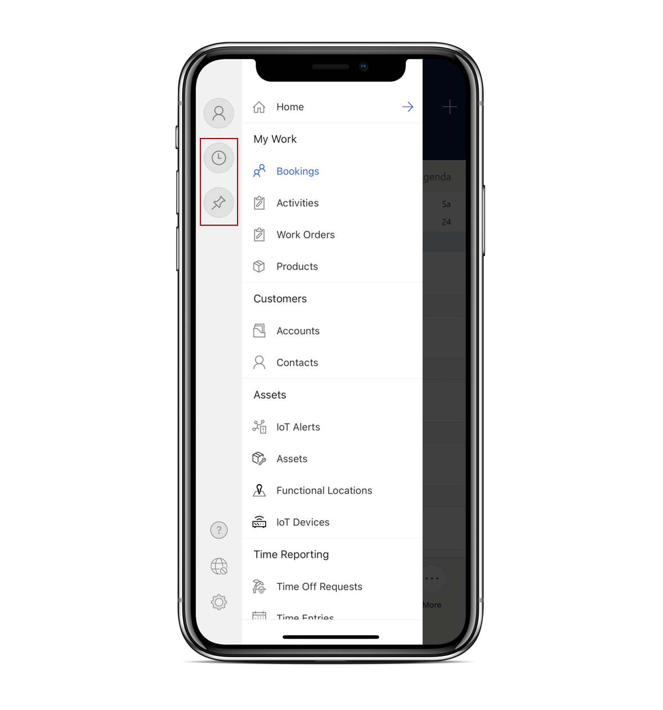
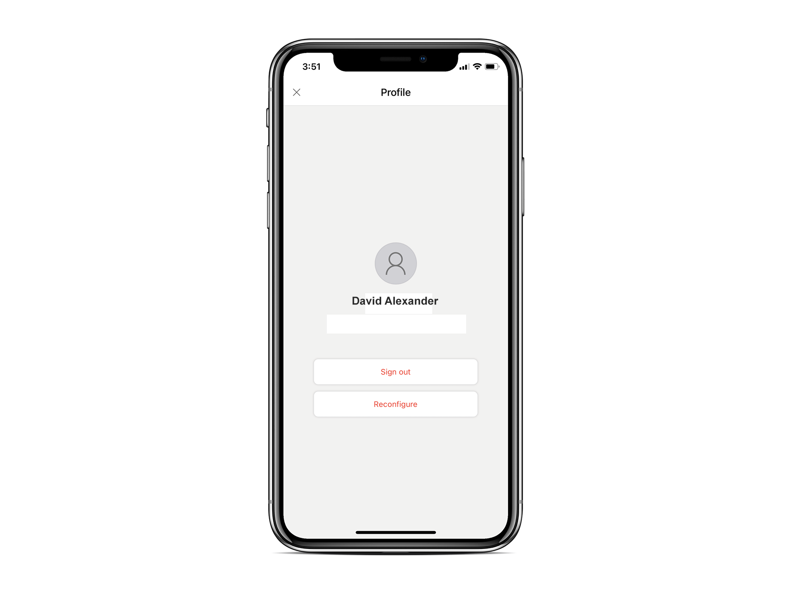

# Download the mobile app and get started

Available natively for Apple iOS and Google Android phones and tablets, as well as Windows laptops and tablets, the Field Service (Dynamics 365) Mobile app offers technicians the capabilities they need for onsite customer service.

## Prerequisites

Before technicians can use the mobile app, a system administrator must [set up the Field Service (Dynamics 365) Mobile app](mobile-power-app-get-started.md) along with users and security roles.

## Download

Go to the app store on your iOS, Android, or Windows device and search for **Dynamics 365 Field Service**.

Download the app called **Field Service (Dynamics 365)**.

## Sign in

Launch the app and sign in with your username and password for Field Service. You can choose different **Region settings** if your app is not in the Azure global cloud.

If you can't sign in, contact your organization's administrator. They may need to [set up users and security roles](view-user-accounts-security-roles.md).

After you sign in, the app may download offline data to your device. It can take some time to complete. The downloaded data depends on your administrator's settings for the offline profile of the mobile app.

## View scheduled work orders

## [Unified Interface UX](#tab/vCurrent)

The first screen shows a calendar view of your scheduled work orders.

> [!div class="mx-imgBorder"]
> 

In the footer, select **More** > **Show as** > **Read-only Grid** to see the bookings as a list instead.

## [New mobile UX (preview)](#tab/vNext)

[!INCLUDE [public-preview-banner](../includes/public-preview-banner.md)]

[!INCLUDE [public-preview-note](../includes/public-preview-note.md)]

The home screen shows today's scheduled work orders for the signed in user.

You can filter the list by work order status at the top of the booking list.

You can also sort the list by various dimensions (Account, Incident type, Time, Duration) by selecting **Sort by** on the top right of the list.

The menu at the bottom allows for easy access to the bookings home page (**Home**), the [embedded Guides feature](access-related-apps-mobile-app.md#embedded-guides-in-field-service-dynamics-365-mobile-preview) (**Library**), and to the [app navigation menu](#navigate-the-app) (**More**).

Select the profile picture in the header to access settings, provide feedback, and change the environment.

> [!div]
> 

Each work order in the list exposes some quick actions in the contextual menu or by swiping from left to right, which allows technicians to quickly update the status of the booking and to get directions directly from the home page.

> [!div]
> 

---

## Navigate the app

## [Unified Interface UX](#tab/vCurrent)

To get to the sitemap, select the menu icon. The sitemap quickly gets you to important information like accounts, contacts, customer assets, or to submit time entries.

> [!div class="mx-imgBorder"]
> 

## [New mobile UX (preview)](#tab/vNext)

[!INCLUDE [public-preview-banner](../includes/public-preview-banner.md)]

To access the app navigation in the new mobile UX (preview), select "More..." in the bottom right. All items in sitemap open the corresponding screens in the Unified Interface UX.

> [!div]
> 

---

## Recent and pinned records

In the sitemap, use the **Recent** option to quickly find things you recently looked at, like work orders, assets, time entries, and more.

You can also **Pin** important records for quick access.

> [!div class="mx-imgBorder"]
> 

## Troubleshoot the app

If you run into issues with the app, you can often solve them by removing all cached data.

On the sitemap, select your profile icon in the top left and choose **Reconfigure**.

> [!div class="mx-imgBorder"]
> 

Reconfiguring deletes data and metadata for the current organization from the cache.

[!INCLUDE[footer-include](../includes/footer-banner.md)]
