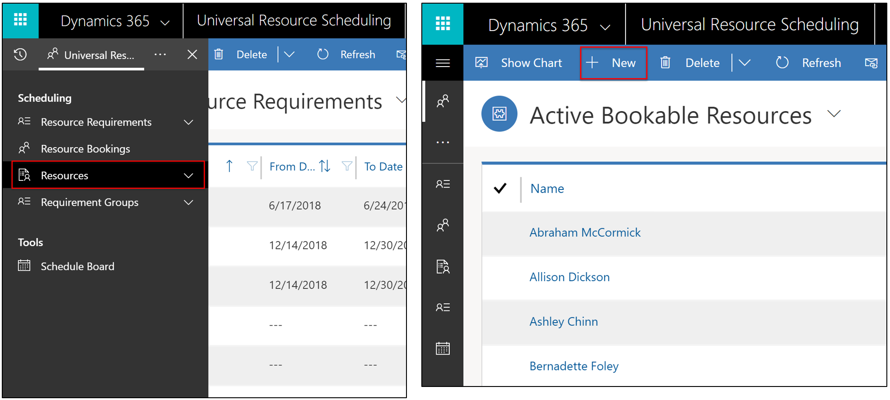
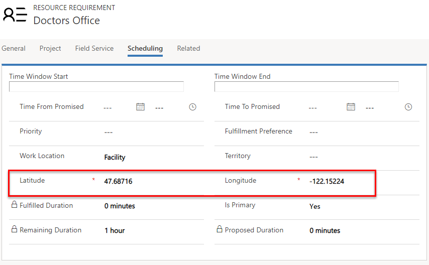
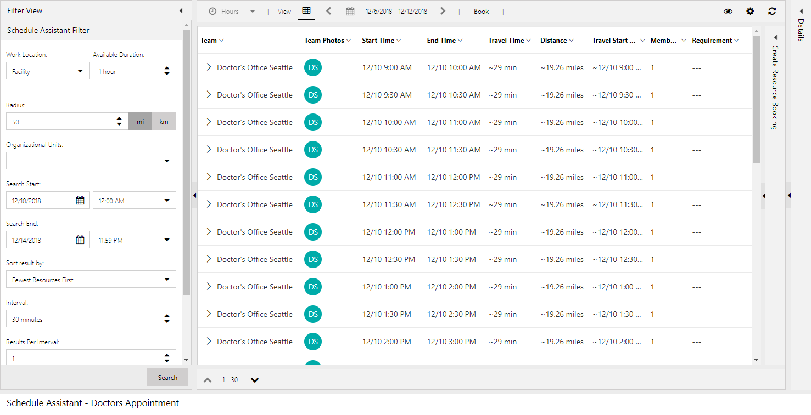
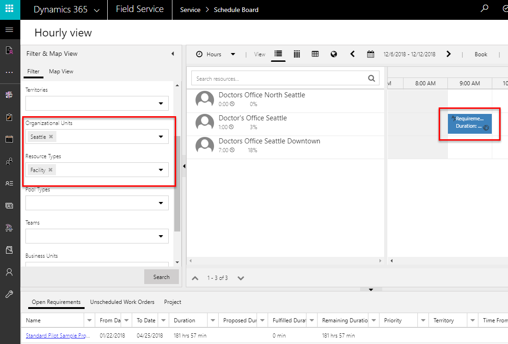
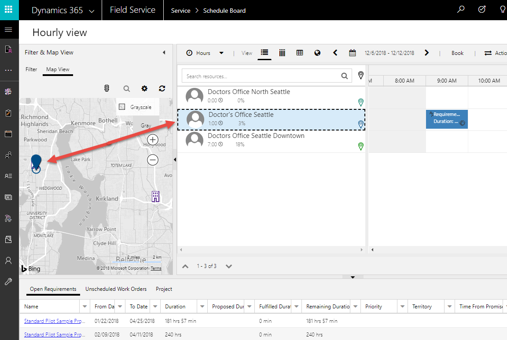
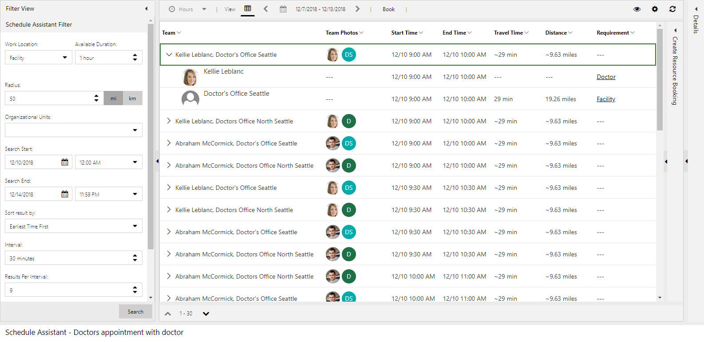
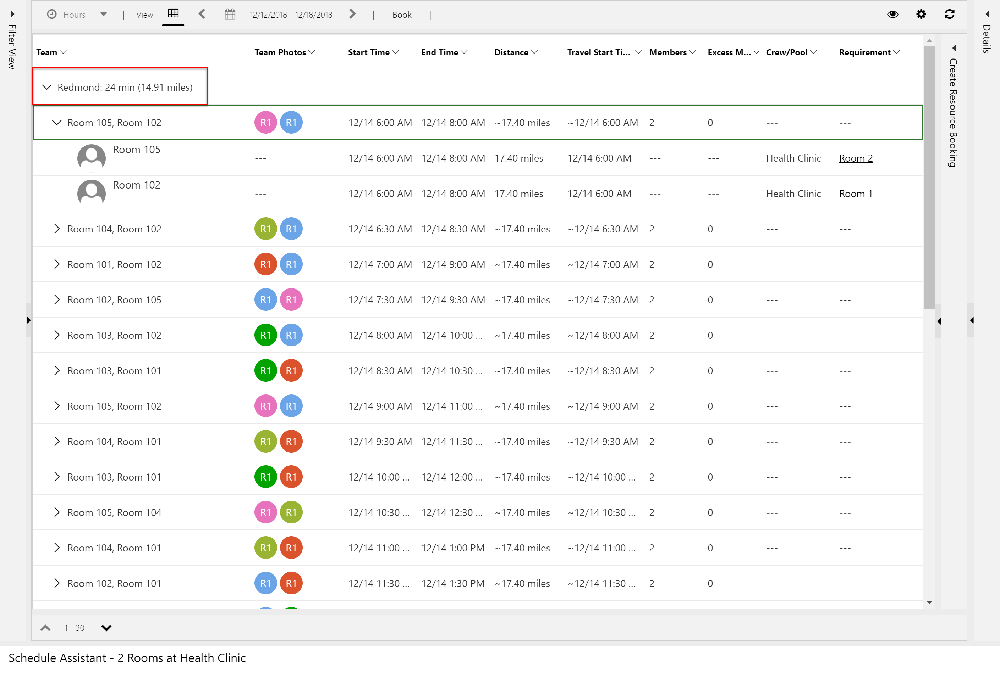
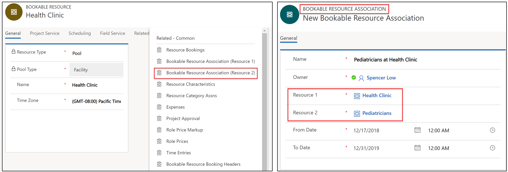
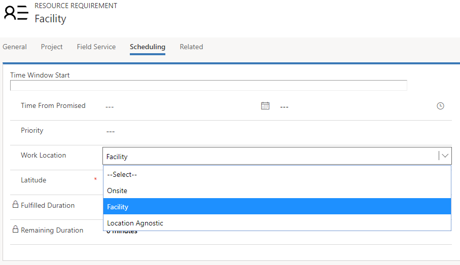

# Facility Scheduling

## Introduction

Universal Resource Scheduling (URS) enables organizations to schedule interactions between customers and company resources. For scenarios where the customer is expected to travel to the company's location, the facility scheduling feature can coordinate physical spaces and related resources.

### Typical examples include:

#### Reserve a physical space

- Reserve a room for an event or party
- Reserve a room for an exercise class
- Reserve a bay at a mechanic shop
- Reserve a boat

#### Reserve an appointment with a person at a facility 

- Fix laptop at a Microsoft retail store
- Wealth management consultation at bank branch
- Doctors office with related nurse and doctor 

In general, to use facility scheduling, an administrator must create a facility resource (with or without additional related resources), configure a requirement for facility results, book the requirement, and view facility bookings on the schedule board.    

## Prerequisites

Universal Resource Scheduling (URS) v3.0

Field Service v8.0 if work order scheduling is applicable 

### Instructions

Lets consider five scenarios to describe facility scheduling. 

1. Schedule a doctor's office
2. Schedule a doctor's office with 5 generic rooms 
3. Schedule a doctor's office and related doctor
4. Schedule a doctor's office with 5 specific rooms
5. Schedule a doctor's office with 5 specific rooms and 5 related doctors

## Scenario 1: Schedule a doctor's office  

In this scenario we will show how to create a single facility to represent a doctor's office and schedule a customer (patient) for an appointment at the doctor's office.

1. create a facility resource

First, navigate to **Universal Resource Scheduling > Resources** and create a facility resource with the following attributes.

> [!div class="mx-imgBorder"]
> 

1. **Resource Type** = Facility
2. **Start/end location** = Organizational Unit Address 
   1. Since a facility represents a physical space at a physical construct, the field start location and end location must be set to Organizational Unit Address. 
   2. The parent Organizational Unit **must have a latitude and longitude** that represents the location of the facility.
   3. Schedule assistant can consider the Facility’s location when displaying available results. 
3. **Display on Schedule Board** = Yes
4. **Enable for Availability Search** = Yes
5. (Optional) Enter Working Hours
6. (Optional) Add related characteristics, territory, resource roles etc to distinguish facility resources from other resources and facilities.  As an example, if a doctor's office had X-ray equipment, "X-Ray" could be added as a characteristic to the facility resource. This can influence which facility resources are filtered and displayed on the Schedule Board or which facility resources are returned during a Schedule Assistant search. 

> [!div class="mx-imgBorder"]
> 

2. create a requirement for a facility 

Next create a requirement that calls for a facility resource.

  1. Enter **from** and **to** date
  2. **Duration**
  3. **Resource Type** = Facility
     1. This allows you to decide which type of Resources should be searched when searching for availability using the Schedule Assistant on a Requirement
     2. This means the requirement requires a facility resource to be fulfilled and ensures the schedule assistant search results return facility type resources (as opposed to personnel or equipment).
     3. This maps to the resource type field on the resource entity
     4. If this field is left empty, all Resources are searched
  4. **Work Location** = Facility
     1. This means the interaction will take place at the facility that will be scheduled and factors into travel time and distance calculations.
     2. Find more details in the configuration considerations section of this article
  5. **Latitude and longitude**
      1. These values represent the customer's location and are used to display facilities relative to the customer's location in schedule assistant results. This is not the facility's location as that is taken from the organizational unit of the facility type resource  
       1. These values can be populated through Booking Setup Metadata (BSM) or workflows

> [!div class="mx-imgBorder"]
> 

> [!div class="mx-imgBorder"]
> 

> [!div class="mx-imgBorder"]
> 

2. Book the requirement 

After creating a facility resource and a requirement that calls for a facility, you can schedule a facility via drag and drop on the schedule board or via the schedule assistant.

The Schedule Assistant considers availability of Resources as well as other constraints set on the Requirement such as characteristics, organizational units, categories, etc.

Select **Book** from the requirement or requirement group forms.

> [!div class="mx-imgBorder"]
> 

**Facility travel time and distance** calculations in the schedule assistant results above represent the time and distance between the facility resource location (as defined by location of related organizational unit) and the customer's lcoation (as defined by the latitude and longitude values on the requirement). The radius filter on the Schedule Assistant filter panel will filter based on this travel calculation.

> [!div class="mx-imgBorder"]
> 

**Filtering work location to location agnostic** will remove travel time and distance calculations from schedule assistant results. 

1. add the facility resource to the Schedule Board

Scheduling a facility is just like scheduling any other resource. You can drag and drop requirements to create bookings, you can drag existing bookings to change the time or resource, or you can use the Schedule Assistant to help sift through the list of facilities based on availability and other constraints.

To view facility resources on the schedule board, filter by resource type and/or organizational units.

> [!div class="mx-imgBorder"]
> 

Facility resource will also be displayed on the schedule board map based on the location of the related organizational unit.

> [!div class="mx-imgBorder"]
> 

## Scenario 2: Schedule a doctor's office with 5 generic rooms

In this scenario we will assume a doctor's office has 5 identical rooms and schedulers do not need to book each room specifically, but must ensure that no more than 5 patients are booked across all rooms during any one time slot.

1. Create a facility resource
2. Increase the capacity of the facility resource from a default of 1 to 5

First navigate to your facility resource and select **Show Work Hours**

When choosing hours, select **Show Capacity** and enter **5**

> [!div class="mx-imgBorder"]
> 

This means when booking a facility via the schedule assistant, the facility resource will show as available and can be double booked up to the capacity limit in this case 5 times.  

> [!div class="mx-imgBorder"]
> 

In the image above, two separate requirements for a facility were both scheduled to the same facility during the same time slot.

> [!Note]
> Capacity scheduling is not intended to be used to book the same requirement multiple times, but rather book multiple requirements. Rebooking a previously booked requirement will cancel the existing booking and create a new one.

**Pro Tip:** It is advantageous to use Resource Pools for capacity scheduling because pool capacity can be defined by the number of pool members. 

## Scenario 3: Schedule a doctor's office and related doctor

In the following scenario we will show how to schedule a doctors office along with a related doctor. 

In order to schedule groups of resources together to perform a task at a facility, non-facility resources can be associated to facility/facility pool resources through the Resource Associations entity (msdyn_bookableresourceassociations). Resources such as people, equipment, or pool resources, may be associated to a facility or facility pool with date effectivity. This means that these resources will be performing work at that location during the expressed date range, and they are not eligible for “onsite” work in which they would have to leave the facility and travel to a customer location. This is extremely important as it relates to using the option “Related Resource Pools”.

1. Create a facility resource

First, create two resources, one to represent a facility (resource type = facility) and the other to represent a doctor (Resource Type = User/Contact/Account).

> [!Note]
> Resource type of User is typically designated for employees who access Dynamics 365 data and consume a license, whereas Contact and Account resource types are for contractors who need to be scheduled but typically do not consume a license or access Dynamics data.

Below is an example of a facility resource.

> [!div class="mx-imgBorder"]
> 

2. Create a doctor resource
3. Associate the doctor resource to the facility resource

From the facility resource, navigate to **Related > Bookable Resource Association (Resource 2)**. This related entity is called Resource Associations (msdyn_bookableresourceassociations).

From here, associate the resource that represents the doctor. 

In the picture below, Abraham McCormick represents a doctor and is associated to Doctors Office North Seattle that represents the doctor's office.

> [!div class="mx-imgBorder"]
> 

4. create a requirement group that calls for a facility and a doctor from the same location

Next, create a requirement group with one requirement that calls for a doctors office (Resource Type = Facility) and another requirement that calls for a doctor (Resource Type = User/Contact/Account).

> [!div class="mx-imgBorder"]
> 

> [!Note]
> Work Location = Facility: When scheduling a requirement group, which consists of multiple requirements, the teams of resources the Schedule Assistant returns must contain at least one facility or facility pool. 

**Pro Tip:** Using the Select **All** field in the requirement group means that both requirements need to be fulfilled ie 2 resources.

> [!div class="mx-imgBorder"]
> 

Next, in order to make sure that teams of resources from different locations are not recommended for work taking place at a facility, set the **Part of Same** field (msdyn_requirementrelationship) to **Resource Tree** in the requirement group control. As an example, a doctor associated with Facility B should not be paired with Facility A. Find more details on the part of same field in requirement groups in the configuration considerations section of this article.

> [!div class="mx-imgBorder"]
> 

Scheduling the requirement group creates a booking for the facility resource and the doctor resource.

> [!div class="mx-imgBorder"]
> 

As in scenario 1, travel time and distance is calculated as the time and distance for the customer to travel to the facility. There is no travel calculation considered for the doctor resource, it is assumed he/she will be at the facility at the required time.

## Scenario 4: Schedule a doctor's office with 5 specific rooms

In the following scenario we will consider a doctors office with 5 rooms and schedulers want to book each specific room. 
 
 1. Create a resource pool with pool type set to facility to represent the overall doctors office

First, create a resource to represent the overall doctor's office where Resource Type = Pool and Pool, Type = Facility.

> [!div class="mx-imgBorder"]
> 

 2. Create facility resources to represent each room
 3.  Add each room resource as resource children to the overall doctors office resource pool

Next, create a resource for each room in the doctor's office where resource type = Facility and add each room resource as a child to the overall doctors office by navigating to **Related > Resource Children**

> [!div class="mx-imgBorder"]
> 

 4. On requirements, set resource type to facility 

Create a requirement that calls for one or more rooms. 

> [!div class="mx-imgBorder"]
> 

Set **Part of Same** to **Same Location** to ensure each room is at the same physical address. 

Each requirement should call for facility resource types.

> [!div class="mx-imgBorder"]
> 

Select **Book** from the requirement group to trigger the schedule assistant.

> [!div class="mx-imgBorder"]
> 

In the results above, two specific rooms are recommended both at the same location. The travel time and distance is calculated from the customer's location (latitude and longitude values on requirement records) and the location of the facility resources (resource children organizational units). 

 
 **Pro Tip:** Alternatively, another way to configure scenario 4 is to use an organizational unit. This will eliminate the need to use resource children. Simply create an organizational unit called Health Clinic and create facility type resources for each room noting the Health Clinic organizational unit as the start/end location on each room resource. Next, when creating a requirement group, enter Organizational Unit in the Part of Same field to ensure the 2 booked rooms are at the same location. Another industry example is you may create 10 car lifts (facilities) at one mechanic shop (Organizational Unit). 

## Scenario 5: Schedule a doctor's office with 5 specific rooms and 5 related doctors

In the following scenario we will show how to schedule a specific room at a doctor's office and a doctor from a pool associated to the office. 

 1. Create a pool resource with pool type set to facility to represent the doctor's office with the start/end organizational unit to represent the location of the doctor's office. 

> [!div class="mx-imgBorder"]
> 

 2. Create facility resources for each room
 3. Add facility room resources as children to doctor's office facility pool

> [!div class="mx-imgBorder"]
> 

 4. Create pool of doctors with pool type = contacts, users, accounts

Set Derive Capacity from Group Members to yes.

> [!div class="mx-imgBorder"]
> 

> [!div class="mx-imgBorder"]
> 

 5. Associate doctor pool to facility pool

> [!div class="mx-imgBorder"]
> 

 6. Create a requirement group that calls for 2 rooms and a pediatrician. Setting Part of Same to resource tree - ensures rooms and pediatricians are related to same facility resource via resource children or resource association

For each room requirement, set the resource type to facility

> [!div class="mx-imgBorder"]
> 

The resource types you choose for the pediatrician requirement will affect schedule assistant results.

If resource type of pediatrician requirement = Pool with Pool type = Users, accounts, contacts, accounts

the requirement will be booked to the pediatrician pool and can be assigned to a specific pediatrician at a later time. Whether pediatricians show as results will depend on capacity (as derived from th number of doctors in the pool).

> [!div class="mx-imgBorder"]
> 

If resource type of pediatrician requirement = users, accounts, contacts then a specific doctor resource will show in results and pool, scheduling will not be utilized. 

> [!div class="mx-imgBorder"]
> 

**Pro Tip:** Use fulfillment preferences to display schedule assistant results in neat hourly timeslots

## Configuration Considerations

###  Choosing the right Work Location on requirements

> [!div class="mx-imgBorder"]
> 

  - **Facility** work location implies the interaction takes place at the facility and travel time is calculated as the distance between the customer location and the facility location. The requirement latitude and longitude fields are used as the customer location. It also means at least one facility or facility pool MUST return in schedule assistant search results in order for a resource(s) to be returned.

  - **On Site** work location implies the interaction takes place at the customer location and travel time is calculated as the distance between the customer location and the resource (typically field technician) location, which is variable based on the resource's schedule that day. The requirement latitude and longitude fields are used as the customer location. As a result, facility resources and facility pools will be excluded from the results.

  - **Location Agnostic** work location implies the interaction takes place remotely and the location of the customer nor the resource is considered for scheduling. Travel time is not applicable and is not calculated. Facility resources can still be returned as part of the schedule assistant search but travel time will not be displayed or considered in ranking.

### Choosing the right Part of Same option on requirement groups

  - **Same Location** – Same location means that only teams of resources working at the same location will be returned. This uses the logic expressed in this document to determine the location, using the Resource Associations (msdyn_bookableresourceassociations) and the Bookable Resource Group (bookableresourcegroup) entities. Using this option, regardless of which specific facility or facility pool other non-facility resources may be associated to, all that matters is that the resources are at the same physical location (organizational unit).

  - **Same Resource Tree** – Related Resource Pools adds an extra layer of stringency to the search. This means that the teams assembled must actually be associated to the same exact facility, or facility pool to be returned as a team. For example, let’s assume there is one physical location, Location A. 

   > At location A are 2 Facilities, facility 1 and facility 2. If Resource 1 is associated to Facility 1, and “Related Resource Pools” is selected, the one team that can be assembled is Facility 1+Resource 1. Facility 2 and Resource 1 cannot be returned. This combo could however be returned if “Same Location” is the only option selected. 

   > So too with Facility Pools. Let’s assume there is one physical location, Location A. At location A are 2 Facilities, facility 1 and facility 2, as well as a Facility Pool (Facility Pool 1). If Resource 1 is associated to Facility Pool 1, and “Related Resource Pools” is selected, the one team that can be assembled is Facility Pool 1 (or one of it’s child facilities)+Resource 1. 
   
   > [!Note]
   > If neither of these two options are selected on the Requirement Relationship (msdyn_requirementrelationship), and work location is set to facility, the Schedule Assistant search will execute as if “Same Location” was selected. 

  - **Same Organizational Unit** – A more stringent option you can select is same organizational unit. This option ensures that the parent organizational unit of the resources are the same. It does not check the bookable resource group or the bookable resource association entity. It is just checking the parent organizational unit.

   > If your implementation uses requirements that are location agnostic, this option may be used without either of the other two options, however it completely ignores the two aforementioned entities (associations and groups). This could work in a simple implementation where resources are always staffed at the same location, and you do not need the advanced location search functionality of the work location “facility”.

### Facility with capacity vs multiple facilities vs facility pool: when to use each

- **Facility with capacity** - this option is configured by adding a capacity to a single facility. It makes the most sense when schedulers care most about not overbooking and either don't need to record scheduling specific facilities or can handle coordination in person when customers arrive at the facility.

- **Multiple facilities** - this option is configured by creating multiple facility resources and relating them to each other either via an organizational unit or via a parent facility resource. This option makes the most sense when each facility needs to be scheduled individually.  

- **Facility pool** - this option is configured by creating a facility pool and adding facilities as pool members. This option makes the most sense when schedulers want to utilize capacity scheduling and/or local scheduling. A facility pool makes capacity scheduling easier because facility pool capacity can be derived by the number of pool members as they are added or removed. Local scheduling allows schedulers to first book to the facility pool parent resource up to capacity, and then at a later date schedule to specific resources in the pool. 

## Additional Notes

- For requirements that are not part of a requirement group, only facility or facility pool resources can return in the Schedule Assistant if work location is set to Facility.
- A resource cannot be related to two facilities (child or association) at the same time
- There is currently no specific way to visualize every resource related to a facility on the schedule board. Currently the closest way to achieve this is to filter by organizational units. 
- Manually scheduling a single requirement to a facility will not create records for all resources related to the facility
- When a team is selected and booked, the latitude and longitude of the location of the facility/facility pool that is booked will be stored on the booking record

### Facility Pool Location

The location for a Facility Pool is taken from the parent organizational unit. If a facility resource is a member of a facility pool, the location of the facility is taken from the pool resource. As an example, if you create a facility with a location/organizational unit of **location A**, and you add this facility to a Pool, which is located at **location B**, for the date range that the facility resource is part of the Pool, it will be considered as if it is located at **location B**.

### Booking Location

When a team is selected and booked, the latitude and longitude of the location of the facility/facility pool that is booked will be stored on the booking record. The work location will be set as well based on the work location used when booking in the Schedule Assistant. If bookings are created without using the Schedule Assistant, if work location of the requirement is set to facility, and there are latitude and longitude values on the requirement, the work location, latitude, and longitude will still be set on the booking. 

