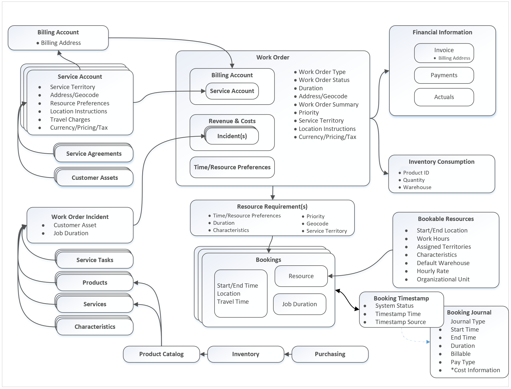

# Field Service Work Order Architecture

The most important process in Field Service is the work order process where work orders are created, scheduled to resources, performed by field technicians, and completed and reviewed. The following diagram can help you understand the various entities, attributes, and relationships that enable the work order process.

> [!div class="mx-imgBorder"]
> 

The work order entity holds the details of the job that needs to be completed. This includes work order type, status, duration, priority and more. Work orders are related to the standard Dynamics Account entity in that specifying a service account on the work order adds related account information such as territory, address, geocode (latitude and longitude), price list, and more. For instances where the work order location (service account) is different than the billing location, you can relate a service account to a billing account. 

> [!Note]
> A service account and billing account are both simply Account entity records. The only difference is which account is entered in the Service Account and Billing Account work order fields, though organizations can distinguish between the two with their own business processes. 

Service accounts are also important when creating Agreements which are used to automatically generate recurring work orders. An agreement can only be associated to one service account and this implies all work orders generated as part of the agreement will be dispatched to that service account location, though the type of work and assets being maintained can vary.

Service accounts are also important for Customer Assets. Adding a service account to a customer asset implies the piece of equipment is located at the service account location. Work orders related to a customer asset maintenance, inspection, repair should correlate to the asset's service account.

## Configuration considerations
## Additional Notes

