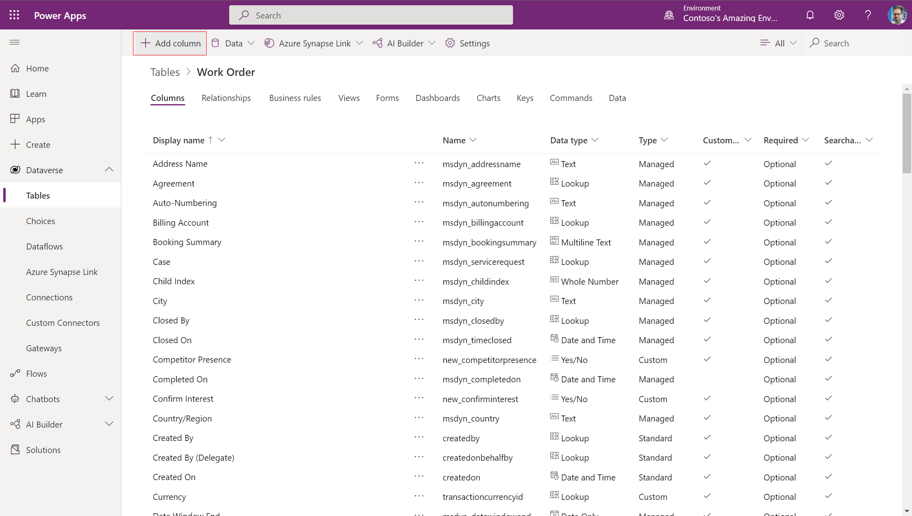
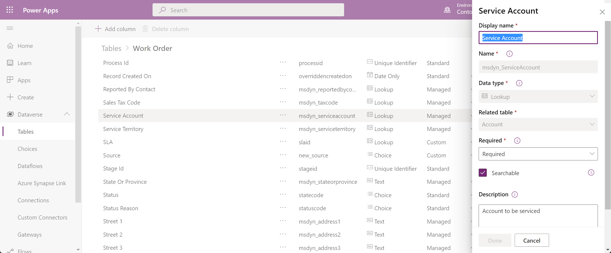

# How to create and edit Field Service columns (fields)

When deploying Field Service you will have to add new columns (also called fields) to the various tables (also called entities) that you use like work orders, bookable resource bookings ("bookings"), customer assets, and more.

Follow best practices when creating, editing, and deleting columns.

In this article we will discuss how to create, edit and delete fields for the work order table, but the following guidance applies to all Field Service tables.

## Understand existing fields

It is very important to understand existing fields that come with the table before creating, editing, or deleting fields. This is because it is beneficial from a process, performance, and upgrade perspective to use existing fields where possible.

In the example of this article, review existing work order fields, understand their function and the process they represent, and decide if you can use the existing fields.

## Create new fields

After understanding the existing fields and processes on the work order form, you may need to create additional fields based on your unique business processes.

Go to https://make.powerapps.com 

Create new fields also called "columns" as needed.

> [!div class="mx-imgBorder"]
> 

> [!div class="mx-imgBorder"]
> 

Do not add new fields to the form yet, review the topic on [customizing Field Service forms](field-service-customize-forms.md) before doing so.

## Edit fields

Administrators can edit the display names and labels of fields but cannot edit field properties. Below are a few examples.

Edit the display names of fields or the labels of choices as needed. 

As an example, you can change the field display name of Service Account to Customer.

> [!div class="mx-imgBorder"]
> 

As another example, for the _System Status_ field, you can change the labels of the choice options like changing the _In Progress_ label to _Work Started_. 

> [!div class="mx-imgBorder"]
> 

Optional fields can be made required, but required fields cannot be made optional.

> [!Note]
> **Do not edit field properties!** It is highly recommended to not edit the properties of existing fields. 

As an example, editing fields in the following ways is unsupported and can cause errors and issues when upgrading.

- Changing field types - As an example you should not change the type of a field from _Date Only_ to _Date and Time_, or change a _Whole Number_ field to a _Decimal_  
- Removing choice options
- Adding choice options
- Changing field requirement from _Required_ to _Optional_ (it is okay to change from Optional to Required)

## Delete columns (fields)

**Do not delete existing fields** Deleting fields can cause important processes to fail causing errors. You can simply hide or remove fields from the forms so that users cannot see them.

## Summary of recommended best practices

- Understand existing fields and try to use them before creating new ones
- Field display names and labels can be edited
- Field properties cannot be edited
- Optional fields can be made required, but required fields cannot be made optional.