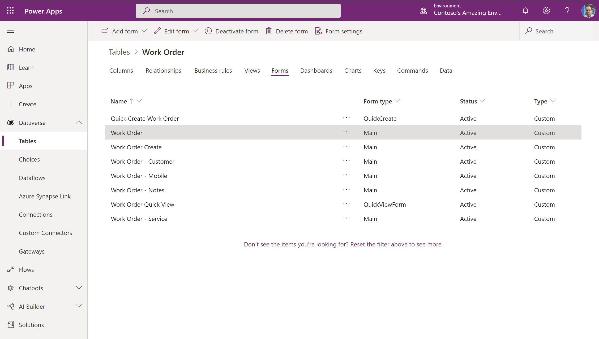
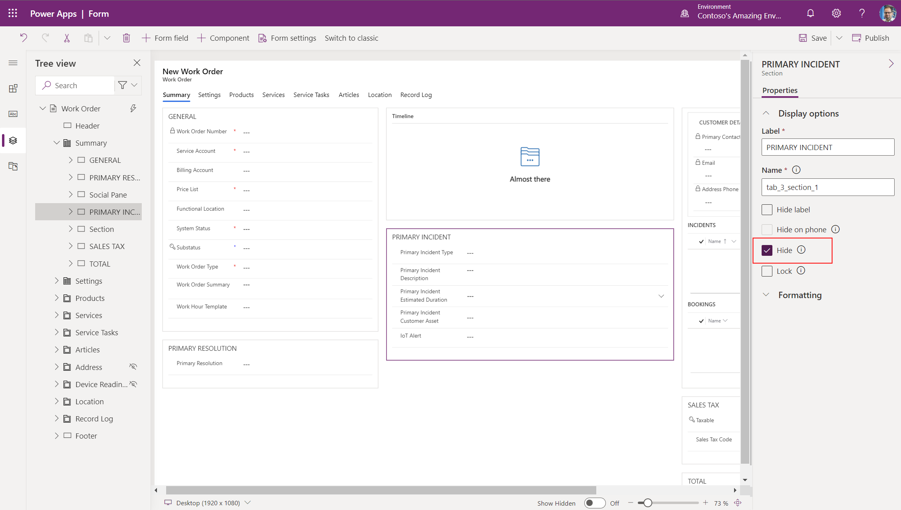
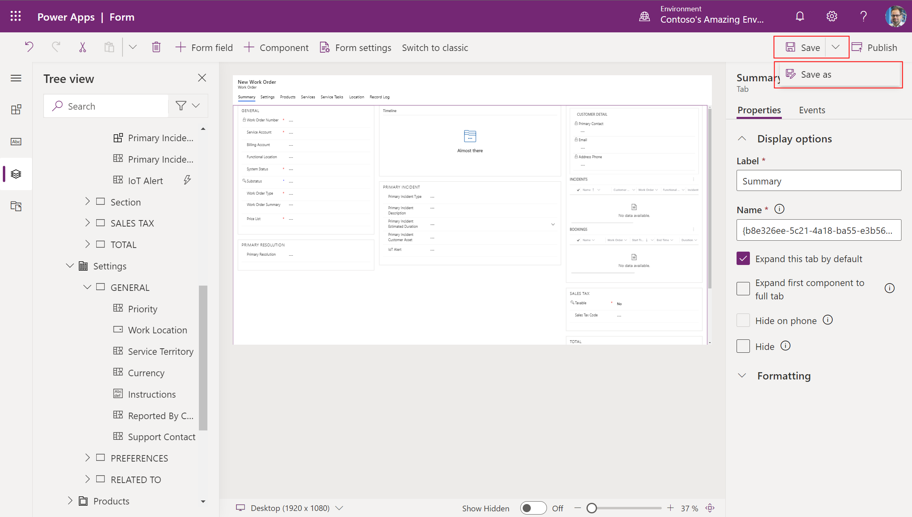
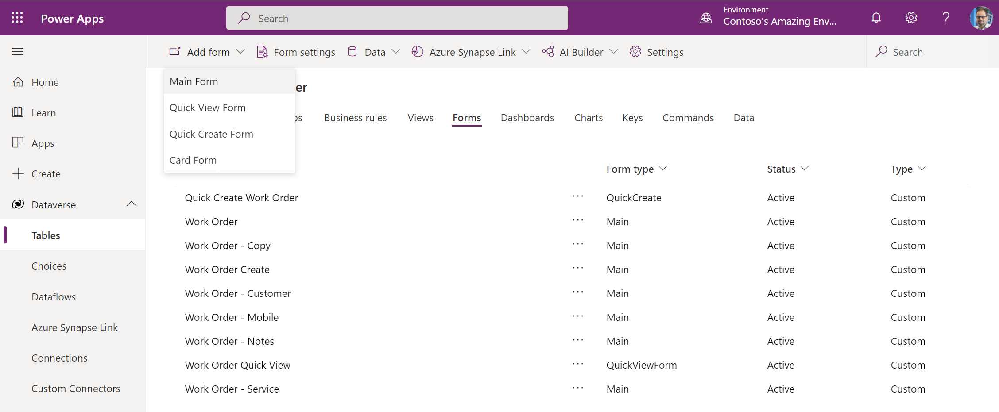

# How to customize Field Service forms

While setting up Field Service for your organization, you may have to customize the forms that back office workers like dispacthers, service managers, and other roles use to view important information and document their work. IT administrators may customize Field Service forms so users can capture information unique to your business or industry and to ensure the form layout matches your business processes.

Customizing forms properly is very important for maximizing performance, like the time it takes for forms to load and save changes; and for improving usability, like how easy it is for users to view and update information. 

In this article we will walk through how to edit or "customize" the Work Order form for back office workers, but the steps below should be used to edit or customize any Field Service web form. 

> [!Note]
> There is a separate and unique process to customize the mobile work order form for frontline workers. See the section at the end of this article. 

## Prerequisites

System administrator security role
Field Service - Adminsitrator security role

## 1. Understand the default work order form

Before customizing the work order form, it is very important to understand the default work order form that is included with Field Servive. This means understanding the fields and the recommended process flow. This will help you determine if you need to make minor changes to the default form or create something completely new. Using the default fields and process is recommended for performance, usability, and upgradability reasons.

Go to the Field Service app > Work Orders > select an existing record or create a new one.

The work order form is optimized for the following standard work order process.

1. A work order is created manually, from a converted case, via an IoT alert, from an agreement schedule, or via an integration with a system status equal to _Unscheduled_ by default. 
2. Work order details are entered like the account, work order type, location, products, services, service tasks, and any other information that is important
3. The work order is scheduled to one or more resources ("frontline workers") and the system status automically becomes _Scheduled_.
4. The frontline worker views the scheduled work order on his or her mobile app and travels to the customer location to perform the required work and records progress. The system status becomes _In Progress_. The fronltine worker updates information like when he or she arrived on site, service tasks completed, services and products billed. 
5. The frontline worker completes the work order and the system status becomes _Completed_.
6. The back office manager or dispatcher views the completed work order and verifies the work is completed and the necessary data is captured. If everything is finished the status is changed to _Closed-Posted_.

> [!div class="mx-imgBorder"]
> 

[Read more about the Field Service work order process](work-order-status-booking-status.md)

View and understand the default fields and determine which ones can be used for your business.

> [!div class="mx-imgBorder"]
> 

The following fields are critical to the Field Service work order process and are required. If your organziation does not plan to use these fields then you may want to consider creating an entirely new entity table.

- Work Order Number
- System Status
- Service Account
- Billing Account
- Price List
- Work Order Type
- Work Location
- Address
- Latitude
- Longitude

The following subgrids are also critical to the Field Service work order process and are highly recommended.

- Bookable Resource Booking ("Bookings")
- Service Tasks
- Products
- Services

Read more about the work order fields and functions by reviewing the topics on [Field Service architecture](field-service-architecture.md) and [creating a work order](create-work-order).

## 2. Make a list of needed and unneeded fields

Make a list of default work order fields that are relevant to your business process and another list of unneeded fields. You must use the ciritical required fields mentioned above. 

## 3. Create new fields as needed

After understanding the existing fields and processes on the work order form, you may need to create additional fields based on your unique business processes.

Go to https://make.powerapps.com 

Create new fields also called "columns" as needed.

Do not add them to the form yet.

> [!div class="mx-imgBorder"]
> 

> [!div class="mx-imgBorder"]
> 

> [!Note]
> **Do not delete existing fields!** Deleting fields can cause important processes to fail causing errors. We will hide unwanted fields from the form later on.

## 5. Edit field display names and labels as needed

Edit the display names of fields or the labels of choices as needed. 

As an example, you can change the field display name of Service Account to Customer.

> [!div class="mx-imgBorder"]
> 

As another example, for the _System Status_ field, you can change the labels of the choice options like changing the _In Progress_ label to _Work Started_. 

> [!div class="mx-imgBorder"]
> 

> [!Note]
> **Do not edit field properties!** It is highly recommended to not edit the properties of existing fields. 

As an example, editing fields in the following ways is unsupported and can cause errors and issues when upgrading.

- Changing field types - As an example you should not change the type of a field from _Date Only_ to _Date and Time_, or change a _Whole Number_ field to a _Decimal_.  
- Removing choice options
- Adding choice options

Leave required fields as required.

## 6. Customize the default work order form (recommended)

We are now ready to customize the Work Order form with a combination of existing work order fields and your custom fields. 

If you want to use many of the default work order fields and your business process is close to the standard work order process (or you're willing to adopt the standard work order process) then it is highly recommended to use the default Work Order Main form and make changes within that form. This will ensure your work order form will be upgraded and you can benefit from improvements. 

a. Go to the Work Order Main form

> [!div class="mx-imgBorder"]
> 

## 7. Hide unwanted tabs, sections, and fields

a. Hide unwanted tabs

> [!div class="mx-imgBorder"]
> 

b. Hide unwanted sections

> [!div class="mx-imgBorder"]
> 

c. Hide unwanted fields

> [!div class="mx-imgBorder"]
> 

## 8. Move unwanted items away from the first form tab

d. Move unwanted subgrids and fields away from the first form tab

> [!div class="mx-imgBorder"]
> 

> [!div class="mx-imgBorder"]
> 

## 9. Add your custom fields to the appropriate form tabs

    

> [!div class="mx-imgBorder"]
> 

Do not add custom fields to the first form tab unless absolutely necessary 
    
[Follow form design best practices](https://docs.microsoft.com/powerapps/maker/model-driven-apps/create-and-edit-forms)

	

## 8. Test your forms

Test load performance against a benchmark (/Performance insights / monitoring tool)

Run Solution Health to test for best practice violations

Run solution checker to test scripts if applicable
	
  

## Summary of recommended best practices

- Always use default fields and processes when possible
- Hide unwanted fields, do not remove them, and move them away from the first tab
- Move unwanted fields and lesser used fields away from the first form tab
- Minimize lookup controls to no more than 10 on a from tab
- Minimize subgrid controls to no more than 3 on a form tab
- Do not add additional subgrids or lookups to first form tab
- Use the PCF _Form component control_ to display information from the other tables inside the form. This prevents form users from having to click away from the form. 
- Do not edit or remove libraries
- use more tabs

## Customizing the mobile work order form

While the instructions in this article are useful for customizing any web form for back office workers, there is a specific work order form optimized for the mobile experience for frontline workers. See the topic on [Editing the booking and work order form](mobile-powerapp-booking-work-order-form.md) to learn how to customize the mobile work order form.

## Create an entirely custom work order form (not recommended)

In some scenarios you may need to create a completely custom work order form. The top reasons you may need to create a custom work order form include:

1. You have a very unique work order process and are unable to use the standard work order process included with Dynamics 365 Field Service. 
2. You have decided it is impossible for all roles to use the same work order form even while using security roles and field security profiles and you need to create different forms for different user personas.

If you have a very unique business process and a lot of custom fields (greater than 100), then it is recommended to create a new custom form. Furthermore, if you want to create multiple different forms for different user personas (roles) then it is recommended to create new custom forms. 

> [!Note]
> You can make a copy of the form
> [!div class="mx-imgBorder"]
> 

a. Create a new form

> [!div class="mx-imgBorder"]
> 

b. remove unwanted fields and subgrids
    except the following

c. add your fields, subgrids, controls
 Guidance

e. Follow form design best practices

	 https://docs.microsoft.com/en-us/powerapps/maker/model-driven-apps/create-and-edit-forms

## More considerations
	- Create forms for different roles - use a custom form
    - required vs business recommended fields
    - turn off price calculations
    - all fields add up

## See also

- [Create and edit forms](https://docs.microsoft.com/powerapps/maker/model-driven-apps/create-and-edit-forms)
- [Design productive forms](https://docs.microsoft.com/powerapps/maker/model-driven-apps/design-productive-forms)
- [Design performant forms](https://docs.microsoft.com/powerapps/maker/model-driven-apps/design-performant-forms)
- https://docs.microsoft.com/en-us/dynamics365/customerengagement/on-premises/customize/optimize-form-performance?view=op-9-1
   