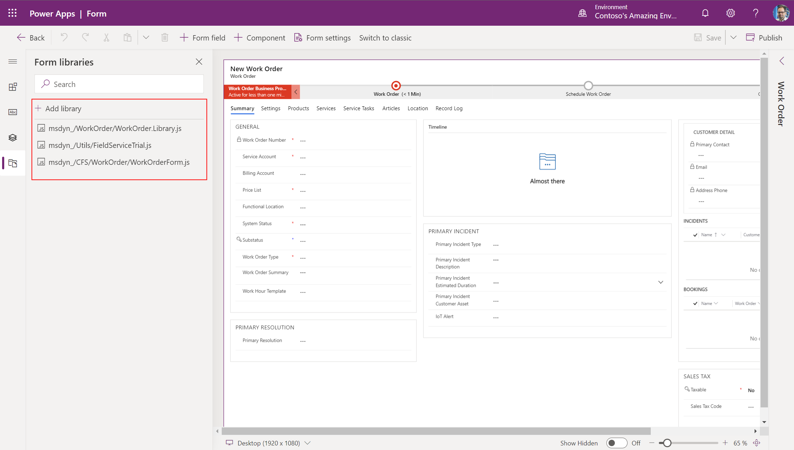

# Write scripts to implement complex business logic in Field Service

In some Field Service implementations, there are functionalities requested by the stakeholders which go beyond the functionalities offered by the Out-of-the-Box CRM instance

It allows you to write custom functionality in CRM that can be shared across CRM deployments.

Plugins allow you to write your own custom functionality on top of Microsoft’s event-driven dynamics platform for just about any process you can imagine.

Plugins
JavaScript web resources

Serverside vs client side

## Understand the risks

- performance issues
- errors
- supportability
- time and cost

## Check if Field Service or Dynamics 365 can accomplish the requirement 

## Try using platform

Make sure you have leveraged the built-in platform options first

In many cases, a simple workflow, business logic could have been used to solve the use case.

[When to use plugins, advantages and disadvantages comapred to workflows](https://docs.microsoft.com/en-us/powerapps/developer/data-platform/plug-ins#when-to-use-plug-ins)

## Review best practices before writings plugins or scripts

References
- [Best practices and guidance regarding plug-in and workflow development for the Microsoft Dataverse](https://docs.microsoft.com/powerapps/developer/data-platform/best-practices/business-logic/)
- [Best practices and guidance of client side scripting for model-driven apps](https://docs.microsoft.com/en-us/powerapps/developer/model-driven-apps/best-practices/business-logic/)
- [Make intelligent customizations when you use JavaScript on forms](https://docs.microsoft.com/en-us/powerapps/maker/model-driven-apps/design-performant-forms#javascript-customization)
- [Scalable Customization Design in Microsoft Dataverse](https://docs.microsoft.com/en-us/powerapps/developer/data-platform/scalable-customization-design/overview)

## Use tools to test your scripts

[Use solution checker to validate your model-driven apps in Power Apps](https://docs.microsoft.com/powerapps/maker/data-platform/use-powerapps-checker)

Use the built-in CRM Plugin Trace Functionality and plugin profiler

[Analyze plug-in performance](https://docs.microsoft.com/en-us/powerapps/developer/data-platform/analyze-performance)

## Summary of recommended best practices

- Avoid writing scripts when possible
- Try using workflows and flows before writing scripts
- Run solution checker on scripts
- create a custom model driven app or canvas app (powerapp)
- do not edit or delete existing form libraries 

> [!div class="mx-imgBorder"]
> 

### See also

- [Create or edit model-driven app web resources to extend an app](https://docs.microsoft.com/en-us/powerapps/maker/model-driven-apps/create-edit-web-resources)
- [Script (JScript) web resources](https://docs.microsoft.com/en-us/powerapps/developer/model-driven-apps/script-jscript-web-resources)
- [Use plug-ins to extend business processes](https://docs.microsoft.com/en-us/powerapps/developer/data-platform/plug-ins)
- [Access external web services](https://docs.microsoft.com/en-us/powerapps/developer/data-platform/access-web-services)
