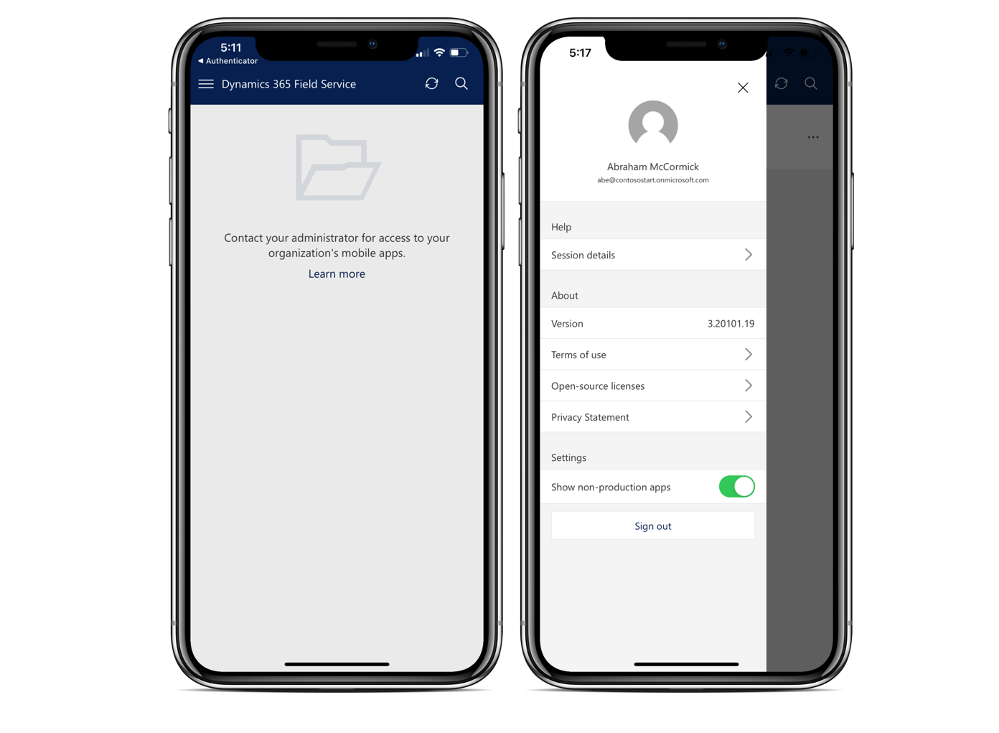

# Get started with Field Service

After you have [installed Dynamics 365 Field Service](install-field-service.md) and have [assigned Field Service licenses to your users](view-user-accounts-security-roles) who need to use the app, you can get started with creating frontline workers and scheduling work orders. The best way to do this is to use the new _Getting Started_ page which can be found in the left navigation pane.

> [!div class="mx-imgBorder"]
> 

At the top of the page you will see Field Service tours and videos.  Each release we will highlight new features, so it is easy to continuously transform your business by leveraging the best of Dynamics 365 Field Service today and tomorrow. We strongly encourage you to come back to the Get Started page.

In the middle of the page you will see a set of action cards that will guide you through the core Field Service processes, like creating frontline workers (also called technicians), customers, work orders, and finally scheduling work orders to frontline workers. See more details in this article below.

At the bottom of the page you will see links to release notes to stay up to date with the latest improvements, a support community forum to post questions, and an ideas forum to give product feedback.

## Prerequisites

- Available with Wave 1 2021 release

- You must have either System Administrator or Field Service - Administrator privileges to see and use the _Get Started_ page.

## Set up your frontline workers

By the end of this getting started page you will have successfully scheduled a work order to a frontline worker to resolve a customer's issue. 

Start by creating a frontline worker who represents someone in your company who completes work orders. Select the **Set Up** button.

> [!div class="mx-imgBorder"]
> 

In the form that displays, enter required information. Recommended values are prepopulated and should not be changed unless necessary. 

> [!div class="mx-imgBorder"]
> 

Optionally you can send an email to the frontline worker user to download the mobile app if [mailboxes are set up](frontline-worker-set-up-email-approval.md).

## Create your accounts

Next create an account that represents one of your customers. Select the **Create** button.

> [!div class="mx-imgBorder"]
> 

Follow the form to enter relevant information.

> [!div class="mx-imgBorder"]
> 

## Create your work orders

Create a work order that outlines work that needs to be done for a customer, typically at the customer's location or at the location of an asset or equipment. Select the **Create** button.

> [!div class="mx-imgBorder"]
> 

 Follow the form to enter relevant information. 
 

> [!div class="mx-imgBorder"]
> 

 The Service Account represents the customer who the work order relates to. 

 Tasks are a checklist of things that need to be done.

 Products are parts that may be needed to complete the work order.

 Services are labor items that may be needed to complete the work order.

## Schedule your work orders

The last step is to schedule the work order to a frontline worker who will complete it for the customer. Select the **Schedule** button to go to the schedule board.

> [!div class="mx-imgBorder"]
> 

Find your work order in the lower pane and click and drag it to your frontline worker.

> [!div class="mx-imgBorder"]
> 

Congratulations! You have successfully completed the core scenario in Field Service.

## Next steps 

### View the scheduled work order on the mobile app

Frontline workers should download the Field Service (Dynamics 365) mobile app from the iOS or Android app stores. 

[iOS - Field Service (Dynamics 365) mobile app](https://aka.ms/fsmobile-apple)

[Android - Field Service (Dynamics 365) mobile app](https://aka.ms/fsmobile-google)

Sign in with the username and password for the frontline worker user.

- For the **Username**, enter the username of the technician user. For example, username@org.onmicrosoft.com
- For the **Password**, enter the password you set for the technician.

Select your app in the list.

> [!div class="mx-imgBorder"]
> 

If you do not see your app, but instead see "Contact your administrator for access to your organization's mobile apps," then select the menu icon and toggle the **Show non-production apps** to _Yes_.

> [!div class="mx-imgBorder"]
> 

In the **Booking** tab, see the work order you scheduled to your frontline worker. You must be signed in with the user the frontline worker was created for in step 3.

> [!div class="mx-imgBorder"]
> 

For more information, see the article on [getting started with the Field Service (Dynamics 365) mobile app](mobile-power-app-get-started.md).

### See also

- See the [Field Service user guide](user-guide.md) to explore more parts of Field Service like asset servicing, inspections, agreements, inventory, automated scheduling, and more!

