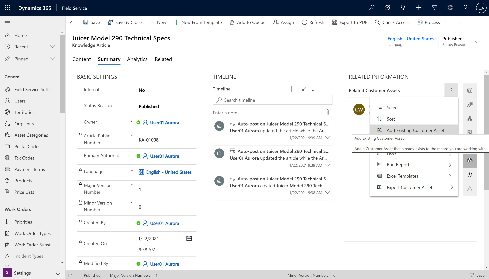

# Knowledge management in Field Service

// https://msit.microsoftstream.com/video/595ba1ff-0400-9887-23d4-f1eb5a0959f3?channelId=0bf6f71a-b361-4d7b-9668-62ff5207b60d

features:
- same knowledge management as customer service. dont need customer service its included with FS but if you have customer service you can use the same knowledge articles for both apps.
- available on mobile offline
- link to cases, work orders, incidents, products and assets

business value:
- improve first time fix rate
- guide technicians through procedures and help

## Prerequisites

## Create a knowledge article

First create a knowledge article. 

From the Field Service app go to Settings > Knowledge articles. 

Create a knowledge article and add text, pictures, and videos as needed.

Then save and publish the article.

See the following topics for more details:

- [Create and manage knowledge articles](https://docs.microsoft.com/dynamics365/customer-service/customer-service-hub-user-guide-knowledge-article)
- [Set up a search provider](https://docs.microsoft.com/dynamics365/customer-service/set-up-search-providers)

## Associate knowledge article to cases, customer assets, incident types, products

Next associate knowledge articles to various work order records like incident types, products, or customer assets based on your business needs. When any of these records are added to a work order the related knowledgte articles will get linked to the work order. Below are two examples of relating knowledge articles to incident types and customer assets.

### Associate knowledge articles to incident types

From the Field Service app go to Settings > Incident types > select an incident type.

> [!div class="mx-imgBorder"]
> 

In the Details section relate the knowledge article(s) to the incident type. 

> [!div class="mx-imgBorder"]
> 

### Associate knowledge articles to Customer assets

From the Field Service app go to Settings > Knowledge articles. 

Select an article and in Related Information select **Add Existing Customer Asset**.

> [!div class="mx-imgBorder"]
> 

This will relate the knowledge article and the customer asset. 

## Create a work order

Create a Work Order by going to the main service section > Work Orders > +New.

Add desired work order incidents, customer assets, and work order products to the work order.

Associated knowledge articles will be added to the work order in **Linked Articles** section of the work order form.

> [!div class="mx-imgBorder"]
> 

> [!div class="mx-imgBorder"]
> 

Users have the ability to link specific knowledge articles to a work order "ad-hoc" to link articles that are not associated to incidents, assets, or products, but may still be needed to complete the work order. From the Linked Articles section select +New Linked Article.

> [!Note]
> Adding multiple work order incident types, customer assets, work order products will add all associated knowledge articles to the work order. 

## View work order and knowledge articles on the mobile app

> [!div class="mx-imgBorder"]
> 

- available offline (currently without images)

## Configuration considerations

- can unlink article

## Additional Notes

- if a case has knowledge articles realted to it, and a work order is created from the case, are the article auto associated to work order?

