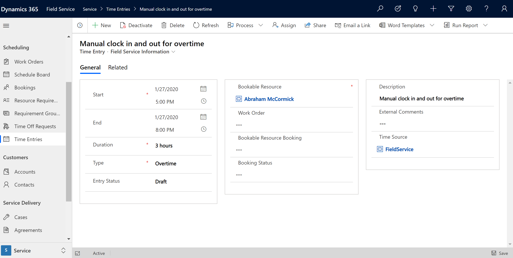

# Time entries for Field Service

Tme entry capabilities help field service organizations better track technician time during work orders and other scenarios.

Time entries canb e created

- automatically during the work roder process
- automatically for time off requests
- manually for custom business processes

> [!div class="mx-imgBorder"]
> 

This feature is valuable because

- reporting 
- utilization
- charging scenarios

Further, this feature makes it simple to configure a solution to create time actuals that capture costs from approved time entries, enabling organizations to drive more accurate accounting practices and profit-loss calculations."

 Field Service time entry aligns with Dynamics 365 Project Service Automation to capture time entries into the same entity that Project Service Automation has always used for consistent capture, regardless of whether your organization uses Field Service, Project Service Automation, or both.

## Prerequisites

Public preview

> [!Note]
>

## Work orders

Time entries are automatically during the work order process. As a work order is scheduled and performed, the booking status changes are tracked in booking timestamps.

> [!div class="mx-imgBorder"]
> 

When the work order booking status is changed to **Completed**, time entries are created based on the booking timestamps.

> [!div class="mx-imgBorder"]
> 

In addition, when the work order system status (different than the booking status) is changed to **Closed-Posted**, Actual records are created. These represent the internal cost of the technician's time to the field service organization.

> [!div class="mx-imgBorder"]
> 

## Manual time entry

Time entries can also be created manually. From the desktop go to **Field Service > Time Entries > +New**.

Add a start time, end time or duration, and the bookable resource that the time entry relates to.

> [!div class="mx-imgBorder"]
> 

Optionally you can relate the time entry to other records like work orders and bookings as needed.

Time entries can also be created manually from Field Service Mobile.

> [!div class="mx-imgBorder"]
> 

## Time off

Time off requests are automatically recorded as time entries as well.

First submit a time off request. This can be done in the web browser or from Field Service Mobile.

> [!div class="mx-imgBorder"]
> 

A time entry record will automatically be created. The type will be Vacation by default and the entry status will be submitted.

> [!div class="mx-imgBorder"]
> 

Next approve the time off request. This is only required if the resource on the time off request requires approval as defined on the bookable resource record.

> [!div class="mx-imgBorder"]
> 

The time entry Entry Status will be updated as approved.

> [!div class="mx-imgBorder"]
> 

Furthermore, making changes to the date or duration of the time entry will udpate the time off request and vice versa.

> [!Note]
> You can create time off requests from Field Service Mobile in online and offline modes and the time entries will be created upon sync. 

## Configuration considerations

Time entries are created based on booking timestamps, and booking timestamps are created based on the **Timestamp Frequency** setting in Field Service Settings. See the topic on [Bookimg timestamps](booking-timestamps.md) to understand how timestamps can be created based on the booking statuses or field service booking statuses.

## Additional Notes

Time entries are only automatically created for work order bookings and not for independent bookings or bookings related to other entities such as cases or custom entities.

Time entries are not created in offline mode, but are created upon sync. 

### See also

[Time and expense in Project Service Automation](https://docs.microsoft.com/en-us/dynamics365/project-service/time-expense-collaboration-guide)

[Bookimg timestamps](booking-timestamps.md)

[Time off requests](submit-approve-time-off-requests.md)