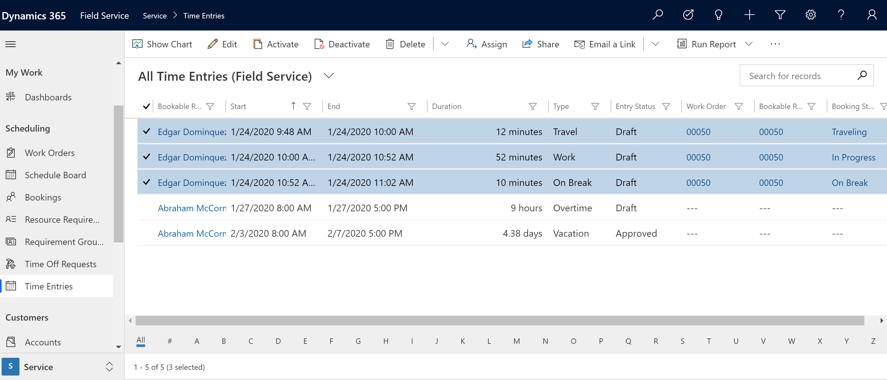
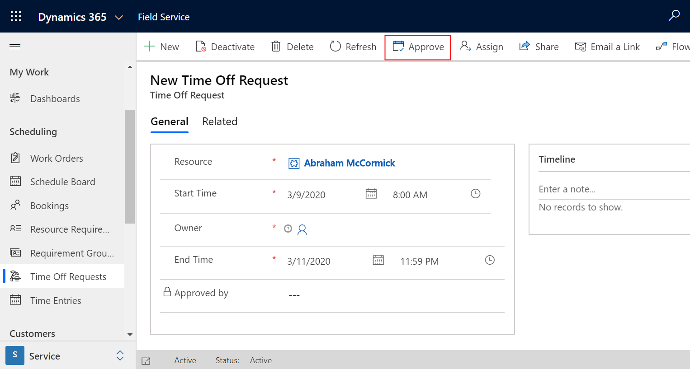

# Integrated technician time tracking

However, organizations that only use one of these products will not be required to install Project Service Automation simply to capture time entries within Field Service. Field Service will support:

- automatic time capture for work orders based on booking timestamps
- manual time capture 
- time off

Further, this feature makes it simple to configure a solution to create time actuals that capture costs from approved time entries, enabling organizations to drive more accurate accounting practices and profit-loss calculations."

> [!div class="mx-imgBorder"]
> 

- charging scenarios
- reporting 
- utilization

 Field Service time entry aligns with Dynamics 365 Project Service Automation to capture time entries into the same entity that Project Service Automation has always used for consistent capture, regardless of whether your organization uses Field Service, Project Service Automation, or both.

## Prerequisites
> [!Note]
>

## Work orders

> [!div class="mx-imgBorder"]
> 

upon complete

> [!div class="mx-imgBorder"]
> 

upon closed-posted

> [!div class="mx-imgBorder"]
> 

## Manual time entry

> [!div class="mx-imgBorder"]
> 

## Time off

Time off requests are automatically recorded as time entries as well.

First submit a time off request. This can be done in the web browser or from Field Service Mobile.

> [!div class="mx-imgBorder"]
> 

A time entry record will automatically be created. The type will be Vacation by default and the entry status will be submitted.

> [!div class="mx-imgBorder"]
> 

Next approve the time off request. This is only required if the resource on the time off request requires approval as defined on the bookable resource record.

> [!div class="mx-imgBorder"]
> 

The time entry Entry Status will be updated as approved.

> [!div class="mx-imgBorder"]
> 

Furthermore, making changes to the date or duration of the time entry will udpate the time off request and vice versa.

> [!Note]
> You can create time off requests from Field Service Mobile in online and offline modes and the time entries will be created upon sync. 

## Configuration considerations

Time entries are created based on booking timestamps, and booking timestamps are created based on the **Timestamp Frequency** setting in Field Service Settings. See the topic on [Bookimg timestamps](booking-timestamps.md) to understand how timestamps can be created based on the booking statuses or field service booking statuses.

mobile app

## Additional Notes

Time entries are only automatically created for work order bookings and not for independent bookings or bookings related to other entities such as cases or custom entities.

### See also

[Time and expense in Project Service Automation](https://docs.microsoft.com/en-us/dynamics365/project-service/time-expense-collaboration-guide)

[Bookimg timestamps](booking-timestamps.md)

[Time off requests](submit-approve-time-off-requests.md)