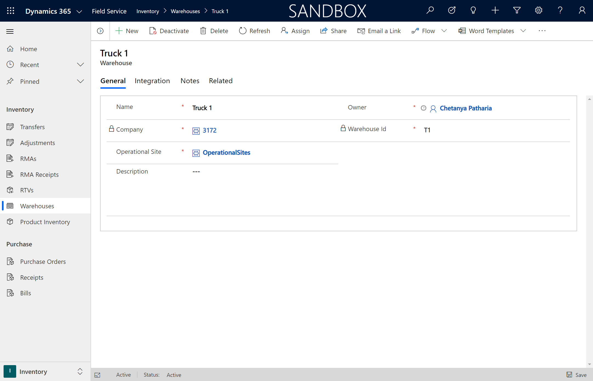

# Integrate Field Service and Finance & Operations Supply Chain Management

While Dynamics 365 Field Service includes basic [inventory capbilities](./inventory-purchasing-returns-overview.md) for managing technician truck stock, tracking asset service history, requesting purchase orders, and documenting returns; many field service organizations still integrate Field Service with their Enterprise Resource Planning (ERP) system. Organizations utilizing the Microsoft Dynamics 365 stack will find it exceptionally easy to integrate Dynamics 365 Field Service and Finance & Operations [Supply Chain Management](https://docs.microsoft.com/en-us/dynamics365/supply-chain/) systems. 

## Introduction

Leveraging the common data model and common data service in Dynamics 365, you can set up a synchronous two-way integration for the following 4 entities, with more entities planned: 

4 entities are integrated between Field Service and Supply Chain Management with more expected:

- Warehouse
- Customer Asset
- Payment Terms
- Ship Via

This first round of integration development is particularly important for two key scenarios:

1. **Asset management** - When creating a work order for repair or maintenance on a customer asset, the integration will allow dispatchers to pick from a full list of customer assets regardless of which system it was created in.
2. **Nearby warehouses** - Integration empowers technicians with a complete list of nearby warehouses and relevant details.

## Prerequisites

This feature is available as an early access public preview https://docs.microsoft.com/en-us/power-platform/admin/opt-in-early-access-updates 

To view integrated data, a user only needs the required license and security for one system. Only few IT administrators will need access to both systems - Field Service and Supply Chain Management. In other words, users only need a license for the interface they are accessing the data in.

## How does it work?

The integration is made possible because Field Service is built on top of the Common Data Service and [Dual Write](https://powerapps.microsoft.com/en-us/blog/announcing-dual-write-preview/) that writes changes in Dynamics 365 Finance and Operations to the Common Data Service and vice versa.

After dual write is enabled, a solution is imported into Field Service that adds the required fields to make the entities in each system integratable. 

As an example, in Field Service you will see new fields added to the warehouse entity that are required in Supply Chain Management.

> [!div class="mx-imgBorder"]
> 

> [!div class="mx-imgBorder"]
> 

When a warehouse record is created or updated in either system, the change will show in the other system in near real-time.

Furthermore, business logic and validations in either system is respected in the other system. As an example, imagine a warehouse cannot not be created in Supply Chain Management without a specific field value. When a user attempts to create the warehouse in Field Service, an error will appear based on the validation logic in Supply Chain Management.

## Additional Notes

this is better than the [prospect to cash](https://docs.microsoft.com/en-us/dynamics365/supply-chain/sales-marketing/prospect-to-cash) data integrator which is one direction, batch, asynchronous and doesnt respect rules

asynchronous and batch exists today and this is a more robusy version of prospect to cash

can integrate to common tables in CDS (Warehouse, Customer Asset, Account, etc) even without field service

same table with no dupicate data

## See also

inventory https://docs.microsoft.com/en-us/dynamics365/field-service/inventory-purchasing-returns-overview
customer assets https://docs.microsoft.com/en-us/dynamics365/field-service/configure-set-up-customer-assets
pricing https://docs.microsoft.com/en-us/dynamics365/field-service/create-price-list 

