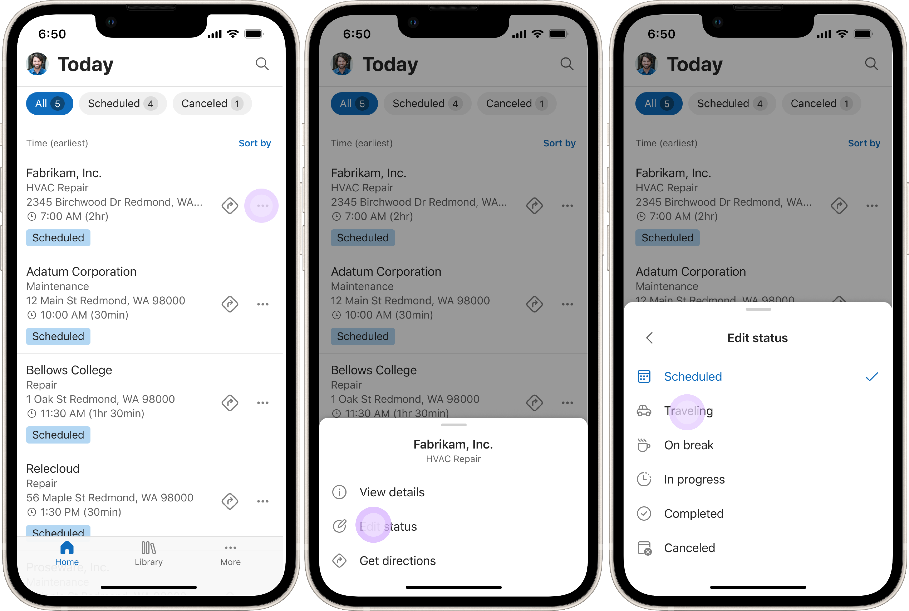
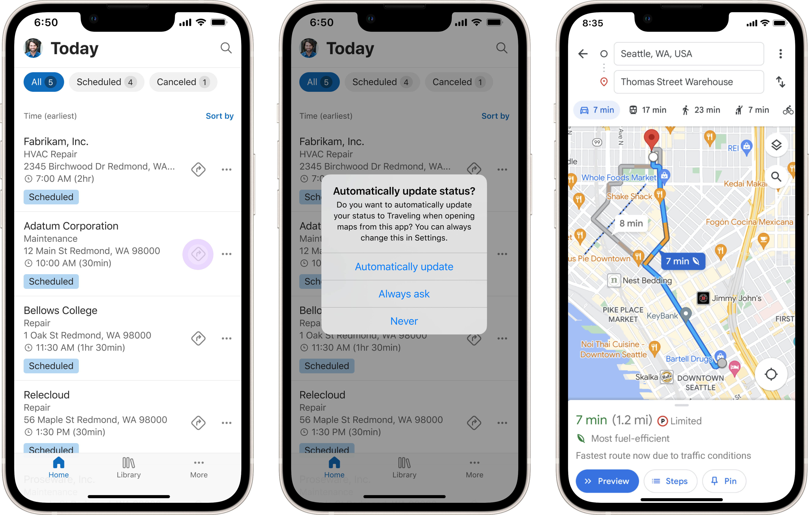
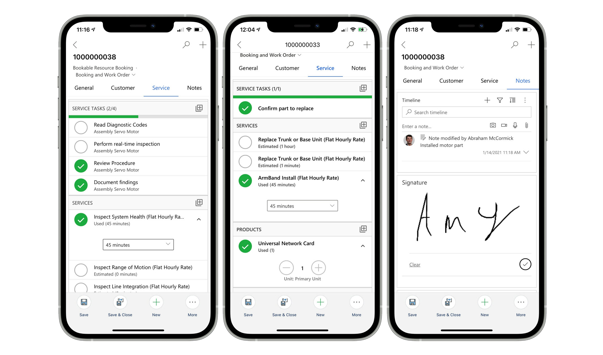
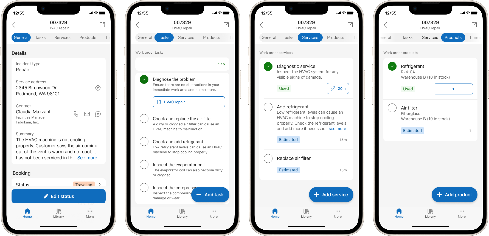
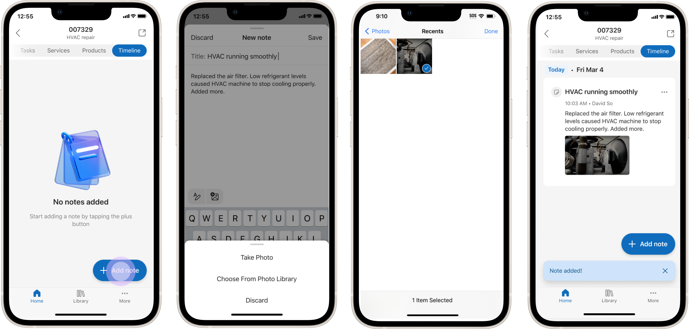
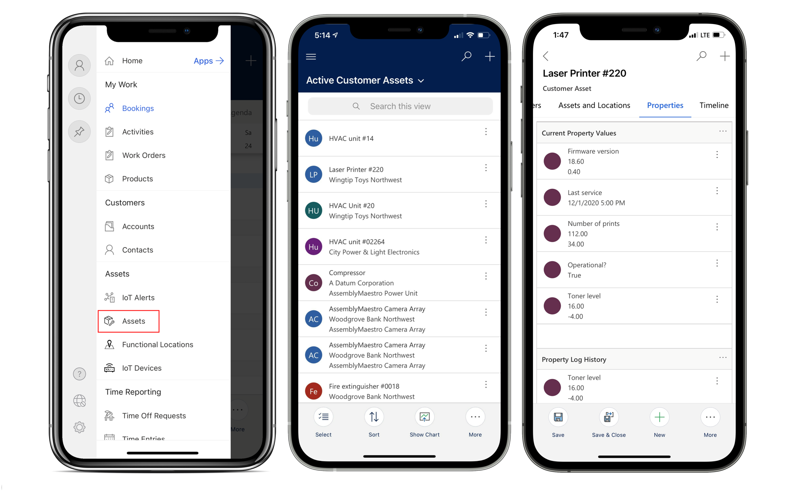
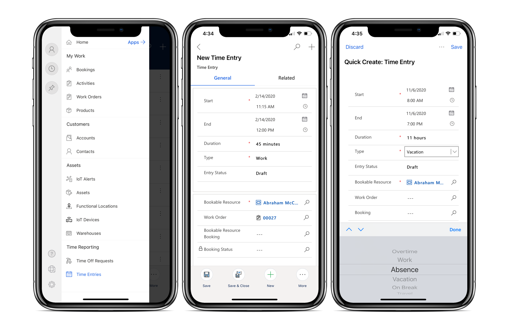

# Complete work orders on the mobile app

Technicians can use various features in the mobile app to efficiently plan their work day, track their work orders, and see details about customers. Other features include:

- A calendar view of assigned jobs with all details about the jobs
- Picture, video, and asset barcode scanning
- Integrations in other Microsoft applications for seamless collaboration
- Offline capabilities to work in areas without internet

## Travel to a job location

## [Unified Interface app](#tab/vCurrent)

Select a booking to see more details about the booking time and the work order. Update the status to indicate you're driving to the customer location. On the **Customer** tab, you can see the work order location on a map to launch turn-by-turn driving directions on your preferred maps app.

> [!div class="mx-imgBorder"]
> 

The functional location field on the work order tells the technician exactly where to go within an address.

## [Public Preview app](#tab/vNext)

Change the status of a booking to **Traveling** directly from the booking home page, by swiping the desired booking from left to right or by tapping on the booking's contextual menu to access its quick actions and selecting the desired status. The same thing can be accomplished by tapping on the booking itself and then tapping on the **Edit status** button in the **General** tab.

> [!div]
> 

Open the default maps app to get directions by tapping on the directions icon on a booking tile in the bookings home page. If the booking record contains the geolocation of the address (lat/long), then the control will use that, otherwise it will fallback to the address string. If no address is specified, then the directions icon will not be available. 
You can decide if you want the booking status to change to **Traveling** when you do so. 

> [!div]
> 

---

## Perform and record work

## [Unified Interface app](#tab/vCurrent)

On the **Service tab**, you see work order details like work order service tasks, products, and services. Mark a service or service task as complete and include the products used. Adjust the product units and the service hours as needed. Selecting the service task, service, or product name opens the full details form.

> [!div class="mx-imgBorder"]
> 

## [Public Preview app](#tab/vNext)

Once ready to perform the work, simply access the booking details view, by tapping on the booking tile on the booking home page. You will see three separate tabs for work order service tasks (**Tasks**), products (**Products**), and services (**Services**). Mark a service or service task as complete and include the products used. Adjust the product units and the service hours as needed. Selecting the service task, service, or product name opens the full details form.

> [!div]
> 

---

## Take notes with attachments

## [Unified Interface app](#tab/vCurrent)

On the **Notes** tab, capture text, image, audio, and video notes and associate them with the booking. You can also attach files and capture signatures. These notes help you record and build a work history.
The **Timeline** tab is available for other historical data related to the booking.

> [!div class="mx-imgBorder"]
> 

> [!NOTE]
> Notes are only available when included with the Bookable Resource Booking form. The control doesn't support other entities.
> Notes taken in the Field Service mobile app are stored in the `msdyn_bookableresourcebookingquicknotes` table. The default **Field Service - Resource** security role includes permissions to this table. If your app users do not have the out-of-the-box **Field Service - Resource** security role, you may have to include access to this table for these users. Follow the best practices described in the [Field Service security roles documentation](view-user-accounts-security-roles.md#q--a) to make sure your app users have access to this table.

## [Public Preview app](#tab/vNext)

In Public Preview you take notes directly in the **Timeline** tab. Simply tap on the **+* Add note** button and add text and/or images to your note. 

> [!div]
> 

> [!NOTE]
> Notes in the Timeline are associated with the current booking and cannot currently be viewed at the Work Order level.

---

## Service assets

> [!div class="mx-imgBorder"]
> 

Technicians can also view and interact with functional locations and customer asset hierarchies on the mobile app when connected to the internet.

For a guided walkthrough of functional locations on the Field Service mobile app, check out the following video.

> [!VIDEO https://www.microsoft.com/videoplayer/embed/RE4I2pU]

## Barcode scanning

Select the search icon to find records from any entity. You can also search by scanning a barcode to find records that have a matching barcode field.

> [!div class="mx-imgBorder"]
> 

For more information, see the article on [configuring global search](mobile-power-app-system-barcode-scanning.md).

## Time entry

Track the time that technicians spend during work orders and other scenarios and create time entries in the mobile app.

Time entries are useful for reporting and billing purposes.

From the main menu, go to **Time Entry** and create a new one.  

> [!div class="mx-imgBorder"]
> 

For a guided walkthrough, check out the following video.

> [!VIDEO https://www.microsoft.com/videoplayer/embed/RE4J6mQ]

## Create follow-up work orders

While working on site, you may want to log work for another time. The Field Service (Dynamics 365) mobile app makes it easy to create follow-up work orders.

For a guided walkthrough, check out the following video.

> [!VIDEO https://www.microsoft.com/videoplayer/embed/RWyHY4]

To create a follow-up work order, select the **Follow up** option in the bottom app menu. This option is only available the user has **create** permissions for the work order table. For more information on the security roles, see [users and security roles](./view-user-accounts-security-roles.md).

> [!div class="mx-imgBorder"]
> 

The following fields are already filled in based on the current work order:

- Address
- Billing Account
- Service Account
- Service Territory
- Exchange Rate
- Tax Code
- Taxable
- Transaction Currency ID

Once the technician saves the work order, it's uploaded and available for booking to the dispatcher.

[!INCLUDE[footer-include](../includes/footer-banner.md)]
