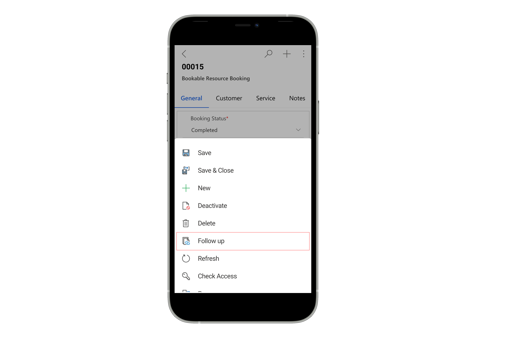

# Complete work orders on the mobile app

## Travel to job location

Select a booking to see more details about the booking time and the work order. For example, you can update the status to **Traveling** to indicate you're driving to the customer location. ON the **Customer** tab, you can see the work order location on a map to launch turn-by-turn driving directions on your preferred maps app.

> [!div class="mx-imgBorder"]
> 

The functional location field above the address tells the technician exactly where to go within an address.

> [!div class="mx-imgBorder"]
> 

## Perform and record work

On the **Service tab**, you'll see work order details like work order service tasks, products, and services. Mark a service or service task as complete in include the products used. Adjust the product units and the service hours as needed. Selecting the service task, service, or product name will send you to the full details form.

> [!div class="mx-imgBorder"]
> 

## Take notes with attached pictures, videos and files

On the **Notes** tab, you can easily capture multiple text, photo, audio, and video notes and associate them with the booking. You can also attach files. These notes help you record and build relevant work history. Customer signatures can also be captured. The **Timeline** tab is available for other historical data connected to the booking.

> [!NOTE]
> Notes are only available when included with the Bookable Resource Booking form. The control doesn't support other entities.
> Notes taken in the Field Service mobile app are stored in the `msdyn_bookableresourcebookingquicknotes` table. The default **Field Service - Resource** security role includes permissions to this table. If your app users do not have the out-of-the-box **Field Service - Resource** security role, you may have to include access to this table for these users. Follow the best practices described in the [Field Service security roles documentation](/dynamics365/field-service/view-user-accounts-security-roles#q--a) to make sure your app users have access to this table.

> [!div class="mx-imgBorder"]
> 

## Service assets

> [!div class="mx-imgBorder"]
> 

Technicians can also view and interact with functional location and customer asset hierarchies on the mobile app.

> [!div class="mx-imgBorder"]
> 

> [!NOTE]
> Internet connectivity is required to view and interact with functional location and customer asset hierarchy trees on the Field Service mobile app.

For a guided walkthrough of functional locations on the Field Service mobile app, check out the following video.

> [!VIDEO https://www.microsoft.com/videoplayer/embed/RE4I2pU]

## Barcode scanning

Select the global search icon to search for records across accounts, contacts, work orders, customer assets, or any other entity. Technicians can also search by scanning a barcode with their phone's camera. The barcode scan will find records that have a matching barcode field.

> [!div class="mx-imgBorder"]
> 

For more information, see the article on [configuring global search](mobile-power-app-system-barcode-scanning.md).

## Time entry

Time entry capabilities help field service organizations better track the time that technicians spend during work orders and other scenarios.

Time entries are useful for:

- reporting
- understanding utilization
- billing and invoicing for service

Technicians can view and create time entries in the mobile app.

From the main menu, go to **Time Entry**, then create a new one. In the **Type** field select whether the time entry relates to work, vacation, absence, break, and so on.  

> [!div class="mx-imgBorder"]
> 

For a guided walkthrough, check out the following video.

> [!VIDEO https://www.microsoft.com/videoplayer/embed/RE4J6mQ]

## Create follow-up work orders

While working on site, you may want to log work for another time. The Field Service (Dynamics 365) mobile app makes it easy to create follow-up work orders.

For a guided walkthrough, check out the following video.

> [!VIDEO https://www.microsoft.com/videoplayer/embed/RWyHY4]

To create a follow-up work order, select the **Follow up** option in the bottom app menu. This option is only available the user has **create** permissions for the work order table. For more information on the security roles, see [users and security roles](./view-user-accounts-security-roles.md).

> [!div class="mx-imgBorder"]
> 

The following fields are already filled in based on the current work order:

- Address
- Billing Account
- Service Account
- Service Territory
- Exchange Rate
- Tax Code
- Taxable
- Transaction Currency ID

Once the technician saves the work order, it's uploaded and available to be booked by the dispatcher.

[!INCLUDE[footer-include](../includes/footer-banner.md)]
