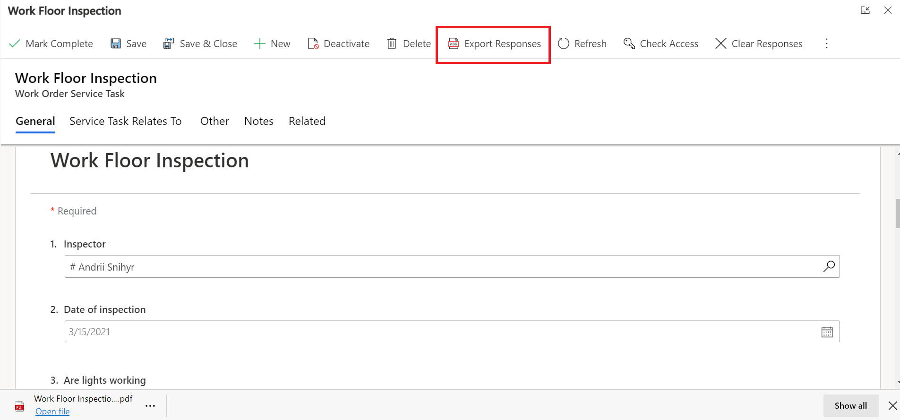
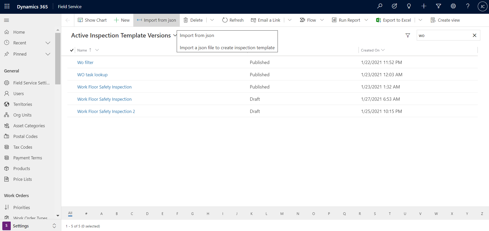

# Advanced options for inspections in Dynamics 365 Field Service

In this article, we'll take a look at more advanced scenarios for using inspections in Dynamics 365 Field Service. For general information about inspections, see [this article on inspections](inspections.md).

For a guided walkthrough, check out the following video.

> [!VIDEO https://www.microsoft.com/videoplayer/embed/RE4JiMF]

## Branching and conditional logic

The inspection can be configured to look and act differently based on inspection answers in real time as the technician fills it out.

Go to the **Logic** section of the designer form to add branching and conditional logic to the inspection.

> [!div class="mx-imgBorder"]
> 

Based on the response to an inspection question, options include:

- **Make page visible**: Make the entire page of questions visible when the condition is true. Otherwise keep it hidden.

- **Show the question**: Make the question visible when the condition is true. Otherwise keep it hidden.

- **Change to required**: Question becomes required when the condition is true.

- **Skip to question**: When the condition is true, then the focus shifts to the selected question.

See the following screenshot for an example.

> [!div class="mx-imgBorder"]
> 

## Copy inspections

You can make a copy of an inspection. This is helpful if your organization has multiple inspections that are mostly similar.

From the list of inspections:

- Select an inspection (seen as "1" in the following screenshot).
- Select **Copy** in the top ribbon (seen as "2" in the following screenshot).
- A new inspection with the same questions will be created (seen as "3" in the following screenshot) with a **Draft** status.

> [!div class="mx-imgBorder"]
> 

## Create new versions of the same inspection

Select the **Revise** ribbon button to edit a published inspection to add new questions, remove obsolete questions, edit the question types, and update the logic.

> [!div class="mx-imgBorder"]
> 

In the **Versions** section of the inspection form, you'll see the current version of the inspection with a status of **Published**, and a new version that can be edited with a status of **Draft**.

> [!div class="mx-imgBorder"]
> 

When the draft version is published, the existing published inspection version will be deactivated.

Existing work orders will display and reference the previous version of the inspection, whereas new work orders will display and reference the new revised version.

## Export inspection as blank PDF

Exporting and inspection as a PDF is helpful for situations where you need to send the inspection questions via email ahead of time.

From an inspection, select **Export to PDF** in the top ribbon.

> [!div class="mx-imgBorder"]
> 

A PDF with the blank inspection questions will download automatically.

> [!div class="mx-imgBorder"]
> 

The PDF will be interactive, where you can enter answers and save them to the PDF; the answers will *not* be saved to Dynamics 365 Field Service or Common Data Model. 

Some question types are limited. For example, the entity lookup question type will not reference the Dynamics 365 database records.

> [!Note]
> The export to PDF function on the inspection only exports blank inspections without responses.

## Export inspection responses as PDF

Inspection responses can also be exported as a PDF from the work order service task. There is a new option - **Export Responses** - on the work order service task that saves the inspection in the same format and with the responses filled in.

> [!div class="mx-imgBorder"]
> 

**Export Responses** can also be used on mobile to generate the inspection response PDF, which can be saved and shared with others.

> [!div class="mx-imgBorder"]
> 

### Known limitations with exporting inspection responses

- The export responses to PDF feature does not support custom date or number formats set using the personalization settings.  Date or number will show in the default format.
- The export inspection to PDF feature does not support right-to-left languages like Hebrew and Arabic.
- Export inspection to PDF and export responses to PDF features do not support Asian languages like Hindi and Chinese.

## Import and export inspection templates

Administrators can export inspection templates to then import into another environment. This is valuable in scenarios where an inspection was created in a test environment but now needs to be imported into a live production environment to use. Importing saves you having to re-create the inspection from scratch in the production environment.

From the inspection, select **Export** > **Export to json** in the top ribbon. 

> [!div class="mx-imgBorder"]
> 

In the list of inspections in another environment, select **Import from json** in the top ribbon.

> [!div class="mx-imgBorder"]
> 

## Language translations

Inspection creators can add language variations for each inspection.

From an inspection, go to the **Translation** section of the form, select a language from the dropdown, and translate each question.

> [!div class="mx-imgBorder"]
> 

Save and publish the inspection.

Next, in order for technicians to view translated inspections on the Dynamics 365 mobile app, you must have language packs installed for each language the inspection is translated to.

Go to **Settings** > **Administration** > **Language Settings**, then select each language. 

> [!div class="mx-imgBorder"]
> 

The maker who adds the strings does not need to install the language packs. The technician who wants to see inspections in their language needs the desired language's pack to be installed.

## Inspections for customer assets

To relate an inspection to a customer asset and build out service history, enter the customer asset in the **Service Task Relates To** section of the work order service **Task** that holds the inspection.

> [!div class="mx-imgBorder"]
> 

Associating a customer asset allows the technician to see which customer asset needs the inspection. From the customer asset, they can see all related inspection history.

> [!div class="mx-imgBorder"]
> 

> [!Note]
> If you relate a work order incident type to a customer asset, the related work order service tasks will be related to the customer asset automatically.

### Inspecting X number of assets at a location

Let's say a technician needs to inspect 10 customer assets at a customer's location. To accommodate this scenario, administrators can:

- Create one inspection with 10 questions - one for each asset - and associate the single inspection to a single service task, or
- Create 10 work order service tasks, each with one inspection.
 
When deciding, keep in mind work order service tasks can be associated to customer assets to build service history, viewable on the customer asset record. This means creating 10 service tasks each related to a different customer asset has the advantage of helping you build service history. The advantage of utilizing a single service task with multiple questions has the benefit of being easier to add to a work order and quicker to fill out. 

## Configuration considerations

### Using Field Service inspections, work order service tasks, or Power Apps inspections

The main advantage for using Field Service inspections is that they are easier to create and easier to fill out. Both service tasks and custom Power Apps require creating additional fields and entities; for work order service tasks, the technician must open and save each one. If you find yourself adding more than 10 service tasks to a work order, or creating a Power App with more than 10 questions, consider inspections instead.

[!INCLUDE[footer-include](../includes/footer-banner.md)]
