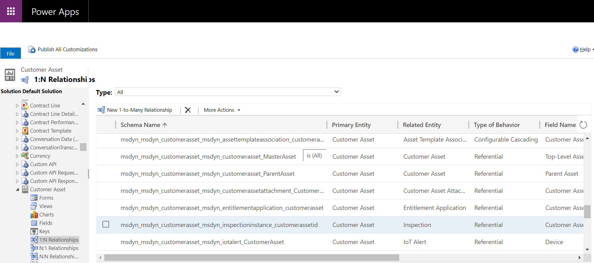
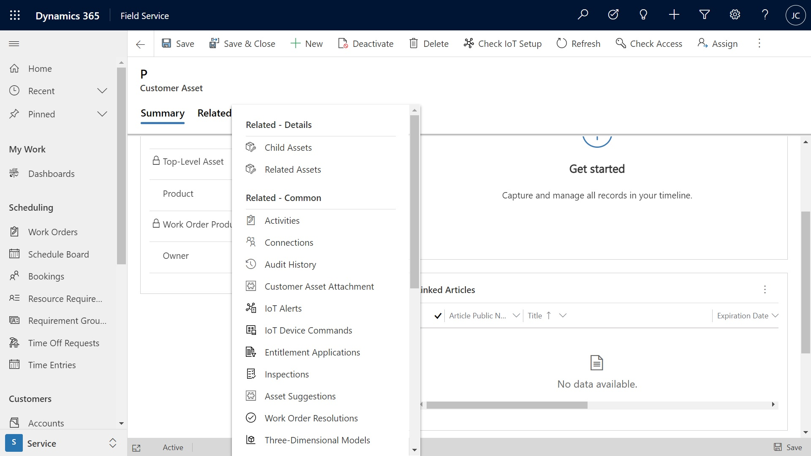

# Use inspections without work orders

Organizations often need to conduct inspections independent of work orders. Currently, inspections can be added to customer assets in Field Service.

## Enable inspections on customer assets without a work order

1. Go to **Advanced Settings** > **Settings** > **Customization** > **Customize the System** > **Components** > **Entities** > **Customer Asset** > **1:N Relationships**

   There's an entity `InspectionInstance` with a display name **Inspection** with a 1:N relationship to customer asset. By default, this relationship isn't visible on the **Related** tab of the asset.

1. Find the row where **Related Entity** is **Inspection**.

   > [!div class="mx-imgBorder"]
   > 

1. Open the record, and then find **Display Option**. This field is set to **Do not Display**.

   > [!div class="mx-imgBorder"]
   > 

1. Update this value to **Use Plural Name** or **Use Custom Label**.

1. Select **Save and Close**, and then select **Publish All Customizations**.

Inspections are now visible on the **Related** tab for assets.

## Validate that inspections have been enabled

1. Go to **Service** > **Assets**, and create a new asset or open an existing asset.

1. Right-click to select the **Related** tab, and verify that **Inspections** are now available. You should also verify that you see an option to create a **New Inspection**.

  > [!div class="mx-imgBorder"]
  > 

## Create an inspection without a work order

- A new inspection instance can be created and an inspection template can be assigned to it. After saving, the inspection responses can be entered and saved. When **Mark Complete** is selected from the ribbon, the inspection becomes read-only, and no more responses can be entered or edited.

- From the Field Service mobile app, a frontline worker can go the asset and perform impromptu inspections in the same way.

[!INCLUDE[footer-include](../includes/footer-banner.md)]
